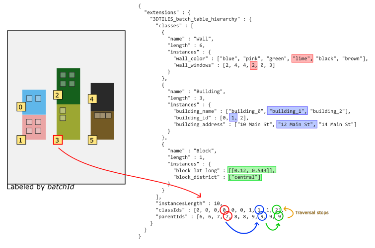

https://github.com/CesiumGS/3d-tiles/tree/master/extensions/3DTILES_batch_table_hierarchy

# 3DTILES_batch_table_hierarchy 扩展

这个是`extensions`属性中可以扩展的一个。

# 简介

标准的BatchTable适用于存储属性信息，因为要素的属性都是一样的（值不一样）。

但是不排除有更复杂的数据有更复杂的层次关系信息，很难将其表示为一个表里具有相同列的一些行记录。

3DTILES_batch_table_hierarchy这个extension应运而生。

# 动机

假设这里有一个瓦片，它的要素可能有不同的属性。这个瓦片假设是一个停车场，那么可能会有这些要素（模型）：汽车、灯柱、树木。如果使用标准的BatchTable，那么：

```JSON
{
    "lampStrength" : [10, 5, 7, 0, 0, 0, 0, 0],
    "lampColor" : ["yellow", "white", "white", "", "", "", "", ""],
    "carType" : ["", "", "", "truck", "bus", "sedan", "", ""],
    "carColor" : ["", "", "", "green", "blue", "red", "", ""],
    "treeHeight" : [0, 0, 0, 0, 0, 0, 10, 15],
    "treeAge" : [0, 0, 0, 0, 0, 0, 5, 8]
}
```

这里有很多""和0，我们可以改造成这样的JSON：

```JSON
{
  "info" : [
    {
      "lampStrength" : 10,
      "lampColor" : "yellow"
    },
    {
      "lampStrength" : 5,
      "lampColor" : "white"
    },
    {
      "lampStrength" : 7,
      "lampColor" : "white"
    },
    {
      "carType" : "truck",
      "carColor" : "green"
    },
    {
      "carType" : "bus",
      "carColor" : "blue"
    },
    {
      "carType" : "sedan",
      "carColor" : "red"
    },
    {
      "treeHeight" : 10,
      "treeAge" : 5
    },
    {
      "treeHeight" : 15,
      "treeAge" : 8
    }
  ]
}
```

但是，如果属性个数增加，那么这个JSON也会越来越复杂。

标准的BatchTable还有一个限制是难以表达层次。例如，假设有一个城市街区的瓦片，数据的层次如下所示：

block

- building
    - wall
    - wall
- building
    - wall
    - wall
- building
    - wall
    - wall

为了区分墙是从哪里来的，那么每个墙模型还要存储building的名称，如果层次一复杂，每个要素（模型）存储的属性信息就会非常多而且重复率非常高（因为都来自一个building的话，原则上只需存一次就行了）。

如果使用标准的BatchTable存，假定每个building有两个wall，每个block有3个building，那么：

```JSON
{
    "wall_color" : ["blue", "pink", "green", "lime", "black", "brown"],
    "wall_windows" : [2, 4, 4, 2, 0, 3],
    "building_name" : ["building_0", "building_0", "building_1", "building_1", "building_2", "building_2"],
    "building_id" : [0, 0, 1, 1, 2, 2],
    "building_address" : ["10 Main St", "10 Main St", "12 Main St", "12 Main St", "14 Main St", "14 Main St"],
    "block_lat_long" : [[0.12, 0.543], [0.12, 0.543], [0.12, 0.543], [0.12, 0.543], [0.12, 0.543], [0.12, 0.543]],
    "block_district" : ["central", "central", "central", "central", "central", "central"],
}
```

以上例子均说明了存储要素类别、要素层次的好处。

# BatchTable JSON定义升级

在标准的BatchTable中的`extensions`中扩展一个`3DTILES_batch_table_hierarchy`对象，来定义一系列的class和class的树状结构。

例子：

```JSON
{
  "extensions" : {
    "3DTILES_batch_table_hierarchy" : {
      "classes" : [
        {
          "name" : "Wall",
          "length" : 6,
          "instances" : {
            "color" : ["white", "red", "yellow", "gray", "brown", "black"],
          }
        },
        {
          "name" : "Building",
          "length" : 3,
          "instances" : {
            "name" : ["unit29", "unit20", "unit93"],
            "address" : ["100 Main St", "102 Main St", "104 Main St"]
          }
        },
        {
          "name" : "Owner",
          "length" : 3,
          "instances" : {
            "type" : ["city", "resident", "commercial"],
            "id" : [1120, 1250, 6445]
          }
        }
      ],
      "instancesLength" : 12,
      "classIds" : [0, 0, 0, 0, 0, 0, 1, 1, 1, 2, 2, 2],
      "parentCounts" : [1, 3, 2, 1, 1, 1, 1, 1, 1, 0, 0, 0],
      "parentIds" : [6, 6, 10, 11, 7, 11, 7, 8, 8, 10, 10, 9]
    }
  }
}
```

> 译者注
>
> 这里有12个instance，但不代表batchLength是12。
>
> 首先，用batchId去索引classIds，获得的classId用于索引classes，获得的classId在自己的class排位序号用于索引classes中的instance中的数据。
>
> 然后，用batchId这个初始索引号访问parentIds，直到子的索引号去索引parentIds结果二者相等时结束。

### 扩展属性：3DTILES_batch_table_hierarchy

可以看到3DTILES_batch_table_hierarchy这个属性有5个顶级属性：`classes`、`instancesLength`、`classIds`、`parentCounts`、`parentIds`。

### classes属性

`classes`：是一个对象数组，每个对象均有如下属性：

- `name`：类别名称，字符串。
- `length`：这个类别的instance的个数。
- `instances`：这个类别所有instance的属性，可以是btBinary的引用。

### instancesLength属性

instances的总数，每个class的length加和应与这个属性的值相等。

注意，这个和瓦片的batchLength不同，batchLength是要素的总数。尽管所有的要素都是instances，但是并不是所有的instance都是要素。

> 译者注：因为存在树状结构，所以有一些parent并不是一个要素，仅仅作为层级关系中的一个节点，所有的要素均为叶子instance。

### classIds属性

一个长度为instanceLength的整数数组。

例如，classIds[3]=1，代表第3个instance的classId是0，要到classes数组中寻找数据：`classes[classIds[3]]['instances'][classIds[3]在自己class中的排位]`。

### parentCounts属性

一个长度为instancesLength的整数数组，每个值指示这个instance有多少个父级。如果不指定parentCounts，那么默认是一个长度为instancesLength的全为1的数组。

### parentIds属性

一个整数数组。数组长度等于parentsCounts中所有值的和。

例如，parentIds[2] = 6，代表第2个instance的父级instance索引号是6，往上遍历时，需要用6来访问classIds，直到parentIds[索引号]=上一级的索引号，即parentIds[6]=6，那么说明这个instance已经没有父级instance了。

### 对BtBinary的引用

classIds、parentCounts和parentIds均可以改为对二进制体的引用。默认componentType是UNSIGNED_SHORT，默认type是SCALAR。

```
"classIds" : {
    "byteOffset" : 0,
    "componentType" : "UNSIGNED_SHORT"
}
```

## 举例

### 要素类别

回到上文提及那个有汽车、灯柱、树木这三种要素的瓦片，其BatchTable可能如下所示：

```JSON
{
  "extensions" : {
    "3DTILES_batch_table_hierarchy" : {
      "classes" : [
        {
          "name" : "Lamp",
          "length" : 3,
          "instances" : {
            "lampStrength" : [10, 5, 7],
            "lampColor" : ["yellow", "white", "white"]
          }
        },
        {
          "name" : "Car",
          "length" : 3,
          "instances" : {
            "carType" : ["truck", "bus", "sedan"],
            "carColor" : ["green", "blue", "red"]
          }
        },
        {
          "name" : "Tree",
          "length" : 2,
          "instances" : {
            "treeHeight" : [10, 15],
            "treeAge" : [5, 8]
          }
        }
      ],
      "instancesLength" : 8,
      "classIds" : [0, 0, 0, 1, 1, 1, 2, 2]
    }
  }
}
```

由于此例不包含层次结构，所以`parentCounts`和`parentIds`和`instancesLength`均不存在或者不等于`batchLength`（模型个数）。

取`classId`为0，那么这个模型表示的是灯柱，classId为1的是汽车，classId为2的是树木。

要素的`batchId`用于访问classIds中的值。batchId是0、1、2在classIds数组对应的值是0、0、0，即batchId是0、1、2的三个模型代表的是灯柱。同理，batchId是3、4、5和6、7分别代表的是class1和2，即汽车和树木。

取batchId为5，那么其class是1，为汽车，其属性为：

```yaml
carType : "sedan"
carColor : "red"
```

那么，这个停车场的三维瓦片如下图所示：


### 要素层级结构

城市街区案例：

```json
{
  "extensions" : {
    "3DTILES_batch_table_hierarchy" : {
      "classes" : [
        {
          "name" : "Wall",
          "length" : 6,
          "instances" : {
            "wall_color" : ["blue", "pink", "green", "lime", "black", "brown"],
            "wall_windows" : [2, 4, 4, 2, 0, 3]
          }
        },
        {
          "name" : "Building",
          "length" : 3,
          "instances" : {
            "building_name" : ["building_0", "building_1", "building_2"],
            "building_id" : [0, 1, 2],
            "building_address" : ["10 Main St", "12 Main St", "14 Main St"]
          }
        },
        {
          "name" : "Block",
          "length" : 1,
          "instances" : {
            "block_lat_long" : [[0.12, 0.543]],
            "block_district" : ["central"]
          }
        }
      ],
      "instancesLength" : 10,
      "classIds" : [0, 0, 0, 0, 0, 0, 1, 1, 1, 2],
      "parentIds" : [6, 6, 7, 7, 8, 8, 9, 9, 9, 9]
     }
  }
}
```

这个瓦片的`batchLength`是6，但是这个瓦片的`instancesLength`是10。

// TODO

取batchId为3，那么它具有的属性是：

```yaml
wall_color : "lime"
wall_windows : 2
building_name : "building_1"
building_id : 1,
building_address : "12 Main St"
block_lat_long : [0.12, 0.543]
block_district : "central"
```

分解步骤：

- 取batchId=3，获取以下属性

    classId = classIds[batchId] // 0，排0这个class的第3位（0开始）

    parentId = parentIds[batchId] // 7

    取属性`classes[classId]['instances'][第三位=3]`，得如下结果

    ```yaml
    wall_color : "lime"
    wall_windows : 2
    ```

- 此时索引为上一级获得的parentId，是7，重复

    classId = classIds[7] // 1，拍1这个class的第1位（0开始）

    parentId = parentIds[7] // 9

    取属性`classes[classId]['instances'][第一位=1]`，得如下结果

    ```yaml
    building_name : "building_1"
    building_id : 1,
    building_address : "12 Main St"
    ```

- 此时索引位上一级获得的parentId，是9，重复

    classId = classIds[9] // 2，排2这个class的第0位（0开始）

    parentId = parentIds[9] // 还是9，说明没有parent了

    取属性`classes[classId]['instances'][第零位=0]`，得如下结果

    ```yaml
    block_lat_long : [[0.12, 0.543]]
    block_district : ["central"]
    ```

如图所示



## 样式化


### getExactClassName


### isExactClass


### isClass


## 注意

尽管在BtJSON中可以在`extensions`属性里存储3DTILES_batch_table_hierarchy这个扩展信息，但是每个要素（模型）的公共数据还是得存储在BtJSON里的：

```JSON
{
  "Height" : [...],
  "Longitude" : [...],
  "Latitude" : [...],
  "extensions" : {
    "3DTILES_batch_table_hierarchy" : {...}
  }
}
```

这个层次结构仅仅适用于当前瓦片，别的瓦片有别的层次结构，不通用。