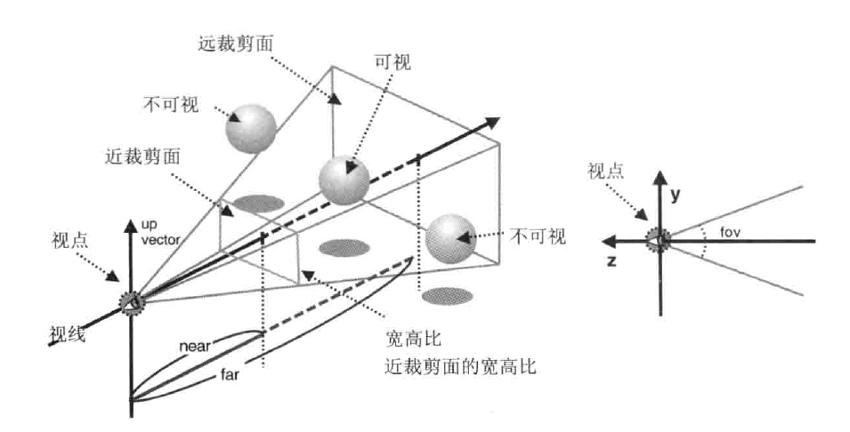
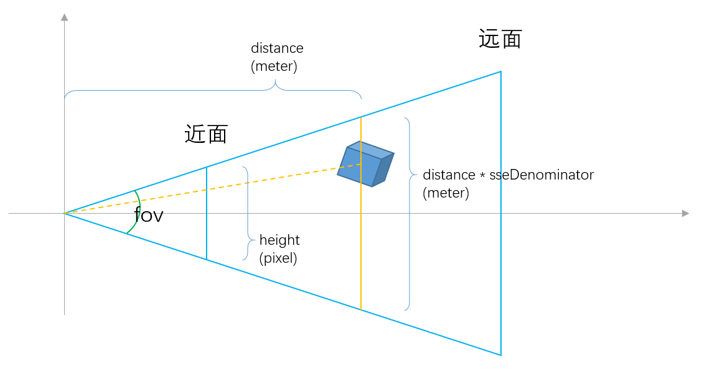

几何误差出现在 3dTiles 的每个瓦片定义上，这个是一个事先计算好的值，是固定设置在json中的。

要想弄明白  3dTiles 的 `几何误差` 的具体含义，必须先搞清楚这个屏幕空间误差 `SSE, Screen-Space Error`。而这个 `SSE`，则是当前瓦片是否被过滤而不显示的最重要指标。

Cesium能指定 Cesium3DTileset 的 `maximumScreenSpaceError`，当当前摄像机位利用当前瓦片的 几何误差 计算得到的 `SSE` > `maximumScreenSpaceError` 时，该瓦片就要进行下一级别的瓦片渲染，以满足精度。

很遗憾的是，Cesium并没有把 `Cesium3DTile.getScreenSpaceError()` 方法公开成API，不过可通过隐式字段 `_screenSpaceError` 获取瓦片当前的 SSE，辅以 `Cesium3DTileset.maximumScreenSpaceError`，就可以判断当前瓦片是否显示，以此为依据调整几何误差。

默认的 `Cesium3DTileset.maximumScreenSpaceError` 是16.

很郁闷，网上就没有多少解释这个参数的文章，只能去翻看源码自己推演。

# 1 屏幕空间误差（`SSE, Screen-Space Error`）

屏幕空间误差这个东西来自 `Cesium3DTile.js` 这个文件内关于 `Cesium3DTile` 这个类的一个方法 `Cesium3DTile.getScreenSpaceError()`.

屏幕空间误差是根据当前瓦片与相机的 距离 以及当前瓦片的 几何误差 实时计算的，是一个动态的值。

由于在三维视图下讨论比较有意义，故默认先讨论透视投影相机下的屏幕空间误差的粗略表达式：
$$
SSE' = k × geometricError,   k ∈ [0,1]
$$

> 为什么说是粗略表达式呢？因为真正的 `SSE` 在这个 `SSE'` 的基础上还要做一些像素比例拉伸等线性变换，但是这个公式是影响屏幕空间误差最大的一部分。

由此可见，`SSE` 可以理解为是几何误差的一个比例值，这个等比因子 `k` 的计算就十分的重要。

`SSE` 的单位是像素，`geometricError` 的单位是米。

上源码：

``` JS
//  1.71版本 Cesium3DTile.js 791行
error = (geometricError * height) / (distance * sseDenominator)
```

抽取 `k` 的定义
$$
k= \frac{height}{distance × sseDenominator} ≡ \frac{ScreenSpaceError}{geometrircError}
$$
其中，

`height` 表示 WebGL绘制的帧高度（大多数情况下，这个高度就是页面上 canvas 元素承载的WebGL帧的高度，单位为像素），

`distance` 表示瓦片包围盒中心至摄像机位置的距离，单位是米

`distance × sseDenominator` 表示的是瓦片所处位置的截平面高度，单位为米

这个 `sseDenominator` 是 Fov半角 的正切值 的两倍。

没有图形学基础的朋友，估计很难理解 分子 和 分母的含义，尤其是这个“截平面”，后面会详细介绍。


# 2 三维视图中的相机 与 相机的视锥体



这就是所谓的透视投影相机与其视锥体，视锥体实际上就是途中 近裁剪面 到 远裁剪面的这块横躺着的四棱台。

上述的 `distance` 、`sseDenominator` 均由 YOZ 平面观察说明：



<div style="color:red;">注意！这图是错误的，近面高并不是height！</div>

在源代码中，`sseDenominator` 是如下计算的：
$$
sseDenominator = 2 × tan(\frac{fov}{2}) 
$$
如果不太好理解，先看 $tan\frac{fov}{2}$ 部分，它代表的是下面这个三角形的 fov 半角正切值：


画的有点弯曲哈，这个正切值是什么意思呢？

就是瓦片（图中方块）所在的那条黄线，即平行于近面远面的一个“截平面”，其实是一个矩形，的半高，除以三角形的另一条直角边，即 `distance`

所以，`distance × sseDenominator` 实际上就是：
$$
分母 = distance × sseDenominator = distance × 2 × \frac{截平面半高}{distance} = 2 × 截平面半高 = 截平面高
$$
即黄线的高度。

所以，屏幕空间误差 
$$
sse = k×geometryError = \frac{height}{截平面高} × geometryError
$$


通常， `height` 即 `WebGLContext.drawingBufferHeight` ，即 承载 WebGL 的 canvas 的帧高（注意不是HTML元素高）。测试全屏状态下，此值是936像素。

而截平面高则有一个范围，即摄像机的近截面和远截面的高的闭区间。