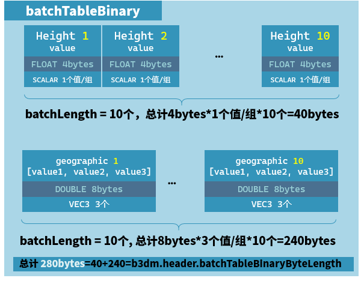

B3dm，Batched 3D Model，成批量的三维模型的意思。

倾斜摄影数据（例如osgb）、BIM数据（如rvt）、传统三维模型（如obj、dae、3dMax制作的模型等），均可创建此类瓦片。

# 瓦片文件二进制布局（文件结构）


## ① 文件头：占28字节（byte）

位于b3dm文件最开头的28个字节，是7个属性数据：

| 属性的官方名称                 | 字节长 | 类型                | 含义                                  |
| ------------------------------ | ------ | ------------------- | ------------------------------------- |
| `magic`                        | 4      | string（或char[4]） | 该瓦片文件的类型，在b3dm中是 `"b3dm"` |
| `version`                      | 4      | uint32              | 该瓦片的版本，目前限定是 1.           |
| `byteLength`                   | 4      | uint32              | 该瓦片文件的文件大小，单位：byte      |
| `featureTableJSONByteLength`   | 4      | uint32              | 要素表的JSON文本（二进制形式）长度    |
| `featureTableBinaryByteLength` | 4      | uint32              | 要素表的二进制数据长度                |
| `batchTableJSONByteLength`     | 4      | uint32              | 批量表的JSON文本（二进制形式）长度    |
| `batchTableBinaryByteLength`   | 4      | uint32              | 批量表的二进制数据长度                |

其中，

`byteLength` = 28 + `featureTableJSONByteLength` + `featureTableBinaryByteLength` + `batchTableJSONByteLength` + `batchTableBinaryByteLength`

## ② 要素表

回顾上篇，我说的是

> 要素表，记录的是整个瓦片渲染相关的数据，而不是渲染所需的数据。

那么，b3dm瓦片中的要素表会记录哪些数据呢？

### 全局属性

什么是全局属性？即对于瓦片每一个三维模型（或BATCH、要素）或者直接对当前瓦片有效的数据，在b3dm中，要素表有以下全局属性：

| 属性名         | 属性数据类型 | 属性描述                                         | 是否必须存在 |
| -------------- | ------------ | ------------------------------------------------ | ------------ |
| `BATCH_LENGTH` | uint32       | 当前瓦片文件内三维模型（BATCH、要素）的个数      | yes          |
| `RTC_CENTER`   | float32[3]   | 如果模型的坐标是相对坐标，那么相对坐标的中心即此 | no           |

注意，如果glb模型并不需要属性数据，即要素表和批量表有可能是空表，那么 `BATCH_LENGTH` 的值应设为 0 .

### *要素属性

对于每个模型（BATCH、要素）各自独立的数据。在b3dm中没有。

我们回忆一下要素表的定义：与渲染相关的数据。

b3dm瓦片与渲染相关的数据都在glb中了，所以b3dm并不需要存储每个模型各自独立的数据，即不存在要素属性。

>  *在i3dm、pnts两种瓦片中，要素属性会非常多。*

### 全局属性存在哪里？

全局属性存储在 要素表的JSON中，见下文：

### JSON头部数据

由上图可知，文件头28字节数据之后是要素表，要素表前部是 长达 `featureTableJSONByteLength` 字节的二进制JSON文本，利用各种语言内置的API可以将这段二进制数据转换为字符串，然后解析为JSON对象。

例如，这里解析了一个b3dm文件的 要素表JSON：

``` JSON
{
    "BATCH_LENGTH": 4
}
```

那么，此b3dm瓦片就有4个模型（4个要素，或4个BATCH），其 `batchId` 是0、1、2、3.

### 要素表的二进制本体数据

无。

> *注：*
>
> *当要素表的 JSON 数据以引用二进制体的方式出现时，数据才会记录在要素表的二进制本体数据中，此时JSON记录的是字节偏移量等信息。*
>
> *但是在b3dm瓦片中，要素表只需要JSON就可以了，不需要自找麻烦再引用二进制数据，因为`BATCH_LENGTH` 和 `RTC_CENTER` 都相对好记录，一个是数值，一个是3元素的数组。*
>
> *在下面的要介绍批量表中，就会出现 JSON 数据引用二进制体的情况了。在 i3dm 和 pnts 瓦片中，要素表 JSON就会大量引用其二进制体。*

## ③ 批量表

批量表记录的是每个模型的属性数据，以及扩展数据（扩展数据以后再谈）。

要素表和批量表唯一的联系就是 `BATCH_LENGTH`，在 i3dm 中叫 `INSTANCE_LENGTH`，在 pnts 中叫 `POINTS_LENGTH`。

这很好理解，要素表记录了有多少个模型（BATCH、要素），那么批量表每个属性就有多少个值。

### JSON头部数据

先上一份批量表的JSON看看：

``` JSON
{
    "height" : {
        "byteOffset" : 0,
        "componentType" : "FLOAT",
        "type" : "SCALAR"
    },   
    "geographic" : {
        "byteOffset" : 40,
        "componentType" : "DOUBLE",
        "type" : "VEC3"
    },
}
```

这个批量表的JSON有两个属性：`height`、`geographic`，字面义即模型的高度值、地理坐标值。

`height` 属性通过其 `componentType` 指定数据的值类型为 `FLOAT`，通过其 `type` 指定数据的元素类型为 `SCALAR`（即标量）。

`geographic` 属性通过其 `componentType` 指定数据的的值类型是 `DOUBLE`，通过其 `type` 指定数据的元素类型为 `VEC3`（即3个double数字构成的三维向量）。

`byteOffset` ，即这个属性值在 **二进制本体数据** 中从哪个字节开始存储。

从上表可以看出，height 属性跨越 0 ~ 39 字节，一共40个字节。

**通过 FeatureTableJSON 可以获取 BATCH_LENGTH 为10，那么就有10个模型，对应的，这 40 个字节就存储了10个 height 值，查相关资料得知，FLOAT类型的数据字节长度为 4，刚好 4 byte × 10  = 40 byte，即 height 属性的全部数据的总长。**

geographic 属性也同理，VEC3 代表一个 geographic 有3个 DOUBLE 类型的数字，一个 DOUBLE 数值占 8byte，那么 geographic 一共数据总长是：

type × componentType × BATCH_LENGTH = 3 × 8byte × 10 = 240 byte.



**事实上，两个属性的总长是 40 + 240 = 280 byte，与 b3dm 文件头中的第七个属性 `batchTableBinaryByteLength` = 280 是一致的。**

### 二进制本体数据

二进制本体数据即批量表中每个属性的顺次存储。

### 能不能不写二进制本体数据？

可以。如果你觉得数据量比较小，可以直接把数据写在 `BatchTableJSON` 中，还是以上述两个数据为例：

``` json
{
    "height": [10.0, 20.0, 15.0, ...], // 太长了不写那么多，一共10个
    "geographic": [
        [113.42, 23.10, 102.1],
        [111.08, 22.98, 24.94],
    	// 太长不写
    ]
}
```

但是，读者请一定注意这一点：同样是一个数字，二进制的JSON文本大多数时候体积会比二进制数据大。因为JSON文本还包括括号、逗号、冒号等JSON文本必须的符号。对于属性数据相当大的情况，建议使用 JSON引用二进制本体数据的组织形式，此时JSON充当的角色是元数据。

**注意：**对于属性的值类型是 JSON 中的 object、string、bool 类型，则必须存于 JSON 中，因为二进制体只能存 标量、234维向量四种类型的数字数据。

## ④ 内嵌的glb

本部分略，对glb数据感兴趣的读者可自行查阅 glTF 数据规范。

关于两大数据表如何与glb每一个顶点进行关联的，在前篇也有简略介绍。可以参考官方的说明：

https://github.com/CesiumGS/3d-tiles/tree/master/specification/TileFormats/Batched3DModel#binary-gltf

## ⑤ 字节对齐与编码端序

### JSON二进制文本对齐

FeatureTableJSON、BatchTableJSON的二进制文本，最后一个字节相对于整个b3dm文件来说，偏移量必须是8的倍数。

如果不对齐，必须用二进制空格（即 `0x20`）填够。

你问我为啥不对起始偏移量也要求 8byte 对齐？因为 FeatureTableJSON 之前是28byte的 文件头，为了凑齐8倍数对齐，文件头和 FeatureTableJSON 还要塞4个字节填满，那就有点多余了。

末尾对齐，即 (28 + ftJSON长)能整除8，(28 + ftTable长 + btJSON长)能整除8.

### 数据体的起始、末尾对齐

二进制数据体，无论是要素表、批量表，首个字节相对于b3dm文件的字节偏移量，必须是8的倍数，结束字节的字节偏移量，也必须是8的倍数。

如果不满足，可以填充任意数据字节满足此要求。

特别的，二进制数据体中，每一个属性值的第一个数值的第一个字节的偏移量，相对于整个b3dm文件，必须是其 `componentType` 的倍数，如果不满足，则必须用空白字节填满。

例如，上述 height 属性所在的批量表二进制数据体，理所当然位于批量表JSON之后，而批量表的JSON又是8byte对齐的，假设批量表的数据体起始字节是800，那么 height 的第一个值起始字节就是 800，由于 height 属性的 componentType 是 FLOAT，即 4字节，800 ÷ 4 能整除，所以没有问题。

但是，假如 换一个属性，其 componentType 是 `BYTE`，即 1字节，那么假设第二个属性的 componentType 是 DOUBLE，即 8字节，就会出现 第二个属性的第一个值起始偏移量是810，810 ÷ 8 并不能整除，必须补齐 6个空白字节，以满足第二个属性第一个值的起始偏移量是 810+6 = 816字节。

### 编码端序

要素表、批量表的二进制数据，无论是JSON还是数据体，均使用小端序编码（LittleEndian）。

## ⑥ 扩展数据（extensions）与额外补充信息（extras）

其实，无论是要素表，还是批量表，都允许在JSON中存在扩展数据，以扩充当前瓦片模型的功能，而并不是单一的一个一个模型顺次存储在瓦片文件、glb中。

有关扩展数据，在以后会专门出一篇博客介绍。