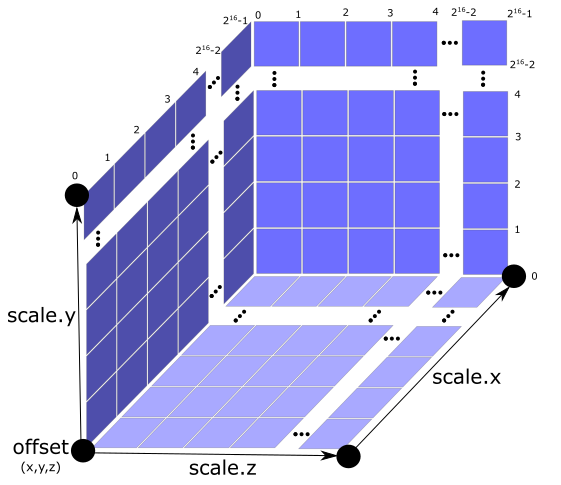

i3dm，即 `Instanced 3D Model`，实例三维模型的意思。

诸如树木、路灯、路边的垃圾桶、长椅等具有明显 **重复** 特征的数据。这类数据用得较少（笑，现在都喜欢搞BIM、倾斜摄影、精模、白模等）

# 瓦片文件二进制布局（文件结构）

与 b3dm 一致，文件头多了个属性。


# 1. 文件头：32byte

i3dm的文件头有8个属性，前7个与b3dm是一样的。

| 属性的官方名称                 | 字节长 | 类型                | 含义                                  |
| ------------------------------ | ------ | ------------------- | ------------------------------------- |
| `magic`                        | 4      | string（或char[4]） | 该瓦片文件的类型，在i3dm中是 `"i3dm"` |
| `version`                      | 4      | uint32              | 该瓦片的版本，目前限定是 1.           |
| `byteLength`                   | 4      | uint32              | 该瓦片文件的文件大小，单位：byte      |
| `featureTableJSONByteLength`   | 4      | uint32              | 要素表的JSON文本（二进制形式）长度    |
| `featureTableBinaryByteLength` | 4      | uint32              | 要素表的二进制数据长度                |
| `batchTableJSONByteLength`     | 4      | uint32              | 批量表的JSON文本（二进制形式）长度    |
| `batchTableBinaryByteLength`   | 4      | uint32              | 批量表的二进制数据长度                |
| `gltfFormat`                   | 4      | uint32              | gltf在i3dm瓦片中存在的形式            |

其中，前7个和b3dm意义一样，不做解释。

第8个，`gltfFormat` 只有两个值：0和1.

0，则位于 i3dm 瓦片文件最后的 gltf 内容是一个 uri，指向gltf的数据内容（可能是Base64 DataURL，也可能是其他地方的地址，笔者没见过...）

1，则位于 i3dm 瓦片文件最后的 gltf 内容是 二进制的 glb，大多数情况见的是这个。

默认情况，gltf 是 y 轴朝上，3dTiles 是z轴朝上，需要坐标转换。

# 2. 要素表

在上篇，有介绍到要素表存在 **全局属性** 和 **要素属性**。在 i3dm 中，这对概念就能得到很好的解释。

## ① 要素表的全局属性

| 属性名                  | 数据类型   | 描述                                                         | 是否必须                                    |
| ----------------------- | ---------- | ------------------------------------------------------------ | ------------------------------------------- |
| INSTANCES_LENGTH        | uint32     | instance的个数                                               | 是                                          |
| RTC_CENTER              | float32[3] | 如果坐标是相对坐标，那么相对中心由此属性给出                 | 否                                          |
| QUANTIZED_VOLUME_OFFSET | float32[3] | 量化空间范围体的偏移量                                       | 否，与要素属性中的POSITION_QUANTIZED 共存亡 |
| QUANTIZED_VOLUME_SCALE  | float32[3] | 量化空间范围体的缩放比例                                     | 否，与要素属性中的POSITION_QUANTIZED 共存亡 |
| EAST_NORTH_UP           | boolean    | 如果这个属性值是true，而且每个实例的方向没有定义，那么每个实例将默认指向WGS84椭球的正东、正北方向。 | 否                                          |

第一第二个能与 b3dm 中的 `BATCH_LENGTH` 和 `RTC_CENTER` 类比来理解，就不解释了。

最后一个属性指示当前 i3dm 瓦片的坐标轴朝向。

下列要着重介绍这个所谓的 `QUANTIZED_VOLUME`，即 **量化空间范围体**。

### 量化空间范围体

这个词“量化空间范围体”是我自己意译的。

每个瓦片，都有它自己的空间范围，为了节约数据占用，可以使用相对坐标来记录每个 instance 的位置，也即记录全局属性中的 `RTC_CENTER` 属性。

但是，即便用了相对坐标，instance 的坐标值仍然是 `FLOAT` 类型，占 4字节。

假设，存在一个矩形空间，它的左下角点的坐标是 `(x, y, z)`，将矩形空间按 $2^{16}$ 等分其 x、y、z 三个方向，定义矩形空间的三条边长对应瓦片本身的坐标空间的缩放比例为 `(ScaleX, ScaleY, ScaleZ)`，如下图所示：



这样，被细分出来的每一个 “小矩形”，都有它自己在这个矩形空间的量化坐标，因为 x、y、z 三个方向被分割成了 $2^{16}$ 块，我们可以使用 `uint16` 类型的数值来记录坐标，这样每个数字只占了 16bit，也即 2byte，比 `FLOAT` 的4byte 小了一倍，对于顶点数据的压缩十分具有价值。

那么，如何将 `(16464, 2172, 63312)` 这个量化的坐标映射回瓦片原本的坐标呢？参考公式：

$\vec{Position} = Scale * \displaystyle\frac{\vec{PositionQuantized}}{65535} + \vec{Offset}$

即量化坐标 `PositionQuantized` 各个坐标分量乘上缩放因子（ `Scale / 65535` ），然后加偏移坐标即可。

三个方向的缩放因子 `QUANTIZED_VOLUME_SCALE:float[3]`  和 偏移量 `QUANTIZED_VOLUME_OFFSET:float[3]` 作为全局属性写在要素表JSON中。

如果这两个全局属性未定义，则 逐要素属性中的 `POSITION_QUANTIZED` 这个量化坐标也不会存在，即使用原有的 float 类型坐标记法。

需要注意的是，量化坐标和普通坐标只能二选一，如果都不存在，那么这个 i3dm 瓦片就不会被渲染。

看到这，是否能理解“要素表的全局属性是对于整个瓦片文件而言”这句话了呢？

## ② 要素表的(逐)要素属性

| 属性名称            | 数据类型                 | 描述                                                  | 是否必须                        |
| ------------------- | ------------------------ | ----------------------------------------------------- | ------------------------------- |
| POSITION            | float32[3]               | 模型实例的坐标                                        | 是，与POSITION_QUANTIZED二选一  |
| POSITION_QUANTIZED  | uint16[3]                | 量化空间范围体内的模型实例坐标                        | 是，与POSITION二选一            |
| NORMAL_UP           | float32[3]               | 模型上方向向量                                        | 否，与NORMAL_RIGHT共存亡        |
| NORMAL_RIGHT        | float32[3]               | 模型右方向向量，必须与`up`向量正交                    | 否，与NORMAL_UP共存亡           |
| NORMAL_UP_OCT32P    | uint16[2]                | 模型上方向向量，32位精度八进制编码                    | 否，与NORMAL_RIGHT_OCT32P共存亡 |
| NORMAL_RIGHT_OCT32P | uint16[2]                | 模型右方向向量，必须与`up`向量正交，32位精度8进制编码 | 否，与NORMAL_UP_OCT32P共存亡    |
| SCALE               | float32                  | 该 instance 对于 gltf 的缩放比例                      | 否                              |
| SCALE_NON_UNIFORM   | float32[3]               | 该 instance 在三个方向上的缩放比例                    | 否                              |
| BATCH_ID            | uin8/uint16(默认)/uint32 | 用于在批量表里检索数据用的batchId                     | 否                              |

当 i3dm 瓦片中逐个 instance 的`POSITION` 被定义时，量化坐标 `POSITION_QUANTIZED` 就不应存在，反之亦然。

接下来四个方向向量属性（法线）`NORMAL_UP`、`NORMAL_RIGHT` 和 `NORMAL_UP_OCT32P`、`NORMAL_RIGHT_OCT32P` 也是一对反依赖的逐要素属性。

`SCALE` 属性定义了当前要素（instance或实例）对使用的 gltf 模型的缩放比例。

`SCALE_NON_UNIFORM` 属性与 `SCALE` 属性差不多，只不过是在三个方向上分别不同的缩放比例。

`BATCH_ID`，是当前要素（instance或实例）的 id 号，将 要素 与 批量表中的属性 二者联系起来。

> 个人觉得，应该叫 `INSTANCE_ID` 更合适一些？

### 默认方向

如果不给定要素属性中与方向有关的向量时，每个实例的朝向有一个默认值：在WGS84椭球上，上方向指向正北，右方向指向正东。

## ③ 要素表的JSON

上述所有属性全部会记录在要素表的 JSON 中，对于 全局属性，其值记录在 JSON 中，对于其要素属性，因为要素（即instance）很多的时候写在JSON中体积会变大，所以使用 JSON引用要素表二进制数据体 的形式。

下列是一个要素表的JSON：

``` JSON
{
    INSTANCES_LENGTH : 4, // 有4个实例
    POSITION : {
        byteOffset : 0 // POSITION的值从ftBinary的第0字节起开始计算
    }
}
```

读者不妨回顾上一篇，b3dm的要素表JSON，并未出现有对要素表体引用的属性，在这里出现了：`POSITION`，它从要素表体的第 0 个字节开始记录数据。

而 `POSITION` 这个逐要素（实例、instance）属性的定义，早已在上文提及，即三个 `FLOAT` 类型数字为一组，一共 `INSTANCES_LENGTH` 组的数据，记录在要素表体。这是 instance 坐标数据，写在 JSON 中虽然没问题，但是会造成空间浪费，以二进制形式记录会比较划算。

## ④ 要素表体

要素表JSON中引用的二进制数据均顺次记录在此。

# 3. 批量表

批量表与 b3dm 的一致，均为 JSON 记录属性元数据，批量表体记录属性具体数据。此处不再举例。

# 4. 要素举例说明

此部分参考官方文档。

## ① 仅有 `POSITION` 的 i3dm 瓦片

``` JS
var featureTableJSON = {
    INSTANCES_LENGTH : 4, // 有4个实例
    POSITION : {
        byteOffset : 0 // POSITION的值从ftBinary的第0字节起开始计算
    }
};

var featureTableBinary = new Buffer(new Float32Array([
    0.0, 0.0, 0.0,
    1.0, 0.0, 0.0,
    0.0, 0.0, 1.0,
    1.0, 0.0, 1.0
]).buffer);
```

使用 JavaScript 语言记录了 要素表JSON，以及要素表二进制数据（以ES6 TypedArray 形式）。

## ② 使用量化位置与八进制方向向量

``` JS
var featureTableJSON = {
    INSTANCES_LENGTH : 4, // 有4个实例
    QUANTIZED_VOLUME_OFFSET : [-250.0, 0.0, -250.0],
    QUANTIZED_VOLUME_SCALE : [500.0, 0.0, 500.0],
    POSITION_QUANTIZED : {
        byteOffset : 0
    },
    NORMAL_UP_OCT32P : {
        byteOffset : 24
    },
    NORMAL_RIGHT_OCT32P : {
        byteOffset : 40
    }
};

var positionQuantizedBinary = new Buffer(new Uint16Array([
    0, 0, 0,
    65535, 0, 0,
    0, 0, 65535,
    65535, 0, 65535
]).buffer);

var normalUpOct32PBinary = new Buffer(new Uint16Array([
    32768, 65535,
    32768, 65535,
    32768, 65535,
    32768, 65535
]).buffer);

var normalRightOct32PBinary = new Buffer(new Uint16Array([
    65535, 32768,
    65535, 32768,
    65535, 32768,
    65535, 32768
]).buffer);

var featureTableBinary = Buffer.concat([positionQuantizedBinary, normalUpOct32PBinary, normalRightOct32PBinary]);
```

规定了全局属性 `QUANTIZED_VOLUME_OFFSET` 和 `QUANTIZED_VOLUME_SCALE`，规定了量化坐标 `POSITION_QUANTIZED`、八进制上方向和右方向向量`NORMAL_UP_OCT32P`、`NORMAL_RIGHT_OCT32P` 在要素表体中的起始偏移值。

于是，使用三个 `TypedArray` 构造的 `Buffer` 对象，再拼接在一起，即要素表体 `featureTableBinary`。

# 5. 字节对齐与编码端序

与b3dm里写的一致，可以回看：[https://www.cnblogs.com/onsummer/p/13252896.html](https://www.cnblogs.com/onsummer/p/13252896.html)

# 6. 扩展（extensions）和额外信息（extras）

同样，这部分内容与b3dm篇章内介绍的一致，会在后续文章内介绍。