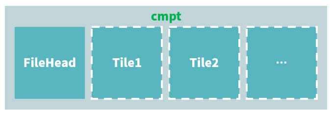

cmpt，即 `Component`，组合模型的意思。

这是前三种的一种更灵活的组织，允许一个瓦片使用 cmpt 形式，组合多种瓦片，cmpt瓦片可以内嵌任意个、任意类型的瓦片，b3dm、i3dm、pnts均可。

所以本文仅简单介绍文件结构。

# 文件二进制布局

虚线意味着可选，也就是说，cmpt瓦片可以是空瓦片。

## ① 文件头：16byte

|    字段名     |    数据类型     | 描述                                   |
| :-----------: | :-------------: | :------------------------------------- |
|    `magic`    | `char[]`, 4byte | 常量`"cmpt"`. 用来指示文件是cmpt瓦片。 |
|   `version`   | `uint32`, 4byte | cmpt的版本。目前是`1`。                |
| `byteLength`  | `uint32`, 4byte | 整个瓦片文件的体积，byte为单位。       |
| `tilesLength` | `uint32`, 4byte | cmpt中融合的瓦片数量。                 |

## ② 内嵌的瓦片

不知道读者一路看过来有没有发现，无论是哪一种瓦片，其文件头前3个属性都是 `magic`、`version`、`byteLength`？

所以，这就给 cmpt 这种套娃式瓦片有了可复用性。

请注意，cmpt是可以继续嵌套cmpt的（无限套娃），虽然我不是很建议你这么搞。

所以本篇其实仅仅介绍 cmpt 的组织结构即可，具体内嵌了什么瓦片，那得继续读取每一个瓦片的 `magic` 属性，才能作分支判断、解析。

> 读者回看 第二篇，介绍 tileset 概念的时候，我说过，tileset其实还能引用子一级的 tileset。cmpt在瓦片级别延续了这种灵活性。

# 文件扩展名和MIME

文件扩展名：`*.cmpt`

MIME： `application/octet-stream` 

扩展名不是必须的，因为`magic`字段会指示瓦片是什么。
