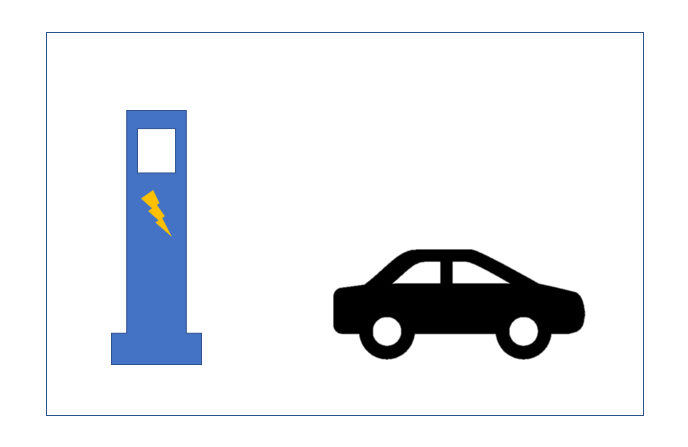
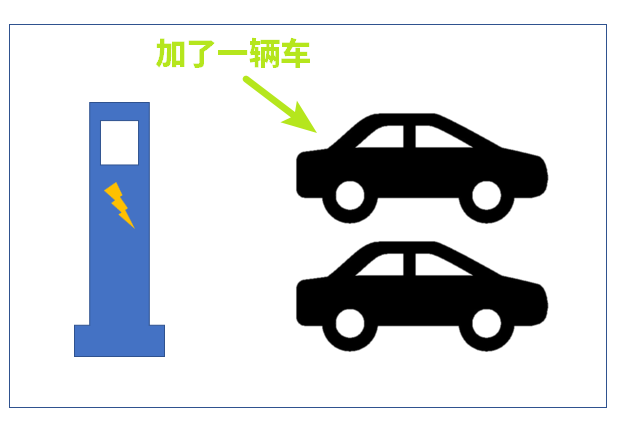

# 1 可扩展的格式

继承自 glTF 的可扩展性，3dTiles 在定义上也留下了可扩展的余地。包括但不局限于：优化几何数据的存储，扩展属性数据等。

# 2 官方当前的两种扩展

- 层级属性
- 点云的 draco 压缩

下面，将简单介绍这两个扩展。

# 3 以 “b3dm 类型的瓦片属性信息” 引入

> b3dm 瓦片的属性信息写在批次表（batchtable） 中。b3dm 中每个独立的模型，叫做 `batch`，（等价于要素表中的要素）这个概念引申自图形编程，意思是“一次性向图形处理器（GPU）发送的数据”，即批次。一个 b3dm 瓦片有多少个 `batch`（有多少个要素），是由要素表的 JSON 表头中的 `BATCH_LENGTH` 属性记录的。
>
> 而批次表（batchtable）的每个属性数据长度，都与这个 `BATCH_LENGTH` 相等。

以上是 03 篇与 04 篇的回顾。

批次表记录属性数据是有缺陷的。

- 第一，对字符串、布尔值等非数字型数据的支持较差，只能记录在批次表JSON头，二进制体无法记录非数字型数据；
- 第二，也就是此扩展重点解决的问题，当 `batch` 之间存在逻辑分层、从属关系时，如何记录它们的层级属性数据的问题

## 3.1 区分每一个顶点是谁

> 此小节需要对 glTF 格式规范比较熟悉。知道“顶点属性”的概念，知道 WebGL 的帧缓存技术。

b3dm 瓦片内置的 glTF 模型中，每个 primitive 的 attribute，也即顶点属性中会加上一个新的属性，与 `POSITION`、`UV0` 等并列，叫做 `_BATCHID`。

这样，通过 `_BATCHID`，使用 WebGL 中的帧缓存技术，在 FBO 上绘制 `_BATCHID` 的颜色附件，即可完成快速查询。

要素表通过 BATCH_ID 访问 批次表里的属性数据，几何数据（glTF 中的 vertex）通过 _BATCHID 绑定要素。


## 3.2 不同模型要素有不同的属性怎么办

假设有这么一块空间范围，归属在 `0.b3dm` 瓦片内，瓦片的 glTF 模型拥有两个 `BATCH`，即两个要素，为了方便观察，不妨具象化：

- 空间范围 = 一个**停车场**

- BATCH1 = **充电桩**

- BATCH2 = **电动汽车**

如下图所示：



现在，我用一个简单的 JSON 来描述这两个要素的属性数据：

``` json
{
  "Charger": {
    "Price": 0.5,
    "DeviceId": "abcdefg123"
  },
  "Car": {
    "Brand": "Tesla",
    "Owner": "Jacky"
  }
}
```

这样的数据不符合原生批次表的存储逻辑，即每个 `batch` 的属性名称应完全一致。

显然，充电桩的 Price（就是单价）、DeviceId 和车子的 Brand（品牌）、Owner 并不是一样的。

如果用这个扩展来表示，在批次表的 JSON 中将会是：

``` JSON
{
  "extensions": {
    "3DTILES_batch_table_hierarchy": {
      // ...
    }
  }
}
```

映入眼帘的是 `extensions`，它是一个 JSON，下面有一个 `3DTILES_batch_table_hierarchy` 的属性，其值也是一个 JSON：

```json
{
	"classes": [
    { /* ... */ },
    { /* ... */ }
  ],
  "instancesLength": 2,
  "classIds": [0, 1]
}
```

其中，`classes` 是描述每个分类的数组，这里有充电桩类、电动汽车类，详细展开电动汽车类：

``` json
[
  { /* 电动汽车类，略 */ },
  {
    "name": "Car",
    "length": 1,
    "instances": {
      "Brand": ["Tesla"],
      "Owner": ["Jacky"]
    }
  }
]
```

每个 `class` 就记录了该类别下，所有模型要素的属性值（此处是 Brand 和 Owner），以及有多少个模型要素（length 值，此处是 length = 1 辆车）。

> 扩展：如果这个 b3dm 又多增加了一个电动汽车，那么这个 JSON 就应该变成下面的样子了

``` json
{
  "name": "Car",
  "length": 2, // <- 变成 2
  "instances": {
    "Brand": ["Tesla", "Benz"], // <- 加一个值
    "Owner": ["Jacky", "Granger"] // <- 加一个值
  }
}
```

图示：



### 3.2.1 属性：3DTILES_batch_table_hierarchy.classes

`classes` 代表此 b3dm 内有多少个模型种类，这里有充电桩、汽车两类。

### 3.2.2 属性：3DTILES_batch_table_hierarchy.instancesLength

`instancesLength` 代表所有模型种类的数量和，这里每个种类都只有 1 个 batch（要素），加起来就是 2

`instancesLength` 和 b3dm 中要素表的 `BATCH_LENGTH` 并不是相等的。

当且仅当模型之间不构成逻辑层级时，这两个数字才相等。显然，此例中的 “充电桩”和“电动汽车”不构成逻辑分层、从属关系。

有关这一条，在 3.3 小节中的层级关系会详细展开。

### 3.2.3 属性：3DTILES_batch_table_hierarchy.classIds

`classIds` 是一个 classId 数组，每个数组元素代表每个 batch 的 **分类 id**，若两个 batch 是 `classes` 数组中的某个 class，那么它俩的 classId 是一样的。

这个数组去重后的 id 数量，就等于 `classes` 数组的长度。

例如，`classIds: [0,0,0, 1,1]`，有 0、1 两个 classId，那么 `classes` 数组的长度就应该是 2.

## 3.3 虚要素：由多个实际的要素构成的属性

现在，换一个场景，假设有一块空间，上面有墙模型要素、窗模型要素、门模型要素、屋顶模型、楼板模型要素共 5 类，每个分类有 1、2、1、1、1 个模型要素，即

- 1个墙模型要素
- 2个窗模型要素
- 1个门模型要素
- 1个屋顶模型要素
- 1个楼板模型要素

通过 3.2，很快得到扩展 JSON：

```json
{
  "classes": [ /* 5个分类对象 */ 
    { "name": "Wall", /* length 和 intances 属性值略 */ },
    { "name": "Window", /* length 和 intances 属性值略 */ },
    { "name": "Door", /* length 和 intances 属性值略 */ },
    { "name": "Roof", /* length 和 intances 属性值略 */ },
    { "name": "Floor", /* length 和 intances 属性值略 */ },
  ],
  "instancesLength": 6,
  "classIds": [0,1,1,2,3,4]
}
```

显然，这 6 个模型要素可以构成一个屋子，此时，这 6 个模型要素并无逻辑信息写在 JSON 中。

那么，现在可以新增一个 `class`：

``` json
{
  "classes": [
    /* 同上，省略 5 个分类对象 */
    {
      "name": "House",
      "length": 1,
      "instances": {
        "HouseArea": [48.94]
      }
    }
  ],
  "instancesLength": 7, // <- 注意，变成 7 了
  "classIds": [0,1,1,2,3,4, 5] // <- 注意，多了个 Id
}
```

这个新增的 `House` class，它在 glTF 中并没有对应的一个图形数据，但是它确确实实就是存在的，由上面 6 个模型要素构成，且有它自己的属性：HouseArea，房屋面积，其值是 48.94 平方米。

同时，因虚构出来一个模型要素，`instancesLength` 不得不加一个，且 `classIds` 也加了一个。

由此，不妨修改一下 `instancesLength` 的定义：**`classes` 中各个 class 的 length 之和。**

> 提问，此时要素表的 BATCH_LENGTH 与 instancesLength 一样吗？

### 表示从属关系：属性 3DTILES_batch_table_hierarchy.parentIds

为了表示 House 类与其他 5 类的关系，新增一个属性与 `classes`、`instancesLength`、`classIds` 并列：

``` json
{
  /* 3DTILES_batch_table_hierarchy 三个属性 classes、instancesLength、classIds，略前两个 */
  "classIds": [0,1,1,2,3,4, 5],
  "parentIds": [6,6,6,6,6,6, 6]
}
```

`parentId` 是什么呢？

重复一下 3.3 的假设，一共 6 个实体模型要素：1个墙模型要素、2个窗模型要素、1个门模型要素、1个屋顶模型要素、1个楼板模型要素

那么，索引从 0 开始计算，第 2 个是窗模型要素，其 `classId` 是 `classIds[2] = 1`，其 `parentId = parentIds[2] = 6`。

现在，得到它的 `parentId` 是 6，从 `classes` 中的 class 挨个往下找，终于在 House 这个 class 找到了第 6 个模型要素（因为 0~5 被前 5 个 class 包了）。

> 结论
>
> parentId 是 classes 中记录的所有模型要素的 **顺序序号**，包括实体的模型要素，以及在本小节中提到的虚要素，即 House。

读者应该注意到了，如果自身已经没有 parent 了，即它已经是这个 b3dm 中逻辑层级最高的要素模型了，它的 parentId 就是它在 classes 中的顺序号本身。

## 优缺点

优点：强大的可扩展性，理论上可以无限层级嵌套虚拟的要素属性，十分适合 BIM 数据的构造。

缺点：不易读写，不适合 b3dm 的增减。难以修改。

# 4 再看 “pnts 瓦片的几何压缩” 扩展

和 glTF 的 顶点属性可以被 Google Draco 压缩工具压缩一样，点云瓦片也支持了此压缩工具，极大地降低了点云瓦片的体积。

## pnts 中 **要素表** 的数据压缩

这个瓦片比起上面那个就简单多了，它位于 pnts 瓦片的 要素表JSON头中：

```json
{
 	"POINTS_LENGTH": 20, // <- pnts 中有多少个点，这里有 20 个点
  /* 其他 pnts 要素表属性，略 */
  "extensions": {
    "3DTILES_draco_point_compression": {
      "properties": {
        "POSITION": 0,
        "RGB": 1,
        "BATCH_ID": 2
      },
      "byteOffset": 0,
      "byteLength": 100
    }
  }
}
```

它指示了 pnts 瓦片的 `POSITION`、`RGB`、`BATCH_ID` 三个数据位于要素表二进制块中，从第 0 个字节开始计，长度为 100 个字节。读取出来，把这 100 个字节二进制数据交给 Draco 解码器，就能解码出来这 20 个点的对应数据。

目前，这个扩展功能仅支持压缩 pnts 瓦片要素表中的 `"POSITION"`，`"RGBA"`，`"RGB"`，`"NORMAL"` 和`"BATCH_ID"` 数据。

被压缩的数据，例如这里的 `POSITION`、`RGB`、`BATCH_ID`，它们的 `byteLength` 值一律为 0（原本是指的要素表二进制数据块的字节起始偏移量）。

## pnts 中 **批次表** 的属性信息压缩

Draco 压缩工具能压缩的数据类型是数字。所以，批次表中的数据，也可以被压缩。

假设，某 pnts 瓦片的批次表记录了 `Intensity`、`Classification` 两个点云的属性信息，它的批次表 JSON 如下所示：

``` json
{
  "Intensity": {
    "byteOffset": 0,
    "type": "SCALAR",
    "componentType": "UNSIGNED_BYTE"
  },
  "Classification": {
    "byteOffset": 0,
    "type": "SCALAR",
    "componentType": "UNSIGNED_BYTE"
  }
}
```

显然，两个属性信息都是标量，数字类型均为无符号的字节。那么，使用了 Draco 压缩之后，批次表的 `extensions` 应写为：

``` json
{
  "Intensity": { /* 略，见上 */ },
  "Classification": { /* 略，见上 */ },
  "extensions": {
    "3DTILES_draco_point_compression": {
      "properties": {
        "Intensity": 3,
        "Classification": 4
      }
    }
  }
}
```

### 注意

pnts 批次表的 3DTILES_draco_point_compression 扩展只需要 `properties` 属性即可，不需要 byteLength 和 byteOffset。

究其原因，Cesium 团队是将批次表二进制数据一并压缩进了要素表二进制块内，而且会把所有被压缩的属性，不管是 要素表，还是批次表，的 byteOffset 均归零。

回顾 pnts 瓦片的规范，若 pnts 瓦片内的点要进行 batch 分类，那么其分类信息在要素表中就记录得够详细了，全局的 `BATCH_LENGTH`、逐点的 `BATCH_ID` 足够将未压缩的批次表属性信息访问出来。

# 5 即将到来的大变动

- 隐式瓦片
- glTF 瓦片
- 元数据
- ...

精力有限，以后有可能的话专门出一个专题讲解更新中的扩展项。

# 6 再谈 extensions 和 extras

某个 extensions 用到的具体数据，如果不方便写在 extensions 的 JSON 中，可以挂在 extras 中。