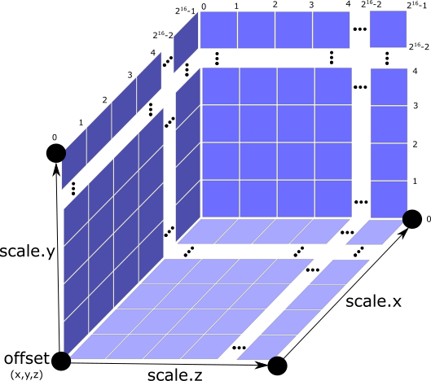

# 数据布局

仍然是28byte头部+body。但是只有要素表，批量表可选，没有glb。

所以重点应为要素表。

在pnts中，每个点都是一个要素。每个点由位置和用于定义其外观的可选属性（例如颜色和法线）以及定义应用程序特定元数据的可选属性来定义。

## 数据头

数据头和b3dm一样，只不过magic属性的值是"pnts"。

## 数据体-要素表

要素表决定了pnts瓦片文件和其中每个点渲染所需的信息。

决定pnts的叫做全局属性，针对整个瓦片文件而言。

决定每个点的叫点属性，针对某个点而言。

### 预定义

- 点属性

    | 属性名             | 数据类型                  | 描述                                   | 是否必须               |
    | ------------------ | ------------------------- | -------------------------------------- | ---------------------- |
    | POSITION           | float32 * 3               | 直角坐标的点                           | 是，除非下面的属性存在 |
    | POSITION_QUANTIZED | uint16 * 3                | 量化的直角坐标点                       | 是，除非上面的属性存在 |
    | RGBA               | uint8 * 4                 | 四通道颜色                             |                        |
    | RGB                | uint8 * 3                 | RGB颜色                                | /                      |
    | RGB565             | uint16                    | 有损压缩颜色，红5绿6蓝5，即65536种颜色 | /                      |
    | NORMAL             | float32 *3                | 法线                                   | /                      |
    | NORMAL_OCT16P      | uint8 * 2                 | 点的法线，10进制单位向量，有16bit精度  | /                      |
    | BATCH_ID           | uint8/uint16(默认)/uint32 | 从BatchTable种检索元数据的id           | /                      |

- 全局属性

    | 属性名                  | 数据类型    | 描述                                                         | 是否必须                         |
    | ----------------------- | ----------- | ------------------------------------------------------------ | -------------------------------- |
    | POINTS_LENGTH           | uint32      | 瓦片中点的数量。所有的点属性的长度必须与这个一样。           | 是                               |
    | RTC_CENTER              | float32 * 3 | 如果所有点是相对于某个点定位的，那么这个属性就是这个相对的点的坐标。 | /                                |
    | QUANTIZED_VOLUME_OFFSET | float32 * 3 | 量化偏移值（不知道是什么）                                   | 与下面的属性必须同时存在         |
    | QUANTIZED_VOLUME_SCALE  | float32 * 3 | 量化缩放比例（不知道是什么）                                 | 与上面的属性必须同时存在         |
    | CONSTANT_RGBA           | uint8 * 4   | 为所有点定义同一个颜色                                       | /                                |
    | BATCH_LENGTH            | uint32      | BATCH_ID的个数                                               | 与点属性中的BATCH_ID必须同时存在 |

### 位置属性

`POSITION`定义了每个点在经过转换前的位置。

RTC_CENTER和POSITION的含义就不说了，主要讲一下Quantized Positions（量化坐标）：

- 量化坐标

    如果`POSITION`属性没有定义，那么坐标信息就存在`POSITION_QUANTIZED`属性中，它定义了相对于量化空间（Quantized Volume）的点坐标。如果`POSITION`和`POSITION_QUANTIZED`都没有定义，那么这个瓦片就没有渲染的必要了。

    量化空间（Quantized Volume）由偏移量（offset）和缩放比（scale）定义，在它定义的框架下的坐标，可以映射到原始局部坐标。下图展示了一个例子：

    

    偏移量（offset）和缩放比（scale）存在全局属性`QUANTIZED_VOLUME_OFFSET`和`QUANTIZED_VOLUME_SCALE`中。如果这两个全局属性没有定义，那么点属性`POSITION_QUANTIZED`就不能用了。

    对于上面这个图，原始局部坐标可以通过以下公式进行运算，设

    POSITION：$\vec{P} =(x, y, z)$

    POSITION_QUANTIZED：$\vec{P_Q}=(m, n, p)$

    QUANTIZED_VOLUME_SCALE = S

    QUANTIZED_VOLUME_OFFSET = O

    现在，这个量化空间（Quantized Volume）的xyz分别被切割成 $2^{16}=65536$ 块，那么：
    $$
    \vec{P} = \vec{P_Q} · S / 65535.0 + O
    $$

### 颜色

如果定义了很多种颜色类型的颜色，那么渲染的顺序是：

`RGBA`>`RGB`>`RGB565`>`CONSTANT_RGBA`。

当然，可以使用3dTiles的style来改变样式。

### 点法线

每个点都可以有法线，但是这个是可选的，有法线可以显著提高可视化的质量。当然，法线也要通过瓦片数据集的转换矩阵的逆矩阵进行转换。

- 八进制编码法向量

    [*A Survey of Efficient Representations of Independent Unit Vectors*](http://jcgt.org/published/0003/02/01/)

    八进制编码，将值存储到无符号、未归一化的[0,255]区间内。在程序运行时，把值映射到[-1,1]的区间内。

### 点云的分类——批量点

我们知道点云是一些有颜色的无序点，但是如何用点云表达一个实体呢？例如一个门，一个窗什么的。

这就需要把点云分类了，分出来的一类点，在3dtiles中就叫“批量点”，每一类批量点都有一个BATCH_ID。例如构成门的点都有一个相同的BATCH_ID，构成窗的点则由另一个BATCH_ID构成。

这个存储BATCH_ID的分类法，对于3dtiles的样式声明很有用。比如，拿来统计数据或者拣选。

`BATCH_ID`存储在（），它的`componentTypes`是`UNSIGNED_BYTE`，`UNSIGNED_SHORT`，`UNSIGNED_INT`，默认使用第二个（如果未指定componentType）。

在点云瓦片中，一类BATCH就相当于一个B3dm中的要素（或模型），其实在B3dm中一个模型（或要素）也可以称作一个BATCH。

所以，在点云瓦片中，`BATCH_LENGTH`就是`BATCH_ID`的个数，例如有BATCH_ID的数组如下：

```js
BATCH_ID: [0,0,1,1] // 代表前2个点的id都是0，后两个点的id都是1
```

那么此时BATCH_LENGTH的值就是2，而不是4.

## 示例

### ① 只有坐标

记录了4个单位长度为边长的正方形的四个角点：

```JS
const featureTableJSON = {
    POINTS_LENGTH : 4, // 意味着有4个点
    POSITION : {
        byteOffset : 0 // 意味着从ftBinary的第0个byte开始读取
    }
}

const featureTableBinary = new Buffer(new Float32Array([
    0.0, 0.0, 0.0,
    1.0, 0.0, 0.0,
    0.0, 0.0, 1.0,
    1.0, 0.0, 1.0
]).buffer)
```

### ② 有坐标有点

这个例子有4个点，是相对于中心定位的点。颜色依次为：红绿蓝黄。

```JS
const featureTableJSON = {
    POINTS_LENGTH : 4, // 意味着有4个点
    RTC_CENTER : [1215013.8, -4736316.7, 4081608.4], // 意味着相对于这个点
    POSITION : {
        byteOffset : 0 // 意味着从ftBinary的第0个byte开始读取
    },
    RGB : {
        byteOffset : 48 // 颜色值意味着从ftBinary的第48个byte读取，紧接在POSITION后
    }
}

const positionBinary = new Buffer(new Float32Array([
    0.0, 0.0, 0.0,
    1.0, 0.0, 0.0,
    0.0, 0.0, 1.0,
    1.0, 0.0, 1.0
]).buffer) // 一共12*4byte = 48byte

const colorBinary = new Buffer(new Uint8Array([
    255, 0, 0,
    0, 255, 0,
    0, 0, 255,
    255, 255, 0,
]).buffer) // 一共12*1byte = 12byte

// ftBinary一共48+12=60byte
const featureTableBinary = Buffer.concat([positionBinary, colorBinary]) 
```

### ③ 量化坐标与八进制编码法向量

这个例子中，有4个点，每个点的法向量都是八进制编码的$[0.0, 1.0, 0.0]$，它们将被放置在x和z方向上.

```JS
const featureTableJSON = {
    POINTS_LENGTH : 4, // 意味着有4个点
    QUANTIZED_VOLUME_OFFSET : [-250.0, 0.0, -250.0], // 意味着区间偏移量在x和z轴上
    QUANTIZED_VOLUME_SCALE : [500.0, 0.0, 500.0], // 意味着x和z方向的缩放比是500
    POSITION_QUANTIZED : { 
        byteOffset : 0 // 意味着量化坐标的数据存在ftBinary的第0个字节往后
    },
    NORMAL_OCT16P : {
        byteOffset : 24 // 意味着量化坐标顶点法线的数据存在ftBinary的第24个字节往后
    }
}

const positionQuantizedBinary = new Buffer(new Uint16Array([
    0, 0, 0,
    65535, 0, 0,
    0, 0, 65535,
    65535, 0, 65535
]).buffer) // 一共12*2byte=24byte，Uint16=16bit=2byte

const normalOct16PBinary = new Buffer(new Uint8Array([
    128, 255,
    128, 255,
    128, 255,
    128, 255
]).buffer) // 一共8*1=8byte，Uint8=8bit=1byte

const featureTableBinary = Buffer.concat([positionQuantizedBinary, normalOct16PBinary])
```

### ④ 批量点

这个例子中，前2个点的`batchId`是0，后2个点的`batchId`是1，注意到这个批量表只有两个名称：

```js
const featureTableJSON = {
    POINTS_LENGTH : 4, // 意味着有4个点
    BATCH_LENGTH : 2, // 意味着有2个类别（batch）
    POSITION : {
        byteOffset : 0 // 意味着POSITION将存储在ftBinary的第0byte之后
    },
    BATCH_ID : {
        byteOffset : 48, // 意味着BATCH_ID的值将从ftBinary的第48byte之后
        componentType : "UNSIGNED_BYTE" // 意味着BATCH_ID的值类型是无符号字节数
    }
}

const positionBinary = new Buffer(new Float32Array([
    0.0, 0.0, 0.0,
    1.0, 0.0, 0.0,
    0.0, 0.0, 1.0,
    1.0, 0.0, 1.0
]).buffer) // 4个点，一共12个值，每个值4byte（Float每个数字占4byte，即32bit），一共48byte

const batchIdBinary = new Buffer(new Uint8Array([
    0,
    0,
    1,
    1
]).buffer) // 前2个的类型是0（batchId），后2个点的类型是1

const featureTableBinary = Buffer.concat([positionBinary, batchIdBinary]); // 合并

const batchTableJSON = {
    names : ['object1', 'object2']
}	// btJSON记录的是每个类型（每个batch）对应的属性数据
```

### ⑤每个点的属性

这个例子中，每4个点的元数据将存储在批量表中。

```JS
const featureTableJSON = {
    POINTS_LENGTH : 4, // 意味着有4个点
    POSITION : {
        byteOffset : 0 // 意味着从ftBinary的第0byte开始
    }
}

const featureTableBinary = new Buffer(new Float32Array([
    0.0, 0.0, 0.0,
    1.0, 0.0, 0.0,
    0.0, 0.0, 1.0,
    1.0, 0.0, 1.0
]).buffer)

const batchTableJSON = {
    names : ['point1', 'point2', 'point3', 'point4'] // 意味着这4个点都有names属性，其值写在这里
}
```

# 批量表

见上面例子。批量表存的就是每个"BATCH"的属性数据。

# 扩展（extensions）

[3DTILES_draco_point_compression](https://github.com/CesiumGS/3d-tiles/blob/master/extensions/3DTILES_draco_point_compression)

# 文件扩展名和MIME

略

# 实现样例

[`PointCloud3DModelTileContent.js`](https://github.com/CesiumGS/cesium/blob/master/Source/Scene/PointCloud3DTileContent.js)

# 属性参考

略。