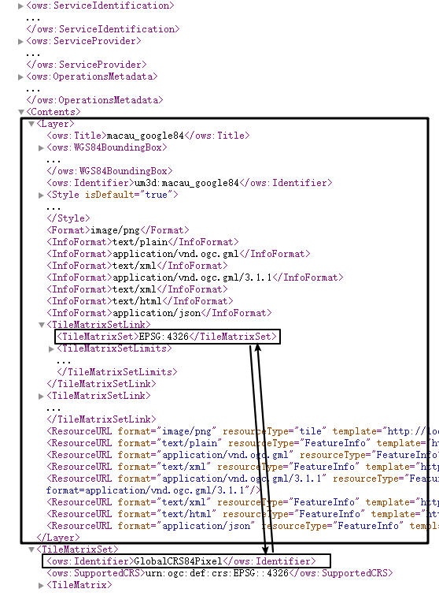

# 1. WMS

使用 `WebMapServiceImageryProvider`

``` js
const wmsProvider = new Cesium.WebMapServiceImageryProvider({
  url: `http://my.gis.host/geoserver/wms`,
  layers: 'cesium:18',
  parameters: {
    service : 'WMS',
    format: 'image/png',
    transparent: true
  }
})

viewer.imageryLayers.addImageryProvider(wmsProvider);
```

geoserver 通常使用结尾至 `wms` 的 url 来提供对所有 wms 图层的访问服务。

参数

- layers：字符串，格式是 "<工作区>:<图层标题>"，可以直接从 geoserver 后台管理页面的 LayerPreview 的  Name 列复制出来。（留个疑问，不知道一个 provider 支不支持多个图层）
- url：wms服务器地址
- tileWidth/tileHeight：单个瓦片的像素宽高，默认是 256像素
- ellipsoid：椭球。若指定了 `tilingScheme` 参数，那么这个参数将被忽略，直接使用切片方案的椭球。默认是 WGS84 椭球。
- minimumLevel/maximumLevel：请求的最大最小级别
- rectangle：`Rectangle` 对象，指定瓦片可见范围，避免出现请求不到的控制台报错。可复制自 geoserver 的范围框数据。单位是弧度。
- clock & times：和动态时间有关，分细一节讲
- subdomains：不知道是什么
- tilingScheme：`TilingScheme` 对象，默认是 GeographicTilingScheme 对象，决定如何分割影像
- parameters：参考 wms kv 式参数列表

## parameters

``` JS
let params = {
  service: 'WMS', // 服务类型，默认，可不指定
  version: '1.1.0', // wms 版本，默认，可不指定
  request: 'GetMap', // wms 动作，默认，可不指定
  format: 'image/png', // 返回的图片格式
  style: 'default', // 默认样式，默认，可不指定
  transparent: 'true' // 透明度
}
```

## subdomains

？需要看源代码

## clock & times

这两个必须成对存在，作用未知，得看源码。

## tilingScheme

切片方案。目前只有两种：

- WebMercatorTilingScheme
- GeographicTilingScheme

### > GeographicTilingScheme

构造参数是一个对象，有 ellipsoid、rectangle、numberOfLevelZeroTilesX、numberOfLevelZeroTilesY 四个。

它表示的是经纬度直接当作 x、y 的切片方案。

numberOfLevelZeroTilesX：x方向上，零级瓦片的序号，默认是2

numberOfLevelZeroTilesY：y方向上，零级瓦片的序号，默认是1

### > WebMercatorTilingScheme

构造参数是一个对象，有 ellipsoid、numberOfLevelZeroTilesX、numberOfLevelZeroTilesY、rectangleSouthwestInMeters、rectangleNortheastInMeters 五个。

最后两个参数是覆盖范围的两个角点坐标。

> 附 wgs84 + web墨卡托的投影范围
>
> [-20037508.3427892, 20037508.3427892]，是一个正方形

### > GeographicProjection

经纬度直接当作 x、y 的投影法则。

### > WebMercatorProjection

3857 坐标系用的投影法则。

### > Ellipsoid

使用 x、y、z 三个轴的半径长度构造一个椭球体对象。

# 2. WFS


# 3. WMTS

wmts 预切图只需在 geoserver 管理页左边 Tile Layers 中，对任意图层进行 `Seed/Truncate` 操作即可。

在 geoserver 的欢迎页面右侧，有一列服务能力，点开 WMTS 1.0.0 超链接，搜索图层名称（使用完整图层名称，即 "<工作空间>:<图层标题>"，能找到 xml 标签 `<ows:Identifier>`，找到其对应的 `<ResourceURL>`，这样就能获取 `template` 了。

这个 `template` 就是要写到代码里去的。

``` JS
const wmtsProvider = new Cesium.WebMapTileServiceImageryProvider({
  url: `你上面获取的 template`,
  layer: "规则同WMS",
  style: "规则同WMS",
  format: "image/png",
  tileMatrixSetID: "EPSG:900913"  // 不要有多余空格不要小写，或者写 EPSG:3857
})
```

以上属性除了 `format` 外均为必填。

增加 `rectangle` 属性以限制请求范围。

至于这个 `tileMatrixSetID`，参考



用 \<Layer> 下的  \<TileMatrixSetLink> 下的 \<TileMatrixSet\> 的值即可。

## 天地图

``` js
imageryProvider: new Cesium.WebMapTileServiceImageryProvider({
  url: `http://t0.tianditu.com/img_w/wmts?tk=f80321b35256f12df8e112516b6f22f5`,
  layer: 'img', // 这是影像图；地形图是 'vec'
  style: 'default',
  format: 'image/jpeg',
  tileMatrixSetID: 'w',
}),
```


# TMS

使用 TileMapServiceImageryProvider

这个就是用于预先切好散列文件用的，属于自定义模板的特化版


# 自定义模板

UrlTemplateImageryProvider

主要讲讲 Url 的各个组件

- {x} 最西是0
- {y} 最北是0
- {z} 切片方案中的层级组件。零级是四叉树金字塔的根。
- {s} 子域，克服浏览器对每台服务器并发请求的限制（分发压力？）


- {reverseX} 和 {x} 一样只不过这个是反过来的，0是最东
- {reverseY} 和 {y} 一样只不过这个是反过来的，0是最南
- {reverseZ} 和 {z} 一样只不过这个是反过来的，0是最高等级瓦片（空间分辨率最高），必须同时定义 maximumLevel。


- {westDegrees} 
- {southDegrees}
- {eastDegrees}
- {northDegrees}

上面四个是角度值的四至。


- {westProjected}
- {southProjected}
- {eastProjected}
- {northProjected}

上面四个是投影坐标系统的四至。


- {with}
- {height}

瓦片的长宽像素。

## {s} 举例

``` JS
let url = 'http://{s}.basemaps.cartocdn.com/light_all/{z}/{x}/{y}.png'
```

## 也可以自己搞 wms

``` JS
let url = `https://hostname/geoserver/ows? ... bbox={westProjected}%2C{southProjected}%2C{eastProjected}%2C{northProjected}&width=256&height=256`
```

## 自定义标记

``` js
let url = `https://yoururl/{Time}/{z}/{y}/{x}.png`

new Cesium.UrlTemplateImageryProvider({
  url : url,
  customTags : {
    Time: function(imageryProvider, x, y, level) {
      return '20171231'
    }
  }
})
```

