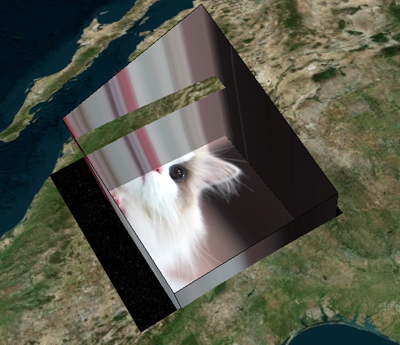
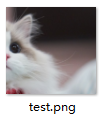

``` JS
// 初始化并启用深度测试
var viewer = new Cesium.Viewer("cesiumContainer");
viewer.scene.globe.depthTestAgainstTerrain = true;

// 创建任意高度点的polygon并设置 负挤出高度
// 官网例子抄的，改了一些参数
var orangePolygon = viewer.entities.add({
  name: "Orange polygon with per-position heights and outline",
  polygon: {
    hierarchy: Cesium.Cartesian3.fromDegreesArrayHeights([
      -108.0,      25.0,      100000,
      -100.0,      25.0,      100000,
      -100.0,      30.0,      100000,
      -108.0,      30.0,      300000,
    ]),
    // 设置负挤出，即向地心挤出
    extrudedHeight: -300000,
    perPositionHeight: true,
    outline: true,
    outlineColor: Cesium.Color.BLACK,
    // 主要是以下这三个参数
    fill: true,
    material: new Cesium.ImageMaterialProperty({image:`../images/test.png`}),
    closeTop: false,
  },
});

// 常规的裁剪功能，这个position是中心点，手工算算polygon的中心点或拿turf什么的工具算出来就行了
var position = Cesium.Cartographic.toCartesian(new Cesium.Cartographic.fromDegrees(-104, 27.5, 10));
var clippingPlaneCollection  = new Cesium.ClippingPlaneCollection({
    modelMatrix: Cesium.Transforms.eastNorthUpToFixedFrame(position),
    planes: [
      new Cesium.ClippingPlane(
        new Cesium.Cartesian3(1.0, 0.0, 0.0),
        -400000
      ),
      new Cesium.ClippingPlane(
        new Cesium.Cartesian3(-1.0, 0.0, 0.0),
        -300000
      ),
      new Cesium.ClippingPlane(
        new Cesium.Cartesian3(0.0, 1.0, 0.0),
        -300000
      ),
      new Cesium.ClippingPlane(
        new Cesium.Cartesian3(0.0, -1.0, 0.0),
        -400000
      ),
    ],
    edgeWidth: 0.0,
    edgeColor: Cesium.Color.WHITE,
});

viewer.scene.globe.clippingPlanes = clippingPlaneCollection;
viewer.zoomTo(orangePolygon); 
```


主要是 polygon 和 clippingPlanes 的裁剪距离的适配问题。

效果图（差点意思，有兴趣的可以自己调节）：



使用的图片：

