# 1. 简介

*Fabric* 是 Cesium 中用于描述材质的一种 JSON 规定。

材质表现了多边形、折线、椭圆等形状的外观。

使用 Fabric 和 GLSL，可以完全自定义材质。

通过几何对象的 `material` 属性可以创建材质，这个属性是 `Cesium.Material` 对象。

可以这么用：

``` JS
// 假设 polygon 是一个 primitive
polygon.appearance.material = Cesium.Material.fromType('color');
```

这就创建了一个只有颜色的材质，包括透明度的颜色。`Cesium.Material.fromType()` 方法是一个简写，完整的写法是：

``` JS
polygon.appearance.material = new Cesium.Material({
  fabric: {
    type: 'Color' // 大写
  }
})
```

每一个 Material 都可以有 0 ~ N 个 uniform，这个参数在创建时指定，也可以在渲染后修改。例如，color 类型的 Material 就有格式为 rgba 的颜色 uniform：

``` JS
polygon.appearance.material = new Cesium.Material({
  fabric: {
    type: 'Color',
    uniforms: {
      color: new Cesium.Color(1.0, 0.0, 0.0, 0.5)
    }
  }
})

// 修改颜色
polygon.appearance.material.uniforms.color = Cesium.Color.WHITE
```

# 2. 内置材质（共23种，ver1.75）

Cesium 有几个内置的材质。列举两个比较常用的：

| 材质类型        | 截图                          | 描述                         |
| --------------- | ----------------------------- | ---------------------------- |
| `type: 'Color'` | 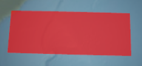 | 一个简单的颜色，包括透明通道 |
| `type: 'Image'` |  | jpg 或 png 贴图类型的材质    |

所有的内置材质可以简单地使用 `Cesium.Material.fromType()` 方法创建：

``` JS
polygon.appearance.material = Cesium.Material.fromType('Image')
polygon.appearance.material.uniforms.image = 'image.png'
```

或者用全写法：

``` JS
polygon.appearance.material = new Cesium.Material({
  fabric: {
    type: 'Image',
    uniforms: {
      image: 'image.png'
    }
  }
})
```

从这儿开始，介绍因这个 fabric 对象中的 `type` 不同的十几种内置纹理，2.1~2.5

## 2.1. 机器生成的规律纹理（4种）

只需指定几个参数，就可以生成一些有规律的纹理贴图，不需要依赖外部贴图文件。它们相当于漫反射+透明度的组合。

| 类型                    | 截图                                 | 描述                             |
| ----------------------- | ------------------------------------ | -------------------------------- |
| `type: 'Checkerboard' ` | 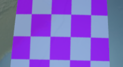 | 国际象棋格子                     |
| `type: 'Stripe' `       | 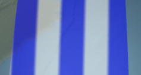       | 竖条纹旗帜                       |
| `type: 'Dot' `          | 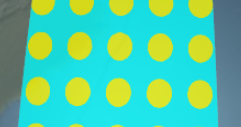          | 行列点阵                         |
| `type: 'Grid' `         |          | 线状网格，显示一些网状结构的图形 |

## 2.2. 基础材质（6种）

基础材料表达的是各个材质因子表示的材料特征，例如镜面反射强度、自发光。通常，组合在一个 fabric 对象中创建复杂的材质。

> 注：如果不懂这些东西，可以请教技术美工。

| 类型                   | 截图                                | 描述                                            |
| ---------------------- | ----------------------------------- | ----------------------------------------------- |
| `type: 'DiffuseMap' `  | 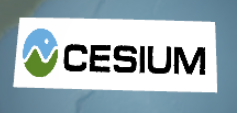  | 漫反射贴图，即最常见的贴图，通常是 rgb 三个颜色 |
| `type: 'SpecularMap' ` | 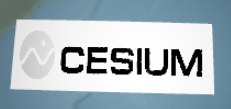 | 单通道贴图，表示的是入射光强度贴图              |
| `type: 'AlphaMap' `    | 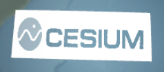    | 单通道的不透明度贴图                            |
| `type: 'NormalMap' `   |    | 三通道贴图，表示的是法线贴图                    |
| `type: 'BumpMap' `     | 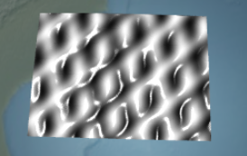     | 单通道的凹凸贴图                                |
| `type: 'EmissionMap' ` | 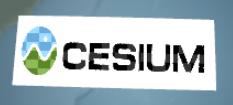 | 三通道的自发光贴图                              |

## 2.3. 折线材质（3种）

折线材质只作用于折线图形。

| 类型                       | 截图                                    | 描述                   |
| -------------------------- | --------------------------------------- | ---------------------- |
| `type: 'PolylineArrow' `   | 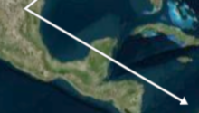   | 箭头线，终点在折线末端 |
| `type: 'PolylineGlow' `    | 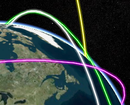    | 发光线                 |
| `type: 'PolylineOutline' ` | 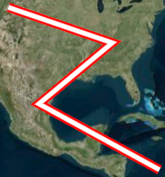 | 描边线                 |

## 2.4. Misc 材质（2种）

还有一些材质不属于上面的分类，例如：

| 类型                   | 截图                                | 描述                       |
| ---------------------- | ----------------------------------- | -------------------------- |
| `type: 'Water' `       |        | 水面贴图，看起来有水波动效 |
| `type: 'RimLighting' ` |  | 边缘会比较亮               |

## 2.5. 公共 uniforms

许多材质是有 `image` 的，可能是一个 base64 编码的字符串或文件路径：

``` JS
polygon.appearance.material.uniforms.image = 'image.png';
polygon.appearance.material.uniforms.image = '';
```

有的材质要求贴图有三个颜色分量，而其他材料（如高光和透明贴图）的贴图只需要一个颜色分量。

可以指定贴图的通道。例如，镜面反射的材质中，镜面反射默认取贴图的自 r 颜色通道，但是可以修改它为 a 通道：

``` JS
polygon.appearance.material = new Cesium.Material({
  fabric : {
    type : 'SpecularMap',
    uniforms : {
      image : 'specular.png',
      channel : 'a'
    }
  }
});
```

这意味着，允许把各种贴图集中到一个贴图文件种，然后使用不同的通道即可，减少加载请求次数。

有些材质的贴图纹理可以重复多次绘制，例如水平或垂直上的重复：

``` JS
polygon.appearance.material = new Cesium.Material({
  fabric: {
    type: 'DiffuseMap',
    uniforms: {
      image: 'diffuse.png',
      repeat: {
        x: 10,
        y: 2
      }
    }
  }
})
```

# 3. 创建新材质

使用 fabric 对象 + GLSL 代码和其他素材，就可以创建材质。

如果一个材质不想被复用，那么就不要指定它的 `type` 属性。

``` JS
let fabric = {
  // ...
}

polygon.appearance.material = new Cesium.Material({
  fabric: fabric
})
```

当 fabric 对象中的 `type` 属性之前是没有指定过的，那么在第一次调用 `new Cesium.Material()` 时，这个新的 fabric 材质将被缓存，随后再次 new Material 或 Material.fromType() 时将从缓存中取用。

``` JS
let fabric = {
   type : 'MyNewMaterial',
   // ...其他 fabric JSON 的属性
}
polygon.appearance.material = new Cesium.Material({
  fabric : fabric
});
// ... 然后在另一处需要这个 fabric
anotherPolygon..appearance.material = Material.fromType('MyNewMaterial');
```


## 3.1. 组件

白色的漫反射材质或许是最常用的：

``` JS
let fabric = {
  components: {
    diffuse: 'vec3(1.0)'
  }
}
```

稍微复杂一些，加一点镜面反射，使得正射视角看反光最强，侧面变弱：

``` JS
let fabric = {
  components : {
    diffuse : 'vec3(0.5)',
    specular : '0.1'
  }
}
```

`components` 属性包含了 fabric 所定义的材质的各种子因素。每个子因素均使用简短的  glsl 代码字符串表示，因此上面写的 `vec(0.5)` 就表示 rgb 均为 0.5 的一种颜色。这个简单的 glsl 代码可以使用所有 glsl 内置的函数，例如 mix、cos、texture2D 等。`components` 可以定义 6 个属性：

| 名称        | 默认值        | 描述                                             |
| ----------- | ------------- | ------------------------------------------------ |
| `diffuse`   | `'vec3(0.0)'` | 漫反射颜色，即物体的基本颜色                     |
| `specular`  | `'0.0'`       | 镜面反射，定义的是单方向反射光强度               |
| `shininess` | `'1.0'`       | 镜面反射的清晰度，这个值越大会出现更小的高光光斑 |
| `normal`    |               | 法线，默认无法线                                 |
| `emission`  | `'vec3(0.0)'` | 自发光，默认不发光                               |
| `alpha`     | `'1.0'`       | 不透明度，0.0 是完全透明，1.0 是不透明。         |


## 3.2. 源代码

`components` 还有一个更强大而灵活的选择是 glsl 源代码，通过 glsl 的方式修改材质。这个途径将设置的 glsl 代码传递到 `czm_getMaterial` 函数，这个函数执行后返回材质的 components：

``` glsl
struct czm_materialInput
{
  float s;
  vec2 st;
  vec3 str;
  mat3 tangentToEyeMatrix;
  vec3 positionToEyeEC;
  vec3 normalEC;
};

struct czm_material
{
  vec3 diffuse;
  float specular;
  float shininess;
  vec3 normal;
  vec3 emission;
  float alpha;
};

czm_material czm_getMaterial(czm_materialInput materialInput);
```

默认情况下，材质的默认值会被返回：

``` GLSL
czm_material czm_getMaterial(czm_materialInput materialInput)
{
    return czm_getDefaultMaterial(materialInput);
}
```

这个时候的 fabric 对象是：

``` js
let fabric = {
  components: {
    source: `czm_material czm_getMaterial(czm_materialInput materialInput) { return czm_getDefaultMaterial(materialInput); }`
  }
}
```

上面修改了漫反射和镜面反射的例子可以通过 glsl 改写为：

``` JS
let fabric = {
  source: 
  `czm_material czm_getMaterial(czm_materialInput materialInput)
   {
  	 czm_material m = czm_getDefaultMaterial(materialInput);
  	 m.diffuse = vec3(0.5);
  	 m.specular = 0.5;
  	 return m;
   }`
}
```

使用 glsl 代替 components 虽然看起来代码比较冗长，但是提供了灵活性。

如果不是有特别的需求，使用 components 属性指定材质的各种因子就可以了。但是，不管是哪一种，在这些 glsl 代码中，都是可以直接使用 glsl 的内置函数和 Cesium 预定义的 函数、结构体、常量的。

## 3.3. 输入

`materialInput` 变量在 source 和 components 中均可以使用，在 glsl 代码的定义中，这个变量是 `czm_materialInput ` 结构体有如下字段：

| 名称                 | 类型    | 描述                                                         |
| -------------------- | ------- | ------------------------------------------------------------ |
| `s`                  | `float` | 一维纹理坐标                                                 |
| `st`                 | `vec2`  | 二维纹理坐标                                                 |
| `str`                | `vec3`  | 三维纹理坐标，三维纹理的二维部分不一定就是二维纹理坐标，切记。例如，在一个椭球几何中，s可能就是从下到上，st可能是经纬度，str三维纹理就是包围盒的三轴方向。 |
| `tangentToEyeMatrix` | `mat3`  | 用于法线贴图、凹凸贴图的转换矩阵，转换切线空间坐标到视图坐标 |
| `positionToEyeEC`    | `vec3`  | 从 fragment 到 视图空间坐标的向量（不知道这个 fragment 说的是什么），用于反射和折射等。向量的长度是 fragment 到视图（相机）的距离。 |
| `normalEC`           | `vec3`  | fragment 在视图坐标中的法线（已归一化），作用于凹凸贴图、反射、折射等 |

例如可以这么设置来可视化纹理坐标：

``` JS
let fabric = {
  components: {
    diffuse: 'vec3(materialInput.st, 0.0)'
  }
}
```

一样的，可以把 diffuse 组件设置为 `materialInput.normalEC` 来可视化法线。

除了 `materialInput` 这个传入的参数，还可以访问 uniforms 中的变量。

例如，可以通过一个 color uniform 去设置 diffuse 组件和 alpha 组件，来创建自己的 Color 材质：

``` JS
let fabric = {
  type: 'MyColor',
  uniforms: {
    color: new Color(1.0, 0.0, 0.0, 1.0)
  },
  components: {
    diffuse: 'color.rgb',
    alpha: 'color.a'
  }
}
```

在 fabric 中，glsl 中的 uniform 变量、`new Cesium.Material()` 和 `Cesium.Material.fromType()` 返回的 js 对象中的 uniform 变量与 `uniforms` 属性的子属性（例如这里的 uniforms.color）具有相同的名称。

子属性的值（对于标量来说）或子属性（对于向量来说）即 uniform 的值。

> 官方这说的什么东西...

下例，通过 image uniform 来实现自定义的 DiffuseMap 材质：

``` JS
let fabric = {
  type: 'OurDiffuseMap',
  uniforms: {
    image: 'czm_defaultImage'
  },
  components: {
    diffuse: 'texture2D(image, materialInput.st).rgb'
  }
}
```

`czm_defaultImage` 是 1x1 分辨率的图片，根据上面的说法，这可以从 dataurl 或图片文件中获取，例如：

``` JS
polygon.appearance.material = Material.fromType('OurDiffuseMap');
polygon.appearance.material.uniforms.image = 'diffuse.png';
```

还有一个多维数据集的变量：`czm_defaultCubeMap`。

支持 glsl 的 uniform 类型，例如 float、vec3、mat4 等。

对于 uniform 数组还不支持，不过在规划中了。

> 译者注
>
> 这段是真够烧脑子的，不知所云。
>
> 梳理一下，在 fabric 这个对象中，uniforms 下的所有属性均被 glsl 认作是 uniform 变量，可以直接当变量使用，例如上例中的 `texture2D(image, materialInput.st)` 中的 image 参数。
>
> 在这里，规定了 image 这个 uniform 的类型是 Cesium 内置的 `czm_defaultImage` 结构体类型。

## 3.4. 复合材质

到现在为止，可以使用内置的材质或者通过指定 fabric 中的 components 属性（或直接使用 glsl 源代码）来创建材质对象。

还可以通过现有材质来创建复合类型的材质。

fabric 对象有一个 `materials` 属性，它的每一个子对象均可以是 fabric 对象，最终即一个材质对象。在 `materials` 中设置的子一级 fabric，可以在最顶级的 fabric 的 components、source 中引用。例如，现在将 DiffuseMap 材质 和 SpecularMap 材质创建一个复合材质：

``` JS
let rootFabric = {
  type: 'OurMappedPlastic',
  materials: {
    diffuseMaterial: {
      type: 'DiffuseMap' // 基本类型中的一种
    },
    specularMaterial: {
      type: 'SpecularMap'
    }
  },
  components: {
    diffuse: 'diffuseMaterial.diffuse',
    specular: 'specularMaterial.specular'
  }
}
```

这个 rootFabric 材质拥有两个组件：diffuse（漫反射）和 specular（镜面反射强度），而这两个组件的值是来自 materials 中的两个子 fabric。显然，在 `materials` 定义的两个子属性的名称，将会在 components 的 glsl 代码中被作为变量使用，直接点出 diffuse 和 specular 字段。

然后就可以像其他材质一样使用它了：

``` JS
let m = Cesium.Material.fromType('OurMappedPlastic')
polygon.appearance.material = m;

m.materials.diffuseMaterial.uniforms.image = 'diffuseMap.png';
m.materials.specularMaterial.uniforms.image = 'specularMap.png';
```


# 4. 语法规定

用了这么多 fabric 对象，其实这个 fabric 对象是有一些规定的。

在 Cesium 的官方打包包中，找到 `Documentation/Schemas/Fabric`，就是 fabric 对象的规定。诸如 `type`、`materials`、`uniforms`、`components`、`source` 这几个属性均能找到详细的定义。

# 5. 渲染流水线中的材质

从渲染的角度看，一种材质其实是一个 glsl 函数：`czm_getMaterial`。片元着色器需要构造一个 `czm_MaterialInput` 结构体变量，调用 `czm_getMaterial` 函数，然后生成 `czm_material` 结构变量，传递给照明函数来计算片元的颜色。

在 js 中，fabric 对象应该有一个 `material` 属性。当此属性发生变动时，图元的 update 函数触发，然后将 fabric 材质最终的 glsl 代码与默认的片元着色器代码合并在一起，然后再将 uniform 合并：

``` JS
const fsSource = this.material.shaderSource + ourFragmentShaderSource;
this._drawUniforms = combine([this._uniforms, this.material._uniforms]);
```

# 6. 笔者注

这篇文章较为详细地介绍了 Appearance 对象中的 fabric 属性构成。

fabric 是一个有官方规定如何写的 js 对象，它拥有 5 个属性：

- type
- materials
- source
- components
- uniforms

其中，type 用于声明 fabric 对象最终会生成什么材质，如果是官方内置的，直接用官方内置的（2.1~2.4），否则则创建自定义的材质并缓存。

materials 允许再塞进去子一级的 fabric，构成复合材质。

uniforms 是一些全局变量，例如你可以在这里写一个 `myUniformVariable`，然后你就可以在 components 或者 source 的 glsl 代码中用到这个 uniform 变量了。

source 是 glsl 源代码，它主要是对 `czm_getMaterial` 这个 Cesium 内置的 glsl 函数的实现，返回值是 `czm_material`

components 是几个基本材质因子的 glsl 代码快捷入口，是 source 的一种简略实现。

创建好 fabric 材质对象后，随之就可以创建 Appearance 对象，与几何实例一起创建 Primitive 了。