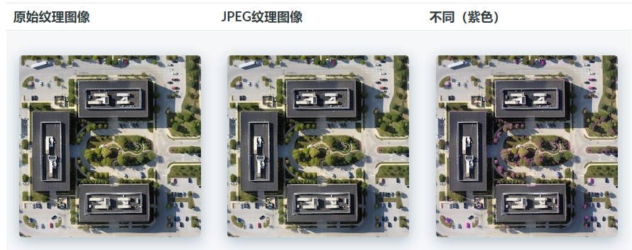

在 Cesium 1.31 中使用三个 WebGL 扩展 `WEBGL_compressed_texture_s3tc`、`WEBGL_compressed_texture_etc1`、`WEBGL_compressed_texture_pvrtc` 增加了对纹理压缩的支持。

纹理将压缩成这些格式，并常驻于 GPU 显存中，并且使用并行技术进行实时解压缩。压缩算法使用一个固定的压缩率，以至于解压缩这些随机纹理有较快的速度。为了通过 Web 传输，使用无损压缩算法（例如 gzip）进一步压缩纹理。传输的纹理大小与 jpg 图像相当。

GPU 压缩的纹理格式是有损的，意味着细节丢失。在压缩时间和压缩质量上要权衡。

不存在一种所有设备都支持的格式。大多数桌面设备支持 `WEBGL_compressed_texture_s3tc`，大多数安卓机器支持 `WEBGL_compressed_texture_etc1`，而 iOS 机器支持 `WEBGL_compressed_texture_pvrtc`。对于程序而言，必须先判断机器支持什么格式，再请求解码对应的数据。这意味着，如果要支持更多的设备，那么压缩的种类就要照顾周全。如果某种设备什么纹理压缩都不支持，那么可以使用未压缩的纹理，或者干脆使用 `WEBGL_compressed_texture_s3tc`，因为它可以转码成 RGB565 格式。

`gltf-pipeline` 工具项目已经更新了，支持了纹理压缩选项，使用 3dTiles 标准中的扩展项来引用 ktx 文件作为纹理。在本文中， 作者将探讨一些压缩格式，比较不同质量值下的压缩输出。原始图像是经典的卫星影像或 3dTiles 纹理，是 1024 x 1024 的 rgb 图片。

注意到不是所有格式都支持透明通道的，好在大多数卫星影像和 3dTiles 瓦片的纹理均不需要透明通道。传输大小为 476 KB（jpg），内存中解压缩大小为 3MB.



最右边的有紫色差异的图片是使用 `Resemble.js` 生成的。

在下表中，CRN 是使用 [crunch](https://github.com/BinomialLLC/crunch) 库输出的紧凑格式，它是一种高度压缩的有损格式，可以快速转码为 `WEBGL_compressed_texture_s3tc` 中的 DXT1 或 DXT5. 

KTX 也是一个纹理格式，`KTX + gzip` 表示使用 gzip 压缩后 KTX 格式的大小。

PSNR 是信噪比，PSNR 越高代表越接近原图像。PSNR 仅用于比较同种压缩格式的纹理图像。因此，不应将 ETC1 压缩的图像与 PVRTC 压缩的图像 的 PSNR 进行比较。

所有计算均在 Intel 至强 E5-1650 上的 Windows 10 运行。当然了，并行计算肯定能改善时间。

gltf-pipeline 使用 crunch 库 压缩为 CRN 格式、DXTn/BCn 格式（即`WEBGL_compressed_texture_s3tc` ），使用 PVRTexTool 工具压缩为 PVRTC 格式。

gltf-pipeline 使用下面的命令来压缩，为每种压缩设置压缩质量参数（即 `--texcomp.quality n`）。

``` shell
node ./bin/gltf-pipeline.js -i /path/to/gltf -o /path/to/output --texcomp.quality 9 --texcomp.format crunch-dxt1

node ./bin/gltf-pipeline.js -i /path/to/gltf -o /path/to/output --texcomp.quality 1 --texcomp.format etc1
```

# 第一种 DXT1


# 第二种 DXT5


# 第三种 ETC1


# 第四种 PVRTC 2bpp


# 第五种 PVRTC 4bpp


# 推荐建议