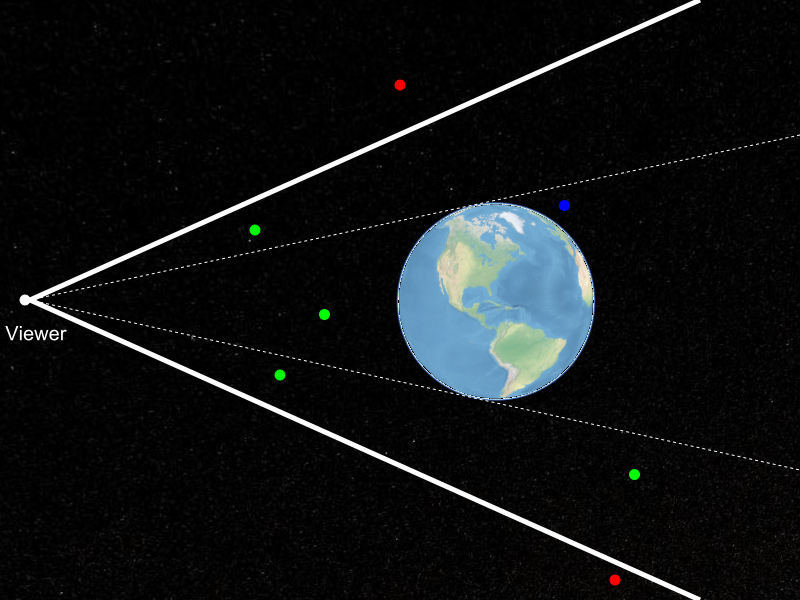

[Horizon Culling | cesium.com](https://cesium.com/blog/2013/04/25/horizon-culling/)

在开发 Cesium 程序时，需要快速确定场景中的对象什么时候不可见，从而判断它不需要渲染。

一种方法是使用视锥体平视剔除，但是还有另一种重要的剔除方法是地平线剔除。



# Horizon culling a point against a sphere


# The plane test


# The cone test


# Generalizing to an ellipsoid


# 代码

作者认为数学推导过程很重要，但是可以归结成一些简单的代码。每当摄像机位置改变时，都要执行

``` GLSL
// Ellipsoid radii - WGS84 shown here
var rX = 6378137.0;
var rY = 6378137.0;
var rZ = 6356752.3142451793;

// Vector CV
var cvX = cameraPosition.x / rX;
var cvY = cameraPosition.y / rY;
var cvZ = cameraPosition.z / rZ;

var vhMagnitudeSquared = cvX * cvX + cvY * cvY + cvZ * cvZ - 1.0;
```

然后对于每个点，要进行测试遮挡剔除算法：

``` GLSL
// Target position, transformed to scaled space
var tX = position.x / rX;
var tY = position.y / rY;
var tZ = position.z / rZ;

// Vector VT
var vtX = tX - cvX;
var vtY = tY - cvY;
var vtZ = tZ - cvZ;
var vtMagnitudeSquared = vtX * vtX + vtY * vtY + vtZ * vtZ;

// VT dot VC is the inverse of VT dot CV
var vtDotVc = -(vtX * cvX + vtY * cvY + vtZ * cvZ);

var isOccluded = vtDotVc > vhMagnitudeSquared &&
                 vtDotVc * vtDotVc / vtMagnitudeSquared > vhMagnitudeSquared;
```

在 Cesium 中，预先计算了缩放空间的位置，而不是每次测试前进行缩放。