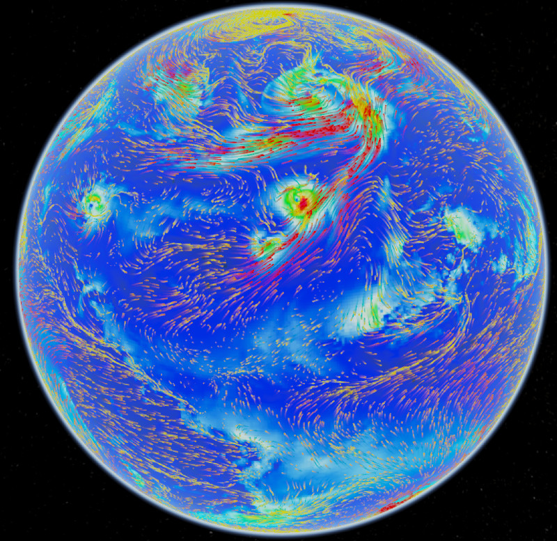

使用 GPU 驱动的 Cesium 风场可视化


在许多领域，如 气候分析、风电场管理等，分析风的情况是很重要的。已经有一些能可视化风场的引擎了，例如 Earth Nullschool 和 Windy，但是它们没法显示地形，地形对估计特定位置的风力影响是很重要的。


作者决定基于 Cesium，自己制作。你可以在 GitHub 上找到源代码：[source code on GitHub](https://github.com/RaymanNg/3D-Wind-Field)

或者直接点击查看在线例子：[the live demo in your browser (raymanng.github.io)](https://raymanng.github.io/3D-Wind-Field/demo/)



这是运行后的例子。

# 1. 它是如何运行的

可视化风场的常用技术是使用 **粒子系统**。例子将使用大量粒子放置在风场中，并根据风力定期更新它的位置。

粒子的运动轨迹可以预示风的流向。


起初，作者使用 Entity API 来绘制粒子轨迹，但是超过 1w 个后，性能就不行了。经过技术调研，发现 Entity API 是使用 CPU 进行计算的。这意味着必须使用更底层的 Renderer 模块来进行 GPU 运算。

在 Cesium 中，渲染流水线中关键的一个对象叫 `DrawCommand`，它在 `Primitive` 对象中创建，并由 `Scene` 对象调度、执行。

> 译者注
>
> 如果读者有初步的 Cesium 渲染流水线知识，这个 DrawCommand 应该理解起来不难。

`DrawCommand` 包含了渲染所需的所有数据、内容，例如 `Framebuffer`、`Texture`、`ShaderProgram`。

要执行自定义渲染，就要自定义 `DrawCommand`。要构建 `DrawCommand`，就要挨个把所必须的组件实现，即 `ShaderProgram`、`Texture`、`Uniforms` 和 `Framebuffer`，然后将其作为 `DrawCommand` 的属性，创建 `DrawCommand` 对象。

要将 `DrawCommand` 塞进渲染流水，需要创建一个自定义的 `Primitive` 对象。它并不需要实现原生 `Primitive` 对象的所有方法，只需要实现这三个方法即可：

- `<自定义Primitive>.prototype.update()`
- `<自定义Primitive>.prototype.isDestroyed()`
- `<自定义Primitive>.prototype.destroy()`

渲染循环机制每次渲染开始前，都会把 Primitive 刷新一遍，调用 Primitive 的 update() 实例方法。

至于在 GPU 上的计算，即使用渲染到纹理的技术，类似于自定义渲染，只需用一个全屏的四边形作顶点着色器并写入计算代码到片元着色器即可。（译者注：这段有点不太明白）

幸运的是，Cesium 已经提供了渲染到纹理的功能，要作的只是将片元着色器的代码扔给 `Cesium.ComputedCommand` 并使用 `Cesium.ComputeEngine` 执行 GPU 计算即可。

最后一步，将自定义的 Primitive 添加到 `Scene.primitives` 这个 PrimitiveCollection 即可。

下面是自定义图元的 es6 class 风格代码，从原文的 GitHub 上抄录（略有改动）：

``` js
class CustomPrimitive {
  constructor(options) {
    this.commandType = options.commandType;

    this.geometry = options.geometry;
    this.attributeLocations = options.attributeLocations;
    this.primitiveType = options.primitiveType;

    this.uniformMap = options.uniformMap;

    this.vertexShaderSource = options.vertexShaderSource;
    this.fragmentShaderSource = options.fragmentShaderSource;

    this.rawRenderState = options.rawRenderState;
    this.framebuffer = options.framebuffer;

    this.outputTexture = options.outputTexture;

    this.autoClear = Cesium.defaultValue(options.autoClear, false);
    this.preExecute = options.preExecute;

    this.show = true;
    this.commandToExecute = undefined;
    this.clearCommand = undefined;
    if (this.autoClear) {
      this.clearCommand = new Cesium.ClearCommand({
        color: new Cesium.Color(0.0, 0.0, 0.0, 0.0),
        depth: 1.0,
        framebuffer: this.framebuffer,
        pass: Cesium.Pass.OPAQUE
      });
    }
  }
  
  createCommand(context) {
    switch (this.commandType) {
      case 'Draw': {
        const vertexArray = Cesium.VertexArray.fromGeometry({
          context: context,
          geometry: this.geometry,
          attributeLocations: this.attributeLocations,
          bufferUsage: Cesium.BufferUsage.STATIC_DRAW,
        });

        const shaderProgram = Cesium.ShaderProgram.fromCache({
          context: context,
          attributeLocations: this.attributeLocations,
          vertexShaderSource: this.vertexShaderSource,
          fragmentShaderSource: this.fragmentShaderSource
        });

        const renderState = Cesium.RenderState.fromCache(this.rawRenderState);
        return new Cesium.DrawCommand({
          owner: this,
          vertexArray: vertexArray,
          primitiveType: this.primitiveType,
          uniformMap: this.uniformMap,
          modelMatrix: Cesium.Matrix4.IDENTITY,
          shaderProgram: shaderProgram,
          framebuffer: this.framebuffer,
          renderState: renderState,
          pass: Cesium.Pass.OPAQUE
        });
      }
      case 'Compute': {
        return new Cesium.ComputeCommand({
          owner: this,
          fragmentShaderSource: this.fragmentShaderSource,
          uniformMap: this.uniformMap,
          outputTexture: this.outputTexture,
          persists: true
        });
      }
    }
  }
  
  setGeometry(context, geometry) {
    this.geometry = geometry;
    const vertexArray = Cesium.VertexArray.fromGeometry({
      context: context,
      geometry: this.geometry,
      attributeLocations: this.attributeLocations,
      bufferUsage: Cesium.BufferUsage.STATIC_DRAW,
    });
    this.commandToExecute.vertexArray = vertexArray;
  }
  
  update(frameState) {
    if (!this.show) {
      return;
    }

    if (!Cesium.defined(this.commandToExecute)) {
      this.commandToExecute = this.createCommand(frameState.context);
    }

    if (Cesium.defined(this.preExecute)) {
      this.preExecute();
    }

    if (Cesium.defined(this.clearCommand)) {
      frameState.commandList.push(this.clearCommand);
    }
    frameState.commandList.push(this.commandToExecute);
  }
  
  isDestroyed() {
    return false;
  }

  destroy() {
    if (Cesium.defined(this.commandToExecute)) {
      this.commandToExecute.shaderProgram = 
        this.commandToExecute.shaderProgram && this.commandToExecute.shaderProgram.destroy();
    }
    return Cesium.destroyObject(this);
  }
}

/** 使用 */
const viewer = new Cesium.Viewer('cesiumContainer');
const customPrimitive = new CustomPrimitive();
viewer.scene.primitives.add(customPrimitive);
```

# 2. 总结

能自定义 DrawCommand 的 Primitive API 提供了底层的功能，有着更好的性能，但是意味着要写更多的代码。

# 译者注

他的例子比较大，还有自定义的着色器代码，得画一个星期啃下来。后续会出另外的文章。