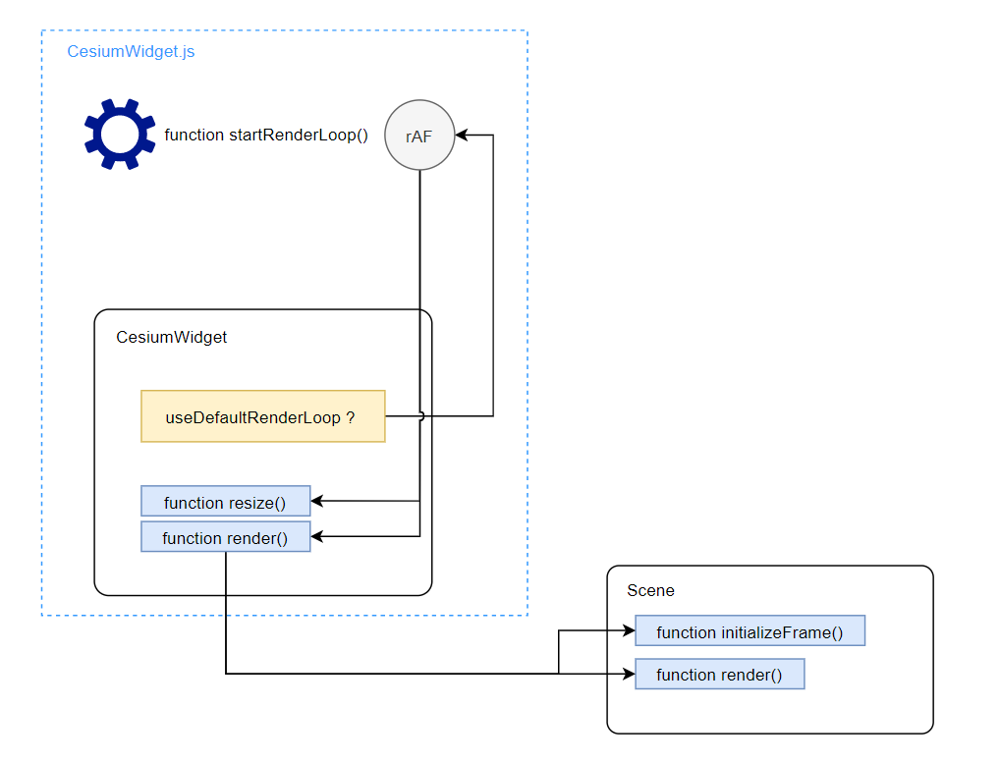

其实最简单的 Cesium 程序，应该是 new 一个 `CesiumWidget`，传递一个 HTMLDOM 元素给它。

Viewer 只不过是这个 widget 的载体，也是很多其他小部件的载体（时间轴啦、按钮啦等等）。

# 1. CesiumWidget 类的构造函数

``` js
// Source/Widgets/CesiumWidget/CesiumWidget.js 27KB
function CesiumWidget(container, options) {
  // ...
}
```

传入参数 `options` 中有一个不起眼的参数：`useDefaultRenderLoop`，是一个布尔值，默认 true。

通常，我们很少去传入这个参数，也就是说，**Cesium 会使用默认的渲染循环。**

这个值，在构造函数经过长长的 scene、globe、相机、底图等对象实例化完成后，最终会传递到 `useDefaultRenderLoopd` 的 set 访问器上：

``` JS
this._useDefaultRenderLoop = undefined;
this.useDefaultRenderLoop = defaultValue(
  options.useDefaultRenderLoop,
  true
);

// defaultValue() 是 Cesium 很常见的判断默认值的工具方法
```

## 1.1. 我们追到 useDefaultRenderLoop 访问器

``` js
useDefaultRenderLoop: {
  get: // ...,
  set: function (value) {
    if (this._useDefaultRenderLoop !== value) {
      this._useDefaultRenderLoop = value;
        if (value && !this._renderLoopRunning) {
          startRenderLoop(this);
        }
      }
   },
}
```

好嘛，看包在最里面那个 `startRenderLoop()`

这是一个非 API 函数，不导出，我们去看看它：

## 1.2. startRenderLoop()

我不太关心这个函数上面如何如何配置，它起眼的只有一句，位于函数最后一行

``` JS
function render(frameTime) {
  // ...
}

requestAnimationFrame(render);
```

这是一个 HTML5 的原生浏览器函数，由浏览器决定何时再画一帧。

它需要一个循环函数，这个循环函数就是这里的 render 局部函数。

### 1.2.1. 局部函数 render(frameTime)

第二个 if 中，有一个 try catch 语句，我们就看 try 的内容，这就是渲染循环的入口。

``` JS
try {
    var targetFrameRate = widget._targetFrameRate;
    if (!defined(targetFrameRate)) {
        widget.resize();
        widget.render();
        requestAnimationFrame(render);
    } else {
        var interval = 1000.0 / targetFrameRate;
        var delta = frameTime - lastFrameTime;

        if (delta > interval) {
            widget.resize();
            widget.render();
            lastFrameTime = frameTime - (delta % interval);
        }
        requestAnimationFrame(render);
    }
}

// 注：targetFrameRate 即帧速率，默认60fps
```

水落石出，即 `CesiumWidget.prototype.resize()`、`CesiumWidget.prototype.render()` 两个函数在推动Cesium 的无限循环渲染。

当渲染完一帧后，浏览器又根据时机继续调用 `requestAnimationFrame(render);` 完成循环闭环：即 requestAnimationFrame 调 render，然后 render 又继续调 requestAnimationFrame。

# 2. CesiumWidget.prototype.resize()

``` JS
CesiumWidget.prototype.resize = function () {
  var canvas = this._canvas;
  if (
    !this._forceResize &&
    this._canvasClientWidth === canvas.clientWidth &&
    this._canvasClientHeight === canvas.clientHeight &&
    this._lastDevicePixelRatio === window.devicePixelRatio
  ) {
    return;
  }
  this._forceResize = false;

  configureCanvasSize(this);
  configureCameraFrustum(this);

  this._scene.requestRender();
};
```

显然，这个函数的作用就是重新调整用于承载 WebGL 内容的 canvas 尺寸，并调整相机视锥体用的。

最后一行 `this._scene.requestRender()`，widget 终于把渲染的接力棒交出去了~~


# 3. CesiumWidget.prototype.render()

``` js
CesiumWidget.prototype.render = function () {
  if (this._canRender) {
    this._scene.initializeFrame();
    var currentTime = this._clock.tick();
    this._scene.render(currentTime);
  } else {
    this._clock.tick();
  }
};
```

`this._canRender` 是在调整 canvas 尺寸时调整的。

在这个 if - else 中，得出结论：无论是否能继续渲染，时钟都会 tick 一次，也即时钟不管 WebGL 崩没崩，它都在后面计时。

这两行代码就不是 CesiumWidget 干的事情了，起源已完，交由 Scene 的主场~！



# 4. 下一步

`Scene.prototype.initializeFrame()` 做了什么

**`Scene.prototype.render()` 做了什么**

`Scene.prototype.requestRender()` 做了什么