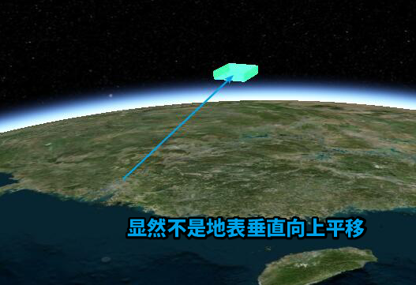

# 1. 由世界坐标转模型坐标

顶点着色器：

``` GLSL
attribute vec3 position3DHigh;
attribute vec3 position3DLow;
attribute vec3 normal;
attribute vec2 st;
attribute float batchId;

varying vec3 v_positionEC;
varying vec3 v_normalEC;
varying vec2 v_st;

void main()
{
  vec3 positionWC = position3DHigh + position3DLow; // 得到世界坐标
  // 官方得到世界坐标（齐次）是这么做的，在三维模式下等价
	// vec4 positionWC = czm_computePosition();
  vec4 positionMC = czm_inverseModel * vec4(positionWC, 1); // 得到模型坐标

  // 以下为官方代码，未改动，仅修改注释
  vec4 p = czm_computePosition(); // 得到世界坐标

  v_positionEC = (czm_modelViewRelativeToEye * p).xyz; // 得到相机坐标
  v_normalEC = czm_normal * normal; // 得到相机坐标系下的法线向量
  v_st = st; // 传递uv

  gl_Position = czm_modelViewProjectionRelativeToEye * p; // 世界坐标到裁剪空间坐标
}
```


# 2. 由相机坐标转模型坐标

顶点着色器

``` GLSL
attribute vec3 position3DHigh;
attribute vec3 position3DLow;
attribute vec3 normal;
attribute vec2 st;
attribute float batchId;

varying vec3 v_positionEC;
varying vec3 v_normalEC;
varying vec2 v_st;

void main()
{    
  vec4 p = czm_computePosition(); // 得到齐次世界坐标

  v_positionEC = (czm_modelViewRelativeToEye * p).xyz; // 得到相机坐标
  v_normalEC = czm_normal * normal;
  v_st = st;
  
  /** 此处开始添加计算模型坐标的代码 */
  vec4 positionMC = czm_inverseModelView * vec4(v_positionEC, 1.0); // 得到模型坐标
  /** 添加的代码结束 */
  
  gl_Position = czm_modelViewProjectionRelativeToEye * p; // 世界坐标到裁剪空间坐标
}
```


# 3. 坐标陷阱：模型坐标系≠东北上坐标系

参考如下代码：

``` JS
var viewer = new Cesium.Viewer("cesiumContainer");
viewer.scene.globe.depthTestAgainstTerrain = true;
viewer.camera.setView({
    destination : new Cesium.Cartesian3(-2644963.9889313546, 5763731.142118295, 2199400.7089496767), //世界坐标系下的一个坐标点
    orientation : {//旋转角度
        heading :6.075,
        pitch :-0.727,
        roll : 6.283
    }
});

const extrudedPolygon = new Cesium.PolygonGeometry({
  polygonHierarchy : new Cesium.PolygonHierarchy(
    Cesium.Cartesian3.fromDegreesArray([
      112.41726298378288, 23.290411251106182,
      113.67072522399741, 23.560312361463682,
      114.09370956893551, 22.590768298743153,
      112.83803246418894, 22.285610818885644
    ])
  ),
  extrudedHeight: 30000
});

const instance = new Cesium.GeometryInstance({
  geometry: extrudedPolygon,
  id: 'box with height'
});

const m = new Cesium.Material({
  fabric: {
    type: 'Color',
    uniforms: {
      color: new Cesium.Color(216 / 255.0, 170 / 255.0, 208 / 255.0).withAlpha(0.618),
    },
  }
});

const aper =  new Cesium.MaterialAppearance({
  fragmentShaderSource: 
  ` varying vec3 v_positionEC;
    varying vec3 v_normalEC;
    varying vec2 v_st;

    void main()
    {
        vec3 positionToEyeEC = -v_positionEC;

        vec3 normalEC = normalize(v_normalEC);
    #ifdef FACE_FORWARD
        normalEC = faceforward(normalEC, vec3(0.0, 0.0, 1.0), -normalEC);
    #endif

        czm_materialInput materialInput;
        materialInput.normalEC = normalEC;
        materialInput.positionToEyeEC = positionToEyeEC;
        materialInput.st = v_st;
        czm_material material = czm_getMaterial(materialInput);
				material.diffuse = vec3(0.24313725490196078, 0.7372549019607844, 0.9333333333333333);
			  material.emission = vec3(0.0, 0.66666666, 0.0);
        material.specular = 0.5;
        material.shininess = 0.8;

    #ifdef FLAT
        gl_FragColor = vec4(material.diffuse + material.emission, material.alpha);
    #else
        gl_FragColor = czm_phong(normalize(positionToEyeEC), material, czm_lightDirectionEC);
    #endif
    }
   `,
  vertexShaderSource: 
  `
  attribute vec3 position3DHigh;
  attribute vec3 position3DLow;
  attribute vec3 normal;
  attribute vec2 st;
  attribute float batchId;

  varying vec3 v_positionEC;
  varying vec3 v_normalEC;
  varying vec2 v_st;

  void main()
  {    
      vec4 p = czm_computePosition();

      v_positionEC = (czm_modelViewRelativeToEye * p).xyz;      // position in eye coordinates
      v_normalEC = czm_normal * normal;                         // normal in eye coordinates
      v_st = st;
      vec4 positionMC = czm_inverseModelView * vec4(v_positionEC, 1.0);
      vec4 positionMC_new = vec4(positionMC.xy, positionMC.z + czm_frameNumber * 100.0, 1.0); // z轴向上平移动画
      vec4 resultPosition = czm_modelViewInfiniteProjection * positionMC_new; // 一步直接算到 gl_Position 所需的坐标
      gl_Position = resultPosition;

  }
	`,
});

var p = viewer.scene.primitives.add(new Cesium.Primitive({
  geometryInstances: instance,
  appearance: aper,
  releaseGeometryInstances: false,
  compressVertices: false,
}));
```

在顶点着色器处，我对模型坐标的z值进行了修改，达到z轴平移动画的效果



可是动画的效果并不是沿着地表的垂直向上的方向平移，换做是 x、y 平移也不是对应的正东方、正北方（如果平移量大，还要考虑曲率的问题）

所以，可以下结论：

**顶点着色器中的模型坐标所用的局部坐标系，仅仅是原点在模型中心，但是三轴并不是沿着正东x、正北y、垂直朝上z这三轴的。**

这是我在 Primitive API 中发现的问题，要格外注意这一点，不知道其他的 Primitive（gltf、3dtiles等的着色器）是不是如此。