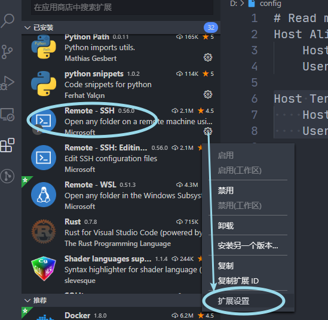
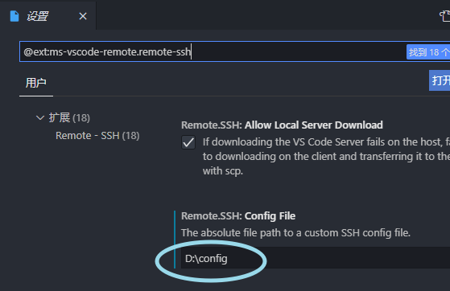

客户端：安装ssh（Windows 10自带OpenSSH）

服务端：安装ssh（Windows Server 2019自带OpenSSH）

---

# 1. ssh 免密登陆

## 1.1. 客户端生成公私钥

使用 `ssh-keygen.exe` 生成本机的公私钥，然后把公钥（字符串）传递给服务端，即写入客户端的 `~/.ssh/authorized_keys` 这个文本文件中，作为一行。

三次回车，就生成好了两个文件：

```
id_rsa
id_rsa.pub
```

带pub后缀的是公钥文件，从里面可以复制本机的公钥。

> 注
>
> ssh-keygen.exe 生成公私钥的教程网上贼多，默认应该是在 `~` 目录下的 .ssh 目录下生成。如果是 Windows，`~` = `C:\Users\<你的用户名>`，如果是 Linux，`~` = `/home/<你的用户名>`
>
> 这个目录还会有一个 `known_hosts` 文本文件（无后缀名），用于记录登陆别的主机时的信息（例如更改了远程主机的系统时，就要清理一下这个文件里对应那一行的记录，直接删掉也没问题，这个文件的作用跟登陆网页时勾选记住密码差不多）

## 1.2. 服务端 sshd 配置

在用户目录（就是 `~` 目录）下的新建 `.ssh` 目录（如果不存在）。

然后把客户端公钥文件的内容写入到这个新建的目录下的 `authorized_keys` 文件内（如果没有就创建一个）。

随后，更改 sshd 的配置文件

``` BASH
sudo vim /etc/ssh/sshd_config
```

主要是确保这三项的状态：

```bash
# 这项确保能读取
AuthorizedKeysFile .ssh/authorized_keys
# 这项确保能用公钥登陆
PubkeyAuthentication yes
# 这项允许使用rsa算法生成的公钥
RSAAuthentication yes
```

### 重要！更改 authorized_keys 文件的权限 和 .ssh 目录的权限

``` BASH
sudo chmod -R 700 ~/.ssh/
sudo chmod 600 ~/.ssh/authorized_keys
```

**这一步必须做，目录的权限是700，文件的权限是600，才能被ssh正确使用，否则仍旧需要输入密码的！**

### 重启 sshd 服务

``` BASH
sudo systemctl restart sshd
```

即可免密登录。

# 2. VSCode 远程编程配置

任意处创建 `config` 文本文件（不带后缀名，不过带应该也没问题）

格式：

``` 
Host: <你的服务器名，随便写，单词即可>
    HostName <服务器ip或域名>
    User <你要登陆的服务器的哪个账户名>
    [Port <端口>]
```

由于 ssh 默认是 22 端口，所以我的腾讯云服务器是这么写的：

``` 
Host Tencent
    HostName 1**.2**.1**.3*
    User xxxxxxx
```

## Windows用户注意

不建议把这个文件保存在 Windows 的 `~/.ssh/` 目录下，否则会出现 shell 登陆不了的问题（Bad owner or permissions on C:\\Users\\<你的用户名>/.ssh/config）

我放在 D盘根目录下了。

VSCode 的配置（前提是你安装了 Remote - SSH 插件）：





# 3. ssh登录

语法：

``` 
ssh <user>@<ip>
# user 是服务端的用户名
# 如果不写 user，就用客户端当前用户名登录
```

如果没有免密登录，就会问 <user\> 密码是什么。

可使用 `whoami` 命令查看当前客户端的账号（用户）名。

## 指定私钥登录

默认会到用户目录下的 `.ssh` 目录找 `id_rsa` 私钥文件，如果不存在就会要你输入密码。

语法：

```
ssh -i <私钥文件路径> <user>@<ip> 
```


# *SSH补充

scp：发送文件

ssh：登录工具（客户端）

ssh-server：提供ssh服务

sftp：登录文件系统的工具？


可以改默认登录目录，到服务端安装路径下找`sshd_config_default`文件，但是ssh运行起来后，Windows上是在`C:\ProgramData\ssh`下的`sshd_config`文件里的。

修改这一项：

``` config
ChrootDirectory D:\
```

即可把目录修改为D盘根目录。