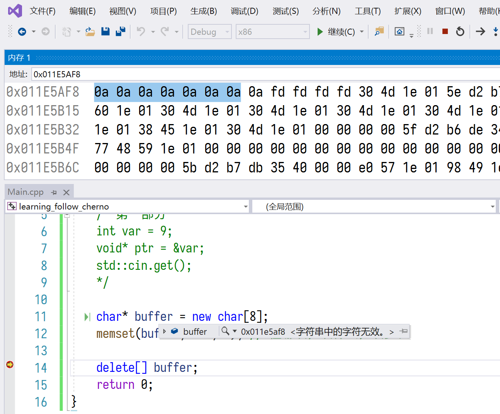

指针只是一个整数，指针只是一个整数，指针只是一个整数。

# Visual Studio 内存技巧

工具栏：调试 - 窗口 - 内存 - 内存1，输入指针的值，即可查看此处指针的内存内容


# 2. 访问指针所指的内存数据

## ① 解引用

在指针变量前加个 `*` 号即可 **访问** 到指针实际指向的内存数据

## ② 为什么要用 void 指针

如果你不关心指针指向的那块内存存了什么数据，当然可以用 void 指针指向一切。

但是，如果你关心指针存储的内存地址上，究竟是 4byte 的 int 数据，还是 8byte 的 double 数据？这个时候，void 就不合适了。

``` CPP
double a = 10.0;
double* ptr = &a;
```

此时，指针 ptr 被指明是 double 类型的，实际上是在说，它存储的那个内存地址，往后数 8byte 是一个 double 数据。

# 3. 申请一块内存



> `memset()` 函数
>
> 往某块内存里塞数据

## 注意 delete

因为这里是 new []，所以后面要 delete []