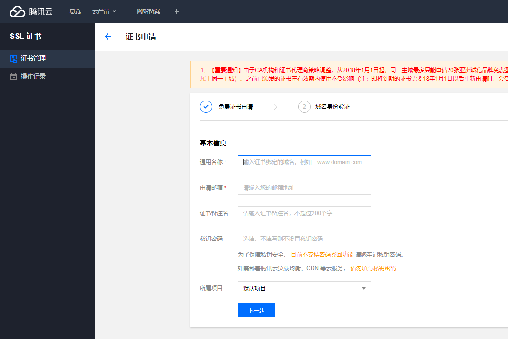

## 生成私钥：server.key 文件

``` BASH
openssl genrsa -des3 -out server.key 1024
```

这条命令是生成一个服务器（当前机器的）私钥。

- genrsa：加密算法
- 1024：加密复杂度
- -des3：对称加密算法
- -out server.key：输出什么文件

执行后，会让你输入保护私钥本身的密码：我就拿123456吧。

nginx不知道这个密码，待会还得去掉

## 生成证书请求文件：server.csr 文件

``` BASH
openssl req -new -key server.key -out server.csr
```

> 如果在 Windows 下有报 找不到 cnf 文件的错误：
>
> ``` 
> Can't open C:\ci\openssl_1587479240221\_h_env\Library/openssl.cnf for reading, No such file or directory
> 11452:error:02001003:system library:fopen:No such process:crypto\bio\bss_file.c:69:fopen('C:\ci\openssl_1587479240221\_h_env\Library/openssl.cnf','r')
> 11452:error:2006D080:BIO routines:BIO_new_file:no such file:crypto\bio\bss_file.c:76:
> ```
>
> 请指定对应的配置文件路径 -config C:\path\to\openssl.cnf，例如
>
> ``` BASH
> .\openssl.exe req -new -key ..\..\..\Desktop\openssldemo\server.key -out ..\..\..\Desktop\openssldemo\server.csr -config ..\openssl.cnf
> ```

首先会让你输入私钥的密码

- Enter pass phrase for root.key：

然后输入一些信息：

- Country Name：CN，国家代号，中国输入 CN
- State or Province Name（full name）：省全名，拼音
- Locality Name：市全名
- Organization Name：公司英文名
- Organization Unit Name：可不输入
- Common Name：不输入
- Email Address：随便输入
- A challenge password：可不输入
- An optional company name：可不输入


## 备份一份服务器密钥文件

``` bash
cp server.key server.key.org
```

意思就是把带密码的这份 server.key 备份成 server.key.org

## 去除私钥文件的密码

``` bash
openssl rsa -in server.key.org -out server.key
```

意思就是把 server.key.org 这个带密码的私钥文件去掉密码，并输出（覆盖）成 server.key 文件

## 生成自签名证书文件：server.crt

``` bash
openssl x509 -req -days 365 -in server.csr -signkey server.key -out server.crt
```

意思就是把申请文件 server.csr 和私钥文件 server.key 一同生成自签名的证书文件 server.crt，这个证书文件就包含了公钥。

这里这个 `server.crt` 其实是个文本文件


注意，除了 crt 格式，nginx 还支持 pem 格式的证书

## 格式

- pem：Privacy Enhanced Mail，base64编码的文本文件证书，apache httpd 和 nginx 比较喜欢用这个，查看命令是 `openssl x509 -in certificate.pem -text -noout`
- der：Distinguished Encoding Rules，二进制的，查看命令 `openssl x509 -in certificate.der -inform der -text -noout`
- crt：格式而已，内部使用pem或der都有可能

### 扩展名

- pem、der：同上
- key：通常用来存放一个公钥或者私钥,并非X.509证书,编码同样的,可能是PEM,也可能是DER.
- csr：Certificate Signing Request,即证书签名请求,这个并不是证书,而是向权威证书颁发机构获得签名证书的申请,其核心内容是一个公钥(当然还附带了一些别的信息),在生成这个申请的时候,同时也会生成一个私钥,私钥要自己保管好.做过iOS APP的朋友都应该知道是怎么向苹果申请开发者证书的吧.
- cer：还是certificate,还是证书,常见于Windows系统,同样的,可能是PEM编码,也可能是DER编码,大多数应该是DER编码.
- crt：CRT应该是certificate的三个字母,其实还是证书的意思,常见于*NIX系统,有可能是PEM编码,也有可能是DER编码,大多数应该是PEM编码,相信你已经知道怎么辨别.

# 参考资料

[如何用 OpenSSL 创建自签名证书 | Azure Docs](https://docs.azure.cn/zh-cn/articles/azure-operations-guide/application-gateway/aog-application-gateway-howto-create-self-signed-cert-via-openssl)

[基于 OpenSSL 生成自签名证书_qhh0205-CSDN博客_openssl 自签名证书](https://blog.csdn.net/qianghaohao/article/details/90314163)

[如何创建自签名的 SSL 证书 - 简书 (jianshu.com)](https://www.jianshu.com/p/e5f46dcf4664)

[使用openssl生成自签名证书_whahu1989的专栏-CSDN博客](https://blog.csdn.net/whahu1989/article/details/102616675)

[那些证书相关的玩意儿(SSL,X.509,PEM,DER,CRT,CER,KEY,CSR,P12等) - guogangj - 博客园 (cnblogs.com)](https://www.cnblogs.com/guogangj/p/4118605.html)

[沃通DV超快SSL证书,2048位SSL证书,只验证域名所有权,支持所有浏览器,全球通用,不显示单位名称,10分钟颁发-沃通WoSign SSL证书!](https://www.wosign.com/DVSSL/DV_SSL.htm)（收费的）

[SSL 证书服务，大家用哪家的？ - 知乎 (zhihu.com)](https://www.zhihu.com/question/19578422)

# 备注

使用 `https://` 访问某个地址时，如果不带端口，默认访问的是 443

使用 `http://` 访问某个地址时，如果不带端口，默认访问的是 80

所以注意这俩端口有没有被别的东西占用 [Windows下如何查看某个端口被谁占用 | 菜鸟教程 (runoob.com)](https://www.runoob.com/w3cnote/windows-finds-port-usage.html)

# 腾讯云免费证书

主要是要有一个域名

