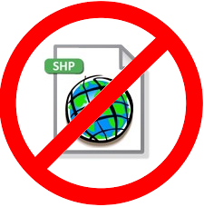

原文出自：[switchfromshapefile.org](http://switchfromshapefile.org)

> 译者注：本文略偏激，但是我大部分赞同不要再用 shp 格式的思想，积极拥抱新的生产力。

`ESRI Shapefile` 简称 shp 格式，是由 ESRI 公开的一种矢量数据格式，它已经有30多年的历史了。

尽管这些年它为各行各业提供了巨大的生产力，但是它在现在这个需求越来越变态的行业中已经略显力不从心。

作为 GIS IT 行业的一员，是时候停止使用 shp 格式并引入新格式了。

# shp 格式好的一面

列举了一些为什么它的占有率如此之高的原因：

- 各种软件几乎都内置支持
- 虽然格式是 ESRI 专有，但是其规范是公开的
- 在大多数场景中它够用
  - 索引文件 （*.shx）为主文件（\*.shp）提供良好的读取性能
  - 文件体积不大，它在未使用 zip 压缩时都要比其他格式要小一些（尤其是文本类型的格式）

# shp 是一种不好的格式

原因可就多多了：

- 无坐标系定义（憋急，待会你看下面仔细的介绍）
- 是一种多文件格式
- 属性名限制在10个字符
- DBF文件限制了最多255个属性
- 限制了数据类型，只能是 float、integer、date、text（text最多254字符）
- 并不指明编码格式
- 单文件最大2GB
- 无拓扑
- 几何类型在一个文件中是单一的
- 复杂的数据结构是存不了的
- 无法存储带纹理材质的三维数据；无法存储参数化对象等
- 投影的定义
- 必须在要素级别挨个指定几何类型，而不是在数据层面就指定
- 无空值
- ...

## 无坐标系定义

默认情况下，shp 格式是不带坐标系定义的，必须额外使用一个 `*.prj` 文件来定义。但是这里要说清楚，`*.prj` 并非 shp 格式规范里的内容，是额外加上去的。

## 多文件格式

你至少要三个文件才能完整使用一个 shp 格式 —— `*.shx` + `*.shp` + `*.dbf`。

你甚至见过更多的文件，例如上面提到的 prj，还有 cfg，等等等等。通常，你需要进行 zip 打包或者挨个发送，才能保证数据完整，相信新手都有传少文件导致乌龙的情况。

## 属性名最多10个字符

所以，在一些古老的高校中仍然推崇使用拼音首字母来写属性，你用英文单词还随时可能爆掉。

## 最多255个属性

其实，255个属性放在先进的场景下也足够了，译者并不觉得是什么缺点。

## 属性值的类型支持得比较少

仅支持 `float`、`integer`、`char`、`date` 四种。对于 `blob`、`数组`、`图像` 就不支持了。

## 不指明编码格式

一定有朋友在刚接触时，发现 shp 的属性表是乱码的，这就是编码问题，原先编辑时用的是 gb 编码，换一台机器变成了 utf8，或者反过来，就会导致显示乱码，这个是历史遗留问题。

## 最大 2GB

`.shp` 和 `.dbf` 文件最大 2GB，虽然 GDAL 的驱动克服了这个限制可以达到 4GB

译者觉得即使是 2GB，对于单份可编辑型数据来说也很大了。

## 无拓扑

它不存储复杂的几何关系。

## 不支持多几何类型

一个 shp 文件，只能是一种几何类型的文件。

译者觉得保持文件单一性也挺好的，并不认为一个数据文件里有多种几何类型是什么优点。

## 扁平的数据结构

链式数据结构，不支持层级数据的存储等。

## 三维的支持很有限

multipatch 虽然是三维几何形状，但是并不支持存储三维数据所需的纹理、材质信息。

## 投影信息互不兼容

通常，定义坐标系的 `.prj` 文件使用的是 `ESRI WKT` 来定义坐标系统投影信息，这个与 `EPSG` 的定义是不兼容的。

## 复合图形必须在要素层面定义

例如 `multi-polygon` 和 `multi-polyline`。

## 无 NULL 值

无法在属性字段里写“没有数据”。不过译者觉得这是个好事。

# 替代品

目前有完全能替代 shp 文件格式的格式吗？似乎没有，毕竟瘦死的骆驼比马大，在 shp 格式还没有完全阻碍到生产之前，新格式并没有那么重要。

列举几个：

- GeoPackage
- FlatGeobuf
- GeoJSON
- GML
- SpatialLite
- CSV
- KML

## OGC GeoPackage

> 译者注：早些年我就写过 gpkg 格式的博客，百度搜即可，很容易找到。

主要特点：

- 以 SQLite 为基础
- 单文件
- 支持矢量和栅格
- 有官方拓展
- 多软件支持

## FlatGeobuf

> 译者注：我也写过这个格式，好好找找，能找到的~

主要特点：

- 使用 FlatBuffers 二进制编码
- 单文件
- 支持矢量数据
- 序列化和流式传输相当高效率
- 性能优秀
- 多编程语言、多软件支持

## GeoJSON

这个不必多说，用过都知道，短小精悍，但是缺点也很明显。

## OGC GML

这可能不太算一种 shp 格式的替代品，因为 GML 格式相对来说复杂得多，软件支持率也不算很广泛。

## SpatialLite

SpatialLite 与 GeoPackage 一样是基于 SQLite 拓展而来，但是它只支持矢量数据。不过能用 SpatialLite 的场景，一般也支持 GeoPackage，SpatialLite 只是特定场合的 shp 格式替代品。

## CSV

就是一文本表格，它不一定是地理数据，但是它存储地理数据的时候，最大的特点就是简单，对非 GIS 行业的人来说特别友好。

## OGC KML

kml 是因谷歌地球的欢迎而起家的一种矢量数据格式，最大的特点就是能把样式也带进数据里。其本质是一种 XML 文本文件。仅支持 WGS84 坐标系。

## ESRI GeoDatabase

作为一种 shp 替代品，GeoDatabase 格式完全称职。但是它并不开源，且数据格式为 ArcGIS 专有。

特点：

- 面向对象的数据存储格式
- 存储介质是多个散列文件
- 支持极为复杂的数据模型
- 专有格式且是闭源格式