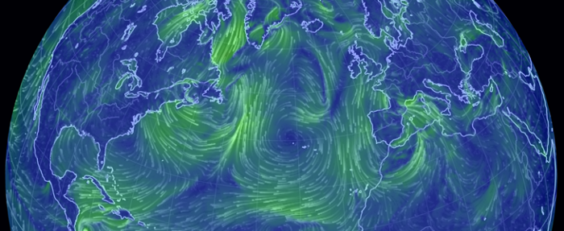
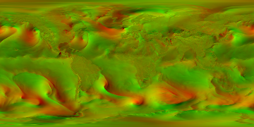

我如何使用 WebGL 来创建一个风向地图？

> 翻译：@四季留歌
>
> 部分翻译。

# 使用 CPU 进行风向可视化

有很多风力可视化在线网站，最出名的莫过于 [earth.nullschool.net](https://earth.nullschool.net/)。它并不是开源的，但是它有一个开源的旧版本，大多数现有方案都基于此实现。

通常，这种可视化依赖于 `Canvas 2D API`，大致的逻辑是这样的：

1. 生成一组随机粒子并绘制它们
2. 对于每个粒子，查询其位置上的风力值，并用此风力值移动此粒子
3. 将一小部分粒子重置，这样能保证粒子所覆盖的区域看起来比较丰满
4. 淡化当前帧，并在其上一层绘制新的一帧

这是有性能限制的：

- 风粒子数量不能太多，大约 5000 个
- 每次更新数据或者视图都会有很大的延迟，因为处理这些数据所用的 JavaScript 运行在 CPU 上，相当耗时

原作者在文章中提出一种使用 WebGL 的新绘制逻辑，这样速度很快，能画上百万个粒子，而且打算和 Mapbox GL 进行结合展示。

原作者找到了 Chris Wellons 写的关于如何使用 WebGL 粒子物理学的[绝棒教程](http://nullprogram.com/blog/2014/06/29/)，认为风力可视化可以使用类似的方。

# OpenGL 基础

简单概括原文就是，OpenGL 等图形技术就是在画三角形，虽然也能画点和线，但是用的比较少。

这节的重点是，在顶点着色器或者片元着色器添加一个纹理参数，然后在这个纹理上查找颜色。

这是本文关于风力可视化的重中之重。

# 获取风力数据

美国国家气象局每 6 个钟发布全球天气数据，这种数据叫做 `GFS`，大概就是经纬度的网格携带了有关的数据值。这种数据称为 GRIB，是一种特殊的二进制格式。可以用一些其他的工具解析为人类可读的 JSON（[工具](https://software.ecmwf.int/wiki/display/GRIB/Releases)）。

原作者写了一些脚本，将风力数据下载下来并转为 PNG 图像，风速编码为 RGB 色彩灰度值 —— 像素坐标代表经纬度，红色灰度值代表水平风速，绿色灰度值代表垂直风速。大概长这样：

分辨率可以更大，但是原作者认为全球可视化来说，这个分辨率够用了。

# 使用 GPU 移动粒子

# 绘制粒子

# 绘制粒子轨迹

# 插值以获取风力值

# 使用 GPU 上的伪随机算法

# 展望