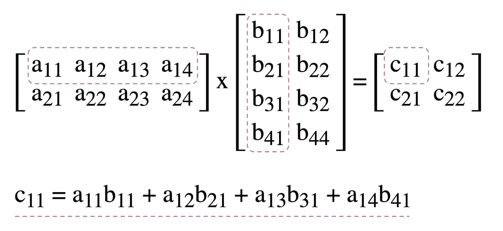
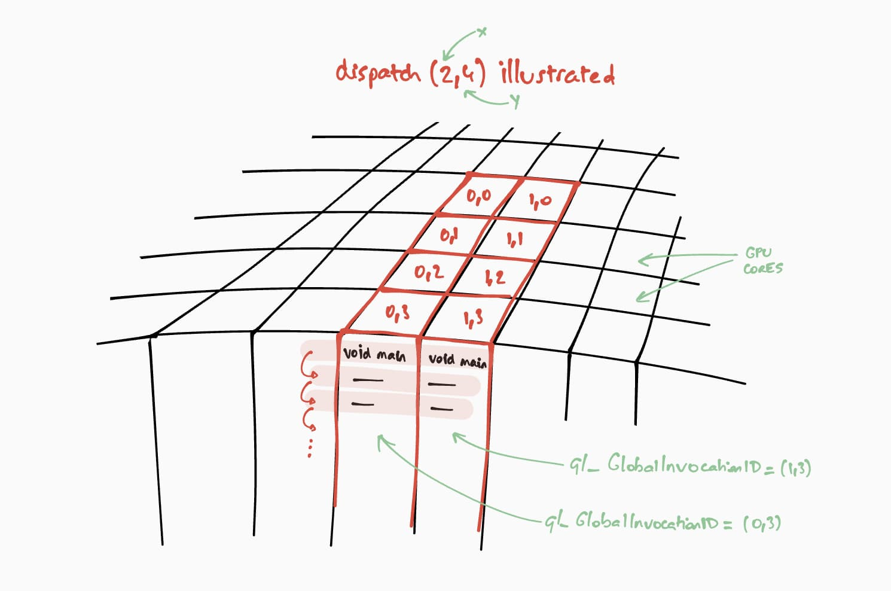
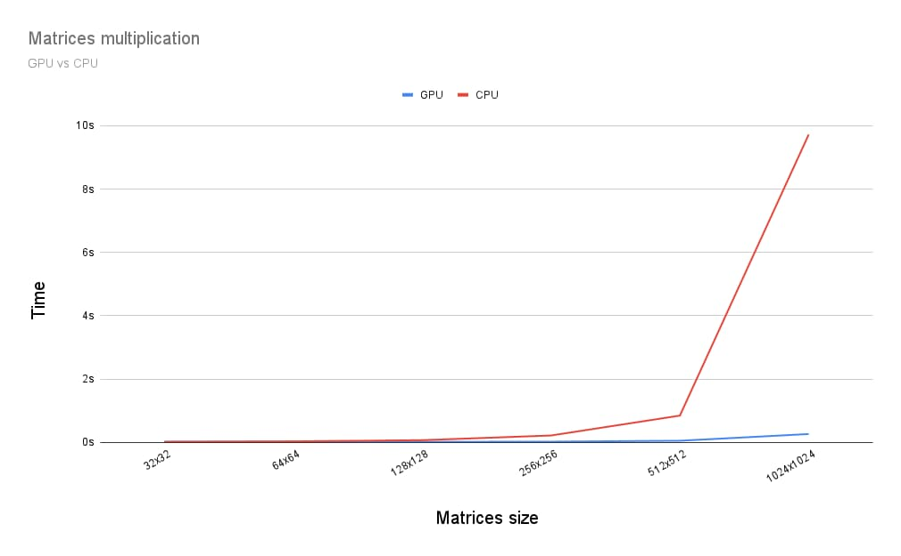

文章出处：https://web.dev/gpu-compute/

| 文章发布时间  | 文章最后更新 | 翻译时间      | 翻译人   |
| ------------- | ------------ | ------------- | -------- |
| 2019年8月28日 | 2021年9月6日 | 2021年9月12日 | 四季留歌 |

版权原作者所有。转载翻译稿请带连接与翻译者。

使用 WebGPU 可以调用 GPU 的并行计算性能。

# 1 背景

GPU 最初是拿来画图的设备，但是近些年它的并行计算能力却开辟了另一些领域，允许开发人员实现多种类型的算法，而不是仅仅拿来画图。

这种借助 GPU 并行计算能力的编程称为 GPU计算，使用 GPU 作为主要运算处理器的科学计算称为通用 GPU 编程（General-Purpose GPU 编程，GPGPU）。

> 译者注：多年后，这段文字会不会写入一些本科毕业论文呢？（笑

GPU 计算为机器学习做出了巨大贡献，因为卷积神经网络和其他模型可以利用该架构在 GPU 上高效运行。但是，Web端缺乏 GPU 的计算功能（WebGL很难做），W3C 的 `GPU for the Web` 社区组正在设计一个 API 来公开大多数现代图形处理器能用的图形编程接口，这个 API 是 WebGPU。

WebGPU 是一个底层 API，类似 WebGL。它的代码量很长，接口粒度很细，不过没关系，我们关注的是性能。

在本文中，作者介绍 WebGPU 中的 GPU 计算部分，仅作为抛砖引玉，希望各位大佬能玩出花样。之后原作者也将考虑写一些 WebGPU 图形渲染的文章。

# 2 访问 GPU

在 WebGPU API 中访问 GPU 很容易，调用 `navigator.gpu.requestAdapter()` 会返回一个 Promise，它会 resolve 一个 GPU 适配器（物理显卡）的 adapter 对象。

一般这个适配器对象会是独显，但是有些情况也可以是核芯显卡。

一旦你有了适配器对象，你可以调用 `adapter.requestDevice()` 来获取一个能 resolve 一个设备对象的 Promise。

适配器和设备这两个对象的区别见官方 Explainer 文档。

``` js
const adapter = await navigator.gpu.requestAdapter();
if (!adapter) { return; }
const device = await adapter.requestDevice();
```

上述俩函数都可以传入 option 对象，用来选择适配器类型和指定设备信息。为了简单起见，这里不传递，即使用默认配置。

# 3 写入缓存

这部分介绍 JavaScript 是如何把数据写入显存的。

下面的例子介绍了如何把 4bytes 数据写入已经访问到的显存里。调用 `device.createBuffer()` 并传递几个参数：需要多大的显存，这块显存的作用。

默认情况下，即使不明确传递参数 `GPUBufferUsage.MAP_WRITE`，申请的这块显存就是拿来写入的。由于 `mappedAtCreation` 是 `true`，它会在创建时映射这块缓存，然后我们就可以在 JavaScript 代码中对返回的 buffer 对象调用 `getMappedRange()` 来访问关联在一起的二进制数据了。

如果你用过 `ArrayBuffer`，那么写入字节数据应该不是什么大问题，接下来要用到 `TypedArray` 来写入缓存。

``` js
// 获取一块状态为映射了的显存，以及一个对应的 arrayBuffer 对象来写数据
const gpuBuffer = device.createBuffer({
  mappedAtCreation: true,
  size: 4,
  usage: GPUBufferUsage.MAP_WRITE
});
const arrayBuffer = gpuBuffer.getMappedRange();

// 通过 TypedArray 向 ArrayBuffer 写数据
new Uint8Array(arrayBuffer).set([0, 1, 2, 3]);
```

状态是映射的显存，这意味着这块显存暂时归 CPU 所有，即能使用 JavaScript 读写它。为了让 GPU 能再次访问这块缓存，它必须取消映射：调用 `gpuBuffer.unmap()` 即可。

> 显存映射/解除映射这组概念，是用来防止 GPU 和 CPU 同时访问缓存时产生冲突用的。


# 4 读取缓存

这一节介绍如何将某个 GPU 缓存对象上的数据复制到另一个 GPU 缓存对象（`GPUBuffer` Object）。

在某个 GPUBuffer 对象上写入了数据，并要复制到另一个，那么就需要一个新的属性 `GPUBufferUsage.COPY_SRC`。这次，调用 `device.createBuffer()` 创建一个没有映射的 GPUBuffer 对象，它的 `usage` 将设为 `GPUBufferUsage.COPY_DST | GPUBufferUsage.MAP_READ`，它用来存放第一个 GPUBuffer 复制过来的数据，并在复制结束后要在 JavaScript 这边再次把数据读取出来。

``` js
// 获取一块状态为映射了的显存，以及一个对应的 arrayBuffer 对象来写数据
const gpuWriteBuffer = device.createBuffer({
  mappedAtCreation: true,
  size: 4,
  usage: GPUBufferUsage.MAP_WRITE | GPUBufferUsage.COPY_SRC // 👈 注意这里
});
const arrayBuffer = gpuWriteBuffer.getMappedRange();

// 通过 TypedArray 向 ArrayBuffer 写数据
new Uint8Array(arrayBuffer).set([0, 1, 2, 3]);

// 解除显存对象的映射，稍后它就能在 GPU 中进行复制操作
gpuWriteBuffer.unmap();

// 创建一个新的状态为未映射的 GPUBuffer，它之后要拿来读取数据
const gpuReadBuffer = device.createBuffer({
  size: 4,
  usage: GPUBufferUsage.COPY_DST | GPUBufferUsage.MAP_READ // 👈 注意这里
});
```

由于 GPU 是一个独立于 CPU 的协处理器，所有 GPU 的指令都是异步执行的，这就是为什么要去创建 GPU 指令组，而且在需要的时候成批提交到 GPU 上的原因（GPUCommandEncoder、GPUQueue）。

在 WebGPU 中，通过调用 `device.createCommandEncoder()` 返回 `GPUCommandEncoder` 对象，这个对象能构建并暂存一系列的 GPU 指令，然后在某个时刻提交至 GPU。另一方面，GPUBuffer 对象上的方法是不缓存的，意思是你调用的时候就会立即执行。

获取 `GPUCommandEncoder` 后，你可以用 `copyEncoder.copyBufferToBuffer()` 将此命令添加到指令队列以供后续的执行；最后调用 `copyEncoder.finish()` 完成指令的编码，然后调用 `device.queue.submit()` 来把这些指令提交给 GPU，然后 GPU 将按顺序执行。

``` js
// 创建一个名为 copyEncoder 的指令编码器，用来复制显存
const copyEncoder = device.createCommandEncoder();
copyEncoder.copyBufferToBuffer(
  gpuWriteBuffer /* 源显存（对象） */,
  0 /* 起始字节（从哪开始读） */,
  gpuReadBuffer /* 目标显存（对象） */,
  0 /* 起始字节（从哪开始写） */,
  4 /* 大小 */
);

// 提交我们写好的复制功能的指令
const copyCommands = copyEncoder.finish();
device.queue.submit([copyCommands]);
```

此时，指令队列已经发送，但是不一定已经执行。想要读取第二个 GPUBuffer 对象上的数据，你要配合参数 `GPUMapMode.READ` 调用 `gpuReadBuffer.mapAsync()` 方法，它返回一个 Promise，你可以用 await 语法来获取 resolve 值。这个 Promise 在 GPUBuffer 被再次映射时 resolve。

然后，使用 `gpuReadBuffer.getMappedRange()` 来获取映射后的数据，一旦提交的指令执行后，我们获取到的这个数据应该会与第一个 GPUBuffer 的数据是一样的。

``` js
// 读取缓存
await gpuReadBuffer.mapAsync(GPUMapMode.READ);
const copyArrayBuffer = gpuReadBuffer.getMappedRange();
console.log(new Uint8Array(copyArrayBuffer));
```

你可以到 glitch 上看看 [示例代码1](https://glitch.com/edit/#!/gpu-compute-sample-1).


---

简而言之，关于 GPUBuffer 对象（显存）的操作，希望读者记住以下几点：

- GPUBuffer 对象必须取消映射，才能用于提交队列；
- 一旦 GPUBuffer 对象被映射了，它就能被 JavaScript 读写；
- 调用 `mapAsync()`、`createBuffer()` 方法，且将 `mappedAtCreation` 属性设为 `true` 时，GPUBuffer 对象会被映射。

---


# 5 着色器编程

在 GPU 上运行的计算代码（仅计算，不绘图）称为 **计算着色器**。它们由数百个 GPU 核心并行执行。它们的输入和输出是 WebGPU 中的缓存器。

为了说明计算着色器在 WebGPU 中的使用，先列举一下矩阵乘法，这是一种机器学习中的常见计算：



简而言之，我们要做：

① 创建三个 GPU 缓存器（GPUBuffer 对象，两个用于输入矩阵，一个用于保存输出的结果矩阵）

② 描述计算着色器的输入和输出

③ 编译着色器代码

④ 创建并设置计算管线

⑤ 将编码后的命令批量提交给 GPU

⑥ 从结果缓存器中读取结果矩阵


# 6 GPUBuffer 对象的创建

为了简单起见，这里使用浮点数组表示矩阵，第一、二个数组元素是行数、列数，其余是矩阵的元素值。


创建三个 usage 带有 `GPUBufferUsage.STORAGE` 参数的 GPUBuffer 来存储数据，因为在计算着色器中要存数据和读数据。

用于存储结果的 GPUBuffer 要带有 `GPUBufferUsage.COPY_SRC`，因为一旦所有的 GPU 指令执行完毕后，这个矩阵将复制到这个 GPUBuffer。

大致代码：

``` js
const adapter = await navigator.gpu.requestAdapter();
if (!adapter) { 
  return; 
}
const device = await adapter.requestDevice();

// 第一个矩阵
const firstMatrix = new Float32Array([
  2 /* 2行 */, 4 /* 4列 */,
  1, 2, 3, 4,
  5, 6, 7, 8
]);
const gpuBufferFirstMatrix = device.createBuffer({
  mappedAtCreation: true,
  size: firstMatrix.byteLength,
  usage: GPUBufferUsage.STORAGE,
});
const arrayBufferFirstMatrix = gpuBufferFirstMatrix.getMappedRange();
new Float32Array(arrayBufferFirstMatrix).set(firstMatrix);
gpuBufferFirstMatrix.unmap();

// 第二个矩阵
const secondMatrix = new Float32Array([
  4 /* 4行 */, 2 /* 2列 */,
  1, 2,
  3, 4,
  5, 6,
  7, 8
]);
const gpuBufferSecondMatrix = device.createBufferMapped({
  mappedAtCreation: true,
  size: secondMatrix.byteLength,
  usage: GPUBufferUsage.STORAGE,
});
const arrayBufferSecondMatrix = gpuBufferSecondMatrix.getMappedRange();
new Float32Array(arrayBufferSecondMatrix).set(secondMatrix);
gpuBufferSecondMatrix.unmap();


// 结果矩阵
const resultMatrixBufferSize = Float32Array.BYTES_PER_ELEMENT * (2 + firstMatrix[0] * secondMatrix[1]);
const resultMatrixBuffer = device.createBuffer({
  size: resultMatrixBufferSize,
  usage: GPUBufferUsage.STORAGE | GPUBufferUsage.COPY_SRC
});
```


# 7 绑定组及其布局对象

绑定组及其布局对象是 WebGPU 中特有的概念（接口）。绑定组表示一组要输入到着色器里的数据，譬如你要做一个菜，那一堆配好的食材就可以叫绑定组。绑定组的布局对象就是告诉着色器绑定组对象长什么样子，即你买的食材是什么，量多少。

在下面的示例代码中，布局对象告诉计算着色器，这里有 3 个绑定的资源，分别编号为 0、1、2，0 号和 1 号对应两个只读存储缓存（`read-only-storage`），2 号对应一个存储缓存（`storage`）。

绑定组对象和这个布局对象是关联的，在本例中，即三个 GPUBuffer 分别一个萝卜填一个坑， `gpuBufferFirstMatrix`、`gpuBufferSecondMatrix` 对象对应 0 号和 1 号坑，`resultMatrixBuffer` 对应 2号坑。

``` js
const bindGroupLayout = device.createBindGroupLayout({
  entries: [
    {
      binding: 0,
      visibility: GPUShaderStage.COMPUTE,
      buffer: {
        type: "read-only-storage"
      }
    },
    {
      binding: 1,
      visibility: GPUShaderStage.COMPUTE,
      buffer: {
        type: "read-only-storage"
      }
    },
    {
      binding: 2,
      visibility: GPUShaderStage.COMPUTE,
      buffer: {
        type: "storage"
      }
    }
  ]
});

const bindGroup = device.createBindGroup({
  layout: bindGroupLayout,
  entries: [
    {
      binding: 0,
      resource: {
        buffer: gpuBufferFirstMatrix
      }
    },
    {
      binding: 1,
      resource: {
        buffer: gpuBufferSecondMatrix
      }
    },
    {
      binding: 2,
      resource: {
        buffer: resultMatrixBuffer
      }
    }
  ]
});
```


# 8 计算着色器代码

实际计算矩阵相乘的代码是 WGSL（WebGPU ShaderLanguage）编写的，可以轻松转换为 SPIR-V。

你应该很容易找到 `var<storage>` 标识的三个存储缓存器。

这段代码使用 `firstMatrix` 和 `secondMatrix` 作为输入，使用 `resultMatrix` 作为输出。

注意，每个存储缓存器都有一个 `binding` 装饰，对应在前面创建的绑定组及其布局对象中的索引号是相同的。

``` js
const shaderModule = device.createShaderModule({
  code: `
    [[block]] struct Matrix {
      size : vec2<f32>;
      numbers: array<f32>;
    };

    [[group(0), binding(0)]] var<storage, read> firstMatrix : Matrix;
    [[group(0), binding(1)]] var<storage, read> secondMatrix : Matrix;
    [[group(0), binding(2)]] var<storage, write> resultMatrix : Matrix;

    [[stage(compute), workgroup_size(8, 8)]]
    fn main([[builtin(global_invocation_id)]] global_id : vec3<u32>) {
      // 防止超出范围
      if (global_id.x >= u32(firstMatrix.size.x) || global_id.y >= u32(secondMatrix.size.y)) {
        return;
      }

			// 设置结果矩阵的维度
      resultMatrix.size = vec2<f32>(firstMatrix.size.x, secondMatrix.size.y);
			
      // 计算部分
      let resultCell = vec2<u32>(global_id.x, global_id.y);
      var result = 0.0;
      // 计算结果矩阵中的某个元素
      for (var i = 0u; i < u32(firstMatrix.size.y); i = i + 1u) {
        let a = i + resultCell.x * u32(firstMatrix.size.y);
        let b = resultCell.y + i * u32(secondMatrix.size.y);
        result = result + firstMatrix.numbers[a] * secondMatrix.numbers[b];
      }
      
      // 计算当前元素的索引号，并将当前元素写入
      let index = resultCell.y + resultCell.x * u32(secondMatrix.size.y);
      resultMatrix.numbers[index] = result;
    }
  `
});
```

## 译者注

文章用的是自定义的矩阵，即一个 TypedArray 中头 2 个元素代表行列 + 剩余的数字代表矩阵值，所以在 WGSL 中要使用 `[[block]]` 来定义一个结构体来接收。

其中，在绑定组里传递了三个 GPUBuffer，所以会看到三个全局作用域下的变量 `firstMatrix`、`secondMatrix` 和 `resultMatrix`。这三个变量被 `[[group(0), binding(i)]], i = 0,1,2` 修饰，刚好和绑定组布局对象是对应的。

`var` 声明的变量代表可变，`<storage, read/write>` 即这个变量的用法，最后，这三个变量均为自定义的 `Matrix` 结构。


# 9 创建、配置管线

**计算管线** 可以通过 `device.createComputePipeline()` 来创建。它需要俩参数：

- 绑定组的布局对象
- 着色器

``` js
const computePipeline = device.createComputePipeline({
  layout: device.createPipelineLayout({
    bindGroupLayouts: [bindGroupLayout] // <- 详见第 8 节
  }),
  compute: {
    module: shaderModule, // <- 详见第 8 节
    entryPoint: "main"
  }
});
```


# 10 指令的提交

上面，我们将三个 WebGPU缓存器、绑定组和计算管道创建好了，现在是时候用它们了。

执行 `commandEncoder.beginComputePass()` 启动一个可编程的计算通道编码器，我们用它来编码要执行矩阵乘法计算的 GPU 指令。使用 `passEncoder.setPipeline(computePipeline)` 来为通道编码器设置计算管线，然后使用 `passEncoder.setBindGroup(0, bindGroup)` 在 0 号索引处设置绑定组对象。索引 0 的意思就是 WGSL 代码中的 `group(0)`。

这里，先说说计算着色器如何在 GPU 上运行。

目标是对结果矩阵上的逐个元素执行着色器，即 main 函数。例如，对于大小为 2 × 4 的结果矩阵，调用 `passEncoder.dispatch(2, 4)` 来执行指令，第一个参数 x，这里是 2，表示表示第一个维度有多大，对应的第二个参数 y 是 4 表示第二维度是 4，最后的第三维度 z 没指定，默认是 1，因为这里不需要计算第三维。

在 GPU 计算这个范畴内，编码一个指令，然后对某一块数据执行内核函数（这里就是 WGSL 中那个 main 函数啦），这个过程被称为 **调度（dispatching）**。



上图即对某个结果矩阵（假设为 2×4）中的每个元素执行 WGSL 中的 main 函数进行并行计算的图解。

在本例的 WGSL 代码中，计算着色器主函数的工作网格大小被设为 `(8, 8)`，因此，第一个矩阵的行数和第二个矩阵的列数要除以 8。调用 `passEncoder.dispatch(firstMatrix[0] / 8, secondMatrix[0] / 8)` 即可。

> 原文的参数就是 `firstMatrix[0] / 8, secondMatrix[0] / 8`，我觉得应该还要 ceil 计算，可能是作者有疏忽。

---

## 译者插入语：为什么要除以8

注意到在 WGSL 中，入口函数申请了 8×8 大小的 GPU 核心（即 `workgroup_size(8, 8)`），之后计算着色器每次执行计算，它的武力值就是这 64 个核心，但是你的矩阵不一定就是 8×8 呀，这里是 2×2，用不完。

这就十分有趣了，源码中 `passEncoder.dispatch(x, y)` 的意义，为什么要用结果矩阵的维度除以 8 再向上取整？

如果，在计算着色器里共享的数据并不是矩阵，而是规模更大的一些数据，譬如是一个图像，尺寸是 16 × 16 = 256，那么显然在横竖两个维度调度一次，即 `dispatch(1, 1)` 就不够了，你两个维度都只调度一次，显然每个维度只有 8 个处理器，共计 64 个处理器，算不完这 256 个数据。

但是如果我 `dispatch(2, 2)`，每个维度我调度两次，就变成了 `(2×8)×(2×8) = 16 × 16 = 256`，我着色器虽然武力值只有64，但是我横竖都打你 2 次，加起来 4 次 64，不就够了吗？

根据我的推断与实际修改代码，如果在 WGSL 中改 `workgroup_size` 为 `(2, 2)` 或 `(4, 4)`，在 dispatch 时也分别除以 2 或 4，那么结果还是一样的。

```
workgroup_size(2, 2)  --VS--  dispatch(1, 1)  → OK!
workgroup_size(4, 4)  --VS--  dispatch(1, 1)  → OK!
```

但是我改为 `workgroup_size(1, 1)` 后，如果仍旧是 `dispatch(1, 1)`，结果就不对了，因为此时要 `dispatch(2, 2)` 结果才对，因为横竖方向都调度了 2 次，即使我武力值（也就是核心数）只有 `1×1 = 1`，4 次加起来也有 4 点伤害（即计算了 4 次），所以算这个矩阵没有问题。

```
workgroup_size(1, 1)  --VS--  dispatch(1, 1)  → Fail!
workgroup_size(1, 1)  --VS--  dispatch(2, 2)  → OK!
```

综上所述，我认为除以 8 再取整，是一种考虑周全的写法，即考虑到了矩阵如果很大的话，这个 `workgroup_size(8, 8)` 的核函数所申请的这 64 个处理核心，只需将大矩阵行列分别除以 8，让行列方向分别调度多次核函数（也就是计算着色器）即可完成运算。

如果出现了调度规模大于 1 的情况，我觉得可能需要考虑 `global_id` 获取 GPUBuffer 传进来大矩阵的行列的问题，因为 `global_id` 的范围始终落在 `workgroup_size` 中，而矩阵的行列已经超出了这个 size，并行计算的话就需要考虑考虑了。显然，作者考虑到了这一点，巧妙地把矩阵的行列传入，在 for 循环中利用矩阵的行列和当前调度中的 `global_id` 计算出真正需要的行列，然后取原矩阵对应位置的元素值。

精彩！

---

如上图所示，对于每个并行运算的核函数（即 main函数），它都有一个内置的参数 `[[builtin(global_invocation_id)]]`，它告诉着色器代码现在算的是哪个元素。

``` js
const commandEncoder = device.createCommandEncoder();

const passEncoder = commandEncoder.beginComputePass();
passEncoder.setPipeline(computePipeline);
passEncoder.setBindGroup(0, bindGroup);
const x = Math.ceil(firstMatrix[0] / 8);
const y = Math.ceil(secondMatrix[1] / 8);
passEncoder.dispatch(x, y);
passEncoder.endPass();
```

调用 `passEncoder.endPass()` 以结束通道编码器。随后，创建一个 GPUBuffer，用于存放计算结果。

最后，调用 `copyEncoder.finish()` 完成指令的编码，然后调用 `device.queue.submit()` 将这些指令提交到 GPU。

``` js
// 创建一个未映射的读数据 GPUBuffer 对象，用来读取结果 GPUBuffer
const gpuReadBuffer = device.createBuffer({
  size: resultMatrixBufferSize,
  usage: GPUBufferUsage.COPY_DST | GPUBufferUsage.MAP_READ
});

// 编译复制命令
commandEncoder.copyBufferToBuffer(
  resultMatrixBuffer /* 结果显存（对象） */,
  0 /* 起始字节（从哪开始读） */,
  gpuReadBuffer /* 目标显存（对象） */,
  0 /* 起始字节（从哪开始写） */,
  resultMatrixBufferSize /* 大小 */
);

// 提交指令到 GPU
const gpuCommands = commandEncoder.finish();
device.queue.submit([gpuCommands]);
```


# 11 读取结果矩阵

只需调用 `gpuReadBuffer.mapAsync()` 时使用 `GPUMapMode.READ` 值并 await 它返回的 Promise 即可。

然后，调用 `gpuReadBuffer.getMappedRange()` 来获取映射的范围。


弯括号的意思是，返回的数组前俩数字是矩阵维度，后面4个数字是矩阵行优先的元素。

在控制台，会打印 `2, 2, 50, 60, 114, 140`

``` JS
// Read buffer.
await gpuReadBuffer.mapAsync(GPUMapMode.READ);
const arrayBuffer = gpuReadBuffer.getMappedRange();
console.log(new Float32Array(arrayBuffer));
```

恭喜你！你做到了。

源代码2：[点我](https://glitch.com/edit/#!/gpu-compute-sample-2)

# 12 收尾

为了让代码更易读，最好使用计算管线的 `getBindGroupLayout` 方法从着色器模块来推断绑定组的布局对象。

这个方法就不需要在创建绑定组布局对象和在计算管线中指定指定管线布局对象了。

源代码3：[点我](https://glitch.com/edit/#!/gpu-compute-sample-3?path=script.js%3A1%3A0)

```diff
 const computePipeline = device.createComputePipeline({
-  layout: device.createPipelineLayout({
-    bindGroupLayouts: [bindGroupLayout]
-  }),
   compute: {
```

``` diff
-// Bind group layout and bind group
- const bindGroupLayout = device.createBindGroupLayout({
-   entries: [
-     {
-       binding: 0,
-       visibility: GPUShaderStage.COMPUTE,
-       buffer: {
-         type: "read-only-storage"
-       }
-     },
-     {
-       binding: 1,
-       visibility: GPUShaderStage.COMPUTE,
-       buffer: {
-         type: "read-only-storage"
-       }
-     },
-     {
-       binding: 2,
-       visibility: GPUShaderStage.COMPUTE,
-       buffer: {
-         type: "storage"
-       }
-     }
-   ]
- });
+// Bind group
  const bindGroup = device.createBindGroup({
-  layout: bindGroupLayout,
+  layout: computePipeline.getBindGroupLayout(0 /* index */),
   entries: [
```

> 译者注：其实就是省去了俩布局对象的创建，使得绑定组对象和管线对象能直接连接在一起，只需在创建绑定组时将其 layout 指定为计算管线的 getBindGroupLayout() 方法调用的返回值即可。


# 13 性能对比

那么，在 GPU 上跑矩阵乘法与在 CPU 上跑的对比如何呢？作者写了 CPU 实现的代码。

如下图，当矩阵大于 256 X 256 维度时，使用 GPU 来计算的性能优势十分明显。



这篇文章只是作者探索 WebGPU 的开始，期待很快会有更多文章深入探讨 GPU 计算以及渲染（Canvas、纹理、采样器）中的原理。

# 译者建议参考

- [WGSL Spec 12.3 Compute Shaders and Workgroups](https://www.w3.org/TR/WGSL/#compute-shader-workgroups)
- [WGSL Spec 1.2 Technical Overview | dispatch、compute shader、workgroup 相关](https://www.w3.org/TR/WGSL/#technical-overview)
- [WGSL Spec 3.6 Attributes | workgroup_size 特性](https://www.w3.org/TR/WGSL/#attributes)
- [WebGPU Spec 21.2 Computing](https://www.w3.org/TR/webgpu/#computing-operations) GPU 计算详细描述
- [WebGPU Spec 14 Compute Passes](https://www.w3.org/TR/webgpu/#compute-passes) 计算通道