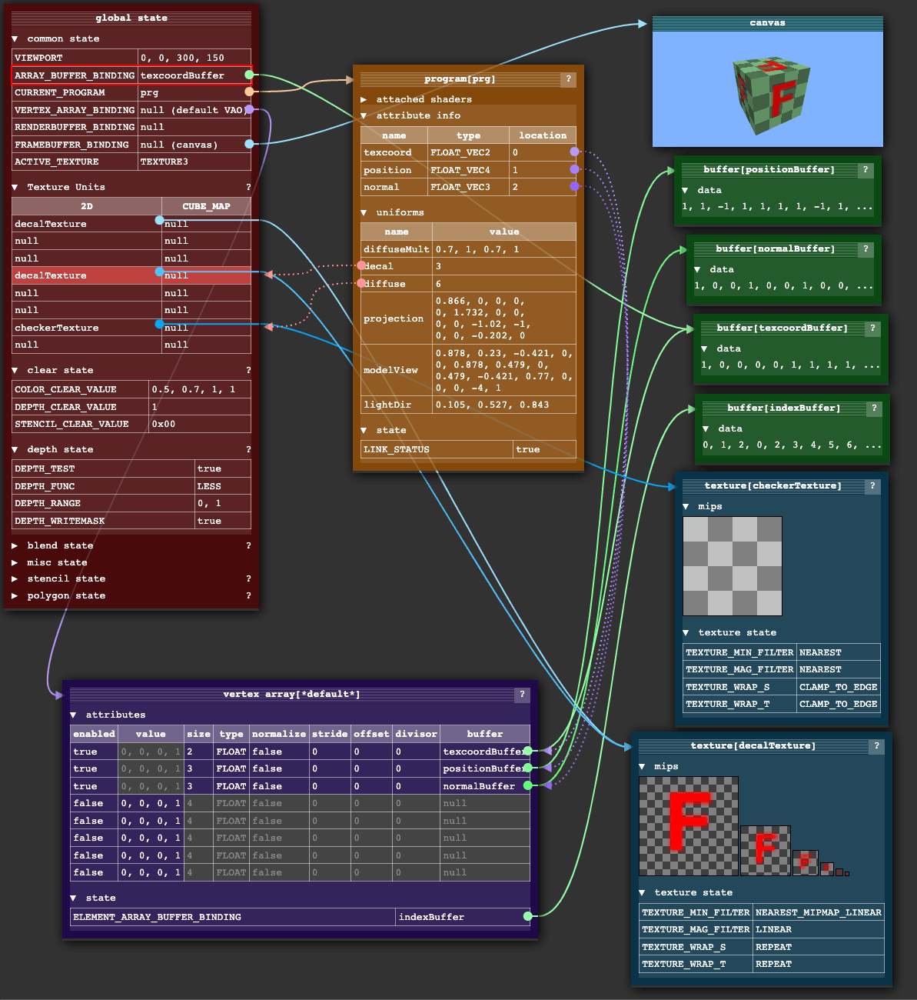

> WebGPU - 专注于处理核心（GPU Cores），而不是绘图画布（Canvas）

原文发布于 2022年3月8日，传送门 https://surma.dev/things/webgpu

---

WebGPU 是即将推出的 WebAPI，你可以用它访问图形处理单元（GPU），它是一种底层接口。

原作者对图形编程没有多少经验，他是通过研究 OpenGL 构建游戏引擎的教程来学习 WebGL 的，还在 ShaderToy 上学习 Inigo Quilez 的例子来研究着色器。因此，他能在 PROXX 中创建背景动画之类的效果，但是他表示对 WebGL 并不太满意。别急，下文马上会解释。

当作者开始注意 WebGPU 后，大多数人告诉他 WebGPU 这东西比 WebGL 多很多条条框框。他没考虑这些，已经预见了最坏的情况，他尽可能找了一些教程和规范文档来看，虽然彼时并不是很多，因为他找的时候 WebGPU 还在早期制定阶段。不过，他深入之后发现 WebGPU 并没有比 WebGL 多所谓的“条条框框”，反而是像见到了一位老朋友一样熟悉。

所以，这篇文章就是来分享学到的东西的。

作者明确指出，他 **不会** 在这里介绍如何使用 WebGPU 绘制图形，而是要介绍 WebGPU 如何调用 GPU 进行它本身最原始的计算（译者注：也就是通用计算）。

他觉得已经有很多资料介绍如何用 WebGPU 进行绘图了，例如 austin 的[例子](https://austin-eng.com/webgpu-samples)，或许他考虑之后也写一些绘图方面的文章。

他在这里会讨论得比较深入，希望读者能正确、有效地使用 WebGPU，但是他不保证你读完就能成为 GPU 性能专家。

絮絮叨叨结束后，准备发车。


# 1. WebGL

WebGL 是 2011 年发布的，迄今为止，它是唯一能在 Web 访问 GPU 的底层 API，实际上它是 OpenGL ES 2.0 的简易封装版以便能在 Web 中使用。WebGL 和 OpenGL 都是科纳斯组标准化的，这个工作组是图形界的 W3C，可以这么理解。

OpenGL 本身是一个颇具历史的 API，按今天的标准看，它不算是一个很好的 API，它以内部全局状态对象为中心。这种设计可以最大限度减少特定调用的 GPU 的 IO 数据量。但是，这种设计有很多额外的开销成本。



上图：WebGL 内部全局状态对象的可视化，源自 [WebGL Fundamentals](https://webglfundamentals.org/webgl/lessons/resources/webgl-state-diagram.html)

内部状态对象，说白了，大多数都是一些指针。调用 OpenGL API 会改变这些指针的指向，所以改变状态的顺序相当重要，这导致了抽象和写库的困难程度大大增加。你必须非常清楚地知道你现在马上要进行的 API 调用需要准备什么状态，调用完了还得恢复到之前的值。

他说，他经常会看到一个黑色的画布（因为 WebGL 报错大多数时候就这样），然后得狂躁地找没调用哪些 API 没有正确设置全局状态。

他承认，他不知道 ThreeJS 是如何做到状态管理架构的，但是的确做的不错，所以大多数人会使用 ThreeJS 而不是原生 WebGL，这是主要的原因了。

> “不能很好认同 WebGL”这只是对原作者他自己说的，而不是读者们。他表示，比他聪明的人用 WebGL 和 OpenGL 已经做了不少 nice 的东西，但是他一直不满意罢了。

随着机器学习、神经网络以及加密货币的出现，GPU 证明了它可以干除了画三角形之外的事情。使用 GPU 进行任意数据的计算，这种被称为 GPGPU，但是 WebGL 1.0 的目的并不在于此。如果你在 WebGL 1.0 想做这件事，你得把数据编码成纹理，然后在着色器中对数据纹理进行解码、计算，然后重新编码成纹理。WebGL 2.0 通过 [转移反馈]() 让这摊子事情更容易了一些，但是直到 2021 年 9 月，Safari 浏览器才支持 WebGL 2.0（大多数浏览器 2017 年 1 月就支持了），所以 WebGL 2.0 不算是好的选择。

尽管如此，WebGL 2.0 仍然没有改变 WebGL 的本质，就是全局状态。


# 2. WebGPU

在 Web 领域外，新的图形 API 已经逐渐成型。它们向外部暴露了一套访问显卡的更底层的接口。这些新的 API 改良了 OpenGL 的局促性。

> 主要就是指 DirectX 12、Vulkan、Metal

一方面来说，现在 GPU 哪里都有，甚至移动设备都有不错的 GPU 了。所以，现代图形编程（3D渲染、光追）和 GPGPU 会越来越普遍。

另一方面来看，大多数设备都有多核处理器，如何优化多线程与 GPU 进行交互，是一个重要的课题。

WebGPU 标准制定者注意到了这些现状，在预加载 GPU 之前要做好验证工作，这样才能给 WebGPU 开发者以更多精力专注于压榨 GPU 的性能。

下一代最受欢迎的 GPU API 是：

- 科纳斯组的 Vulkan
- 苹果的 Metal
- 微软的 DirectX 12

为了把这些技术融合并带到 Web，WebGPU 就诞生了。

WebGL 是 OpenGL 的一个浅层封装，但是 WebGPU 并没这么做。它引入了自己的抽象概念体系，汲取上述 GPU API 的优点，而不是继承自这些更底层的 API.

原因很简单，这三个 API 并不是全部都是全平台通用的，而且有一些他们自己的非常底层的概念，对于 Web 这个领域来说显得不那么合理。

相反，WebGPU 的设计让人感觉“哇，这就是给 Web 设计的”，但是它的的确确又基于你当前机器的 GPU API，抽象出来的概念被 W3C 标准化，所有的浏览器都得实现。由于 WebGPU 相对来说比较底层，它的学习曲线会比较陡峭，但是作者表示会尽可能地分解。


## 2.1. 适配器（Adapter）和设备（Device）

最开始接触到的 WebGPU 抽象概念是适配器（Adapter）和设备（Device）。


上图：抽象层，从物理 GPU 到逻辑设备。

物理设备就是 GPU 本身，有内置的 GPU（核芯显卡）和外部 GPU（独立显卡）两种。通常，某个设备一般只有一个 GPU，但是也有两个或者多个的情况。例如，微软的 Surface 笔记本就具备双显卡，以便操作系统在不同的情况进行切换。

操作系统使用显卡厂商提供的驱动程序来访问 GPU；反过来，操作系统也可以用特定的 API（例如 Vulkan 或者 Metal）向外暴露 GPU 的功能。

GPU 是共享资源，它不仅要被各种程序调用，还要负责向显示器上输出。这看起来需要一个东西来让多个进程同时使用 GPU，以便每个进程把自己的东西画在屏幕上。

对于每个进程来说，似乎看起里他们对 GPU 有唯一的控制权，但是那只是表象，实际上这些复杂逻辑是驱动程序和操作系统来完成调度的。

**适配器（Adapter）**是特定操作系统的 API 与 WebGPU 之间的中介。

但是，由于浏览器又是一个可以运行多个 Web 程序的“迷你操作系统”，因此，在浏览器层面仍需要共享适配器，以便每个 Web 程序感觉上就像唯一控制 GPU 一样，所以，每个 Web 程序就获得了再次抽象的概念：**逻辑设备（Logical Device）**。

要访问适配器对象，请调用 `navigator.gpu.requestAdapter()`，在写本文时，这个方法的参数比较少，能让你选请求的是高性能的适配器（通常是高性能独显）还是低功耗适配器（通常是核显）。

> 译者注：本篇讨论 WebGPU 的代码，没特殊指明，均为浏览器端的 WebGPU JavaScript API.

> 软渲染：一些操作系统（诸如小众 Linux）可能没有 GPU 或者 GPU 的能力不足，会提供“后备适配器（Fallback Adapter）”，实际上这种适配器是纯软件模拟出来的，它可能不是很快，可能是 CPU 模拟出来的，但是能基本满足系统运作。

若能请求到非空的适配器对象，那么你可以继续异步调用 `adapter.requestDevice()` 来请求逻辑设备对象。下面是示例代码：

```js
if (!navigator.gpu) throw Error("WebGPU not supported.");

const adapter = await navigator.gpu.requestAdapter();
if (!adapter) throw Error("Couldn’t request WebGPU adapter.");

const device = await adapter.requestDevice();
if (!device) throw Error("Couldn’t request WebGPU logical device.");
```

如果没有任何请求设备的参数，那么 `requestDevice()` 会返回一个不匹配任何设备功能要求的设备，即 WebGPU 团队认为是合理且对于所有 GPU 都通用的设备对象。

请求设备对象过程中的“限制”见 [规范](https://gpuweb.github.io/gpuweb/#limit)。

举个例子，即使我的 GPU 可以轻易处理 4GB 的数据，返回的设备对象也只允许最大 1GB 的数据，你请求再多也只会返回最大允许 1GB，这样就算你切换到别的机器上跑代码，就不会有太多问题。

你可以访问 `adapter.limits` 查看物理 GPU 的实际限制情况。也可以在请求设备对象时，传递你所需要检验的更高限制参数。


## 2.2. 着色器（Shaders）

如果你用过 WebGL，那么你应该熟悉顶点着色器和片元（片段）着色器。


## 2.3. 管线（Pipelines）


## 2.4. 并行（Parallelism）


## 2.5. 工作组（Workgroups）


## 2.6. 指令（Commands）


# 3. 数据交换


## 3.1. 绑定组的布局


## 3.2. 暂存缓冲区


## 3.3. 过度调度


## 3.4. 结构也疯狂


## 3.5. 输入输出


# 4. 性能


# 5. 稳定性与可用性


# 总结