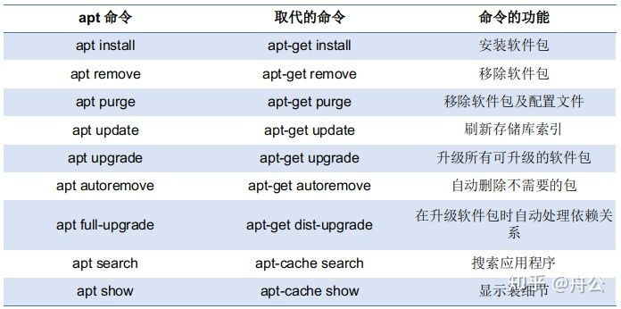

# 1. apt 和 apt-get 的区别


# 2. 查询功能

## 2.1. 列出已经装了的

``` BASH
apt list --installed [| grep <名称>]
```

几乎等价于调用 dpkg 命令：

``` BASH
dpkg-query -l [| grep <名称>]
```

## 2.2. 最近安装的动作

简略版：

``` BASH
grep " install " /var/log/apt/history.log
```

详细版（依赖都给你列出来）

``` BASH
grep " install " /var/log/dpkg.log
```




# *补充：snap 和 flatpak


# **补充2：软件包

- .deb：Debian、Ubuntu常见
- .rpm：RedHat、Fedora、Centos

## yum

yum，必须弄个仓库：/etc/yum.repos.d/下，必须以 .repo 为扩展名

``` 
[local_base]
name=Base CentOS  (local)
baseurl=http://7-repo.apps.home.local/yum-repo/7/
enabled=1
gpgcheck=0
```

这是笔者本地仓库之一，这也是为什么 gpgcheck 值为 0 的原因。如果这个值为 1 的话，每个包都需要被密钥签名，相应的密钥（的公钥）也要导入到安装软件的系统上。因为这个软件仓库是笔者本人维护的且笔者信任这个仓库里的包，所以就不去对它们一一签名了。

准备好仓库文件后，就可以 sudo yum update 更新仓库了

## zypper

和yum很像，加仓库源的时候可以用命令

``` bash
zypper addrepo http://download.videolan.org/pub/vlc/SuSE/15.0 vlc

#删除
zypper removerepo vlc

#查询
zypper repos
```

## apt

*Advanced Pack Tool*

APT 曾经使用 `/etc/apt/sources.list` 文件来管理软件仓库，后来的变成也可以使用 `/etc/apt/sources.d` 目录来管理。

# 参考

https://zhuanlan.zhihu.com/p/42402896

https://zhuanlan.zhihu.com/p/144132093