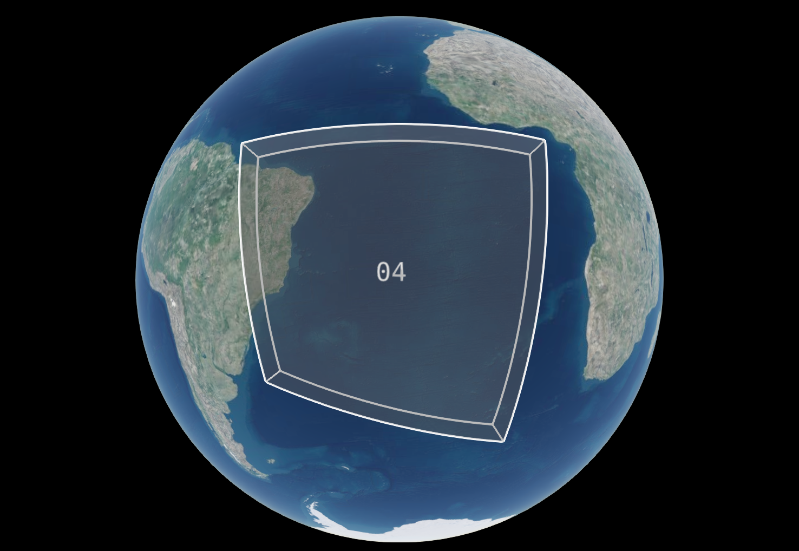
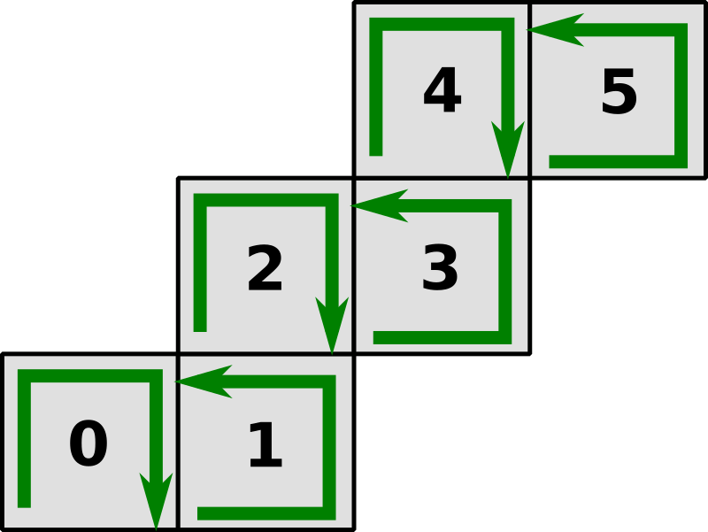
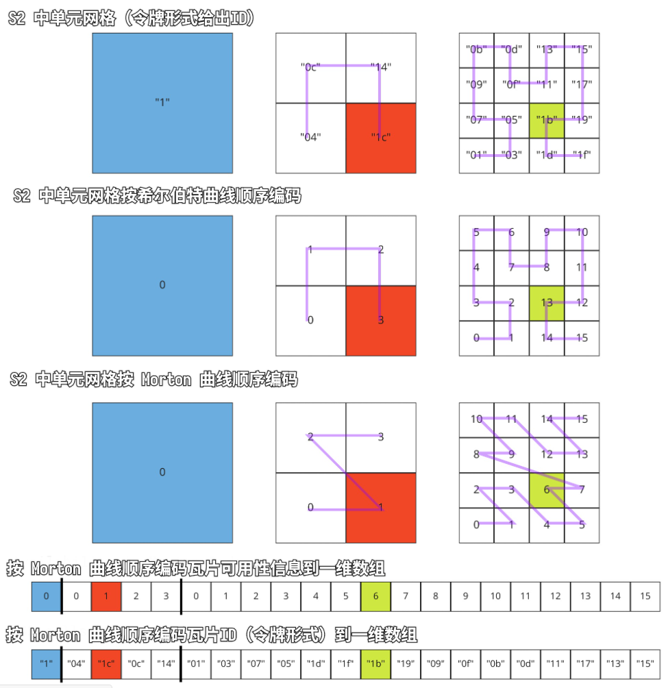

[3DTILES_implicit_tiling](https://github.com/CesiumGS/3d-tiles/tree/main/extensions/3DTILES_bounding_volume_S2)

---


[TOC]

---

# 依赖于

3D Tiles 1.0

# 可选与必需

必须同时出现在 `extensionsUsed` 和 `extensionsRequired` 数组中，即“必需的”。

# 1. 概述

[S2](https://s2geometry.io/) 是一个用于定义单位球体表面的网格框架的程序库，一个网格单元（又叫单元格，Cell）将会横竖各取一半来分成 4 个子单元格，单元格的四个边界线均为测地线（即沿着地面的“直线”）。

S2 所定义的这套地表的网格层次结构，有 6 个根单元格。每个根单元格是由单位立方体投影到球面上获得的。

> 译者注，单位立方体投影到球面这个描述其实不准确，严格来说是单位立方体各个面与球心连接而成的四棱锥,与球面相交得到的那 6 个测地四边形。见本文下面的图。

通常，传统的 GIS 会把地球椭球体投影到某个平面或可展成平面的曲面（圆锥、圆柱）上。例如，墨卡托投影就是投影到圆柱体上。墨卡托有一个众所周知的问题，那就是离极点越近，形变越大。

S2 这种投射方式就改善了墨卡托的问题，并还有其它的好处，它把地表面分割成没有奇怪端点、形变较小、瓦片相对来说几乎相等的瓦片。

基于上述特征，使用 S2 定义的这套瓦片层次结构的 3D Tiles Next 扩展就特别合适跨越全球范围的瓦片数据集。


# 2. 层级

S2 层级结构中，每个根网格测地四边形（称作“单元格”）能细分到 30 级。下图展示第 "1" 个单元格及其 4 个子单元格的图例：

| 第 0 级（根 Cell）                                       | 第 1 级（根 Cell 的子级 Cell）                             |
| -------------------------------------------------------- | ---------------------------------------------------------- |
|          |          |
|  |  |

第一行是地球立方体的第 "1" 个 Cell 及其子 Cell，第二行则是椭球面上的第 "1" 个 Cell 及其 4 个子 Cell，其中子 Cell 上的编号暂且不管，编号会在下文，单元格ID 中详细解释。

S2 使用改版希尔伯特曲线来编码一维顺序的网格编号，给每一级别任意单元格提供了64位的ID，最高层级的单元格可以精确到厘米级空间范围。

观察 S2 希尔伯特曲线如下：

| 在地球立方体表面上             | 在 WGS84 椭球面上                  |
| ------------------------------ | ---------------------------------- |
|  |  |


# 3. 单元格ID

单元格ID 使用 64 位宽度的二进制比特位来编码，从左到右的比特位的规则：

- 第 0~3 位，用来编码属于哪个根单元格，取值范围 0~5（6 个，二进制表示为 000b 到 110b，刚好）
- 从第 4 位开始到 63 位，为第 1 级~第 30 级别这 29 个级别的单元格编码，从左到右每 2 个位表示一级，因为同一级别只有 4 个兄弟单元格，两位比特位刚好表示 4 个单元格的编码；
- 基于上面两条规则，后面再补一个 1 来表示结束
- 再往右，对于没有用到的位数，使用 0 来填充。譬如第 8 级单元格只需要用到 8×2 + 3 + 1 = 20 个比特位

举例（下列第 i 个的起始均为 第 0 个，即以 0 为索引起点数）：

```
001 1 000000000...000   第 1 个根单元格
001 01 10000000...000   第 1 个根单元格的第 1 个子单元格
001 01 11 100000...000   第 1 个根单元格的第 1 个子单元格的第 3 个子单元格
001 01 11 00 1000...000   第 1 个根单元格的第 1 个子单元格的第 3 个子单元格的第 0 个子单元格
```

上述数字用十进制表示即

```
3458764513820540928
3170534137668829184
3386706919782612992
3332663724254167040
```


# 4. 令牌（Token）

为了更简便地表达单元格ID，以及更好指示其级别，先将二进制的单元格ID 转换为十六进制，并去掉尾部所有的 0，这样就得到了单元的令牌。

对于第 3 节中的例子，按上述规则生成令牌即：

```
3
2c
2f
2e4
```

> 译者注 转成十六进制后，其字符长度刚好就是单元的等级（仍然是 0 为索引起点）


# 5. 空间范围体

S2 的单元（Cell）描述了地球椭球面上的一块四边形区域，记录四边形的四个角点。为了形成空间范围立方体，这四个角点要沿着它在椭球面的法线方向（通常就是垂直地表向上）拉伸。

此时，用 `minimumHeight` 表示空间范围立方体的底面高度，用 `maximumHeight` 表示顶面高度，注意，这两个高度的 0 值为地球椭球面，单位均为米。

当本文描述的这个扩展来表示瓦片对象的 boundingVolume（空间范围体）时，瓦片对象的 transform 属性将被忽略。

若使用 3DTILES_bounding_volume_S2 扩展，那么必须保证瓦片必须在空间上是连续紧挨的。

此扩展可以作用于瓦片对象的 boundingVolume 或者瓦片对象的内容属性的 boundingVolume 属性。

> 将地球椭球体映射到地球立方体时，S2 库提供三种投影，即线性、二次方投影、切线形式，3DTILES_bounding_volume_S2 使用二次方投影，因为准确且有效。

下面是一个例子，它的单元格ID 令牌形式为 "89c6c7"：


它的大概位置位于美国费城中心城区，最小高度 minimumHeight 被设为 0，最大高度 maximumHeight 被设为了 1000 米。

具体 JSON 中的对象表示如下：

``` json
"boundingVolume": {
  "extensions": {
    "3DTILES_bounding_volume_S2": {
      "token": "89c6c7",
      "minimumHeight": 0,
      "maximumHeight": 1000
    }
  }
}
```

再举一例：

``` json
{
  "asset": {
    "version": "1.0"
  },
  "geometricError": 1000000,
  "extensionsUsed": [
    "3DTILES_bounding_volume_S2"
  ],
  "extensionsRequired": [
    "3DTILES_bounding_volume_S2"
  ],
  "root": {
    "boundingVolume": {
      "extensions": {
        "3DTILES_bounding_volume_S2": {
          "token": "3",
          "minimumHeight": 0,
          "maximumHeight": 1000000
        }
      }
    },
    "refine": "REPLACE",
    "geometricError": 50000,
    "children": [
      {
        "boundingVolume": {
          "extensions": {
            "3DTILES_bounding_volume_S2": {
              "token": "2c",
              "minimumHeight": 0,
              "maximumHeight": 500000
            }
          }
        },
        "refine": "REPLACE",
        "geometricError": 500000,
        "children": [
          {
            "boundingVolume": {
              "extensions": {
                "3DTILES_bounding_volume_S2": {
                  "token": "2f",
                  "minimumHeight": 0,
                  "maximumHeight": 250000
                }
              }
            },
            "refine": "REPLACE",
            "geometricError": 250000,
            "children": [
              {
                "boundingVolume": {
                  "extensions": {
                    "3DTILES_bounding_volume_S2": {
                      "token": "2ec",
                      "minimumHeight": 0,
                      "maximumHeight": 125000
                    }
                  }
                },
                "refine": "REPLACE",
                "geometricError": 125000
              }
            ]
          }
        ]
      }
    ]
  }
}
```


# 6. 与隐式瓦片扩展一起使用

当此扩展与 3DTILES_implicit_tiling 扩展一起使用时，尤其是后者使用四叉树来组织瓦片索引时，那么瓦片的空间范围体就遵循 S2 所定义的空间层次范围规则。

当 3DTILES_implicit_tiling 扩展使用的是八叉树组织瓦片的索引时，那么空间范围体的分割也可以遵循S2 的方案，只不过在四叉树的基础上，在垂直方向的分割将位于 minimumHeight 和 maximumHeight 的中间点。（请细细品味这一点，在横竖方向上八叉树的空间范围体的最大最小值和四叉树的一样，垂直高度则取中间分两半）

如下图所示

| 单元（第4个根单元）                    | 单元四叉树分割后                                           | 单元八叉树分割后                                        |
| -------------------------------------- | ---------------------------------------------------------- | ------------------------------------------------------- |
|  |  |  |

为了保证 S2 用到的希尔伯特曲线的连贯性，地球立方体的 6 个投影平面按如下图示方向旋转。



> 上面有第 4 个和第 1 个根单元的图，读者可以比对看看。

要十分注意这一点，在配合隐式瓦片分割方案时，奇数面的遍历顺序和偶数面的遍历顺序是相反的。

例如，第 1 个根单元是逆时针编号四个子单元格（隐式子瓦片），第 4 个根单元则是顺时针编号。


## 可用性信息编码

当此扩展与 3DTILES_implicit_tiling 一起使用时，其 subtree 文件内记录的瓦片可用性数据的编码顺序，必须按 Morton 索引顺序一致，如下图：



## 例子①

以下为 3DTILES_bounding_volume_S2 与 3DTILES_implicit_tiling 搭配使用的 JSON 例子：

``` json
{
  "asset": {
    "version": "1.0"
  },
  "geometricError": 10000,
  "extensionsUsed": [
    "3DTILES_implicit_tiling",
    "3DTILES_bounding_volume_S2"
  ],
  "extensionsRequired": [
    "3DTILES_implicit_tiling",
    "3DTILES_bounding_volume_S2"
  ],
  "root": {
    "boundingVolume": {
      "extensions": {
        "3DTILES_bounding_volume_S2": {
          "token": "04",
          "minimumHeight": 0,
          "maximumHeight": 500000
        }
      }
    },
    "refine": "REPLACE",
    "geometricError": 5000,
    "content": {
      "uri": "content/{level}/{x}/{y}.glb"
    },
    "extensions": {
      "3DTILES_implicit_tiling": {
        "subdivisionScheme": "QUADTREE",
        "subtreeLevels": 4,
        "maximumLevel": 7,
        "subtrees": {
          "uri": "subtrees/{level}/{x}/{y}.subtree"
        }
      }
    }
  }
}
```

## 例子②

以下例子为 3DTILES_bounding_volume_S2 表达 S2 的 6 个根单元网格，可以很明显看出它能均匀覆盖全球：


其 JSON 为

``` json
{
  "asset": {
    "version": "1.0"
  },
  "geometricError": 10000,
  "extensionsUsed": [
    "3DTILES_implicit_tiling",
    "3DTILES_bounding_volume_S2"
  ],
  "extensionsRequired": [
    "3DTILES_implicit_tiling",
    "3DTILES_bounding_volume_S2"
  ],
  "root": {
    "boundingVolume": {
      "region": [
        -3.141592653589793,
        -1.5707963267948966,
        3.141592653589793,
        1.5707963267948966,
        0,
        250000
      ]
    },
    "refine": "REPLACE",
    "geometricError": 10000,
    "children": [
      {
        "boundingVolume": {
          "extensions": {
            "3DTILES_bounding_volume_S2": {
              "token": "1",
              "minimumHeight": 0,
              "maximumHeight": 1000000
            }
          }
        },
        "refine": "REPLACE",
        "geometricError": 5000,
      },
      {
        "boundingVolume": {
          "extensions": {
            "3DTILES_bounding_volume_S2": {
              "token": "3",
              "minimumHeight": 0,
              "maximumHeight": 1000000
            }
          }
        },
        "refine": "REPLACE",
        "geometricError": 5000,
      },
      {
        "boundingVolume": {
          "extensions": {
            "3DTILES_bounding_volume_S2": {
              "token": "5",
              "minimumHeight": 0,
              "maximumHeight": 1000000
            }
          }
        },
        "refine": "REPLACE",
        "geometricError": 5000,
      },
      {
        "boundingVolume": {
          "extensions": {
            "3DTILES_bounding_volume_S2": {
              "token": "7",
              "minimumHeight": 0,
              "maximumHeight": 1000000
            }
          }
        },
        "refine": "REPLACE",
        "geometricError": 5000,
      },
      {
        "boundingVolume": {
          "extensions": {
            "3DTILES_bounding_volume_S2": {
              "token": "9",
              "minimumHeight": 0,
              "maximumHeight": 1000000
            }
          }
        },
        "refine": "REPLACE",
        "geometricError": 5000,
      },
      {
        "boundingVolume": {
          "extensions": {
            "3DTILES_bounding_volume_S2": {
              "token": "b",
              "minimumHeight": 0,
              "maximumHeight": 1000000
            }
          }
        },
        "refine": "REPLACE",
        "geometricError": 5000,
      }
    ]
  }
}
```

# JSON 格式规范

- [boundingVolume.3DTILES_bounding_volume_S2.schema.json](https://github.com/CesiumGS/3d-tiles/blob/main/extensions/3DTILES_bounding_volume_S2/schema/boundingVolume.3DTILES_bounding_volume_S2.schema.json)

# 代码库实现相关案例

- [S2Geometry C++实现](https://github.com/google/s2geometry/tree/master/src/s2)
- [S2Geometry Java 实现](https://github.com/google/s2-geometry-library-java/tree/master/src/com/google/common/geometry)
- [CesiumJS 中的 S2Cell 实现](https://github.com/CesiumGS/cesium/blob/master/Source/Core/S2Cell.js)

