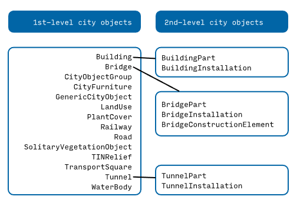

# 1 简介

CityJSON 是一种 JSON 数据，它是 [OGC CityGML 数据模型 v2.0.0](http://www.opengeospatial.org/standards/citygml) 的子集。

它定义了如何存储城市、景观的三维模型。

CityJSON 的目标是解决 CityGML 的冗长问题，CityGML 的 GML 编码实在是难以阅读和操作，提供一种替代方案。

这个标准特别考虑到了开发者，基于此可以快速构建出工具和 API。


# 2 一致性说明

CityJSON 的 Schema 可以在这里找到 https://www.cityjson.org/schemas

# 3 略

# 4 CityJSON 对象

CityJSON 对象表示给定区域的一个三维城市模型，这个模型可能有不同类型的要素。

一个 CityJSON 对象：

- 是一个 JSON 对象；
- 必须含有 4 个成员：
  - `"type"`，值必须为 `"CityJSON"`；
  - `"version"`，值是字符串，CityJSON 只用到第二位版本号，即 "X.Y" 格式
  - `"CityObjects"`, 一个对象，key 是对象的 id，value 是 [City](#5 City 对象) 对象。
  - `"vertices"`，城市模型的顶点坐标数组，它由 [Geometric 对象](#6 Geometry 对象) 来索引，其索引机制与 [Wavefront OBJ](https://en.wikipedia.org/wiki/Wavefront_.obj_file) 格式基本一致。
- 可选成员 `"extensions"`，如果使用到了 [扩展](#10 扩展)，那么这个对象就要存在了；
- 可选成员 `"metadata"`，元数据，是一个对象，用来记录坐标系定义、数据集范围、创建者等；
- 可选成员 `"transform"`，一个对象，用于描述坐标如何解压缩，如果用到了，它的作用仅仅是减小文件体积；
- 可选成员 `"appearance"`，一个对象，描述材质、纹理信息；
- 可选成员 `"geometry-templates"`，一个对象，能被多个不同 [City 对象](#5 City 对象) 复用（例如树），与 CityGML 中的 `implicit geometries` 类似；
- 还可能有其他成员，但是有可能会被解释器忽略掉，所以不要擅自加成员。


因此，最小的 CityJSON 对象是这样的：

``` json
{
  "type": "CityJSON",
  "version": "1.0",
  "CityObjects": {},
  "vertices": []
}
```

属性全空 CityJSON 对象是这样的：

``` json
{
  "type": "CityJSON",
  "version": "1.0",
  "extensions": {},
  "metadata": {},
  "transform": {
    "scale": [],
    "translate": []
  },
  "CityObjects": {},
  "vertices": [],
  "appearance": {},
  "geometry-templates": {}
}
```

虽然说，最好按这个顺序组织，但是 JSON 序列化程序不一定管这个，所以这不是强制的。


# 5 City 对象

City 对象类型列表如下：



分成一级和二级。

一个最小的有效 City 对象（以 `"Building"` 类型为例，任何一级 City 对象均可）：

``` json
{
  "type": "Building",
  "geometry": []
}
```

一个最小的有效二级 City 对象（以 `"BuildingPart"` 为例）：

``` json
{
  "type": "BuildingPart",
  "parents": ["id-parent"],
  "geometry": []
}
```


## 5.1 Attributes

## 5.2 Building

## 5.3 Transportation

## 5.4 TINRelief

## 5.5 WaterBody

## 5.6 LandUse

## 5.7 PlantCover

## 5.8 SolitaryVegetationObject

## 5.9 CityFurniture

## 5.10 GenericCityObject

## 5.11 Bridge

## 5.12 Tunnel

## 5.13 CityObjectGroup

# 6 Geometry 对象

## 6.1 顶点的坐标

## 6.2 用数组表示边界

## 6.3 几何图元定义

## 6.4 几何模板

# 7 Transform 对象

# 8 元数据

## 8.1 CRS

## 8.2 地理范围

## 8.3 地理定位

# 9 Appearance 对象

# 10 扩展