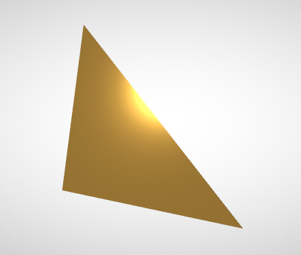

本篇介绍一个非常简单的材料示例，并说明不同材料的不同影响。

下面是一个简单的gltf：

```json
{
  "scenes" : [
    {
      "nodes" : [ 0 ]
    }
  ],

  "nodes" : [
    {
      "mesh" : 0
    }
  ],

  "meshes" : [
    {
      "primitives" : [ {
        "attributes" : {
          "POSITION" : 1
        },
        "indices" : 0,
        "material" : 0
      } ]
    }
  ],

  "buffers" : [
    {
      "uri" : "data:application/octet-stream;base64,AAABAAIAAAAAAAAAAAAAAAAAAAAAAIA/AAAAAAAAAAAAAAAAAACAPwAAAAA=",
      "byteLength" : 44
    }
  ],
  "bufferViews" : [
    {
      "buffer" : 0,
      "byteOffset" : 0,
      "byteLength" : 6,
      "target" : 34963
    },
    {
      "buffer" : 0,
      "byteOffset" : 8,
      "byteLength" : 36,
      "target" : 34962
    }
  ],
  "accessors" : [
    {
      "bufferView" : 0,
      "byteOffset" : 0,
      "componentType" : 5123,
      "count" : 3,
      "type" : "SCALAR",
      "max" : [ 2 ],
      "min" : [ 0 ]
    },
    {
      "bufferView" : 1,
      "byteOffset" : 0,
      "componentType" : 5126,
      "count" : 3,
      "type" : "VEC3",
      "max" : [ 1.0, 1.0, 0.0 ],
      "min" : [ 0.0, 0.0, 0.0 ]
    }
  ],

  "materials" : [
    {
      "pbrMetallicRoughness": {
        "baseColorFactor": [ 1.000, 0.766, 0.336, 1.0 ],
        "metallicFactor": 0.5,
        "roughnessFactor": 0.1
      }
    }
  ],
  "asset" : {
    "version" : "2.0"
  }
}
```

渲染图：



# 材质定义

gltf多了一个顶级属性：`materials`，是所有材质对象的一个数组。

```json
"materials" : [
    {
        "pbrMetallicRoughness": {
            "baseColorFactor": [ 1.000, 0.766, 0.336, 1.0 ],
            "metallicFactor": 0.5,
            "roughnessFactor": 0.1
        }
    }
],
```

本例中，材料由"pbrMetallicRoughness"对象组成，它定义了金属-粗糙度模型里的各项参数。

`baseColorFactor`是RGBA，值域是[0,1]，这里是亮橙色。

`metallicFactor`是0.5，表示反射特性介于金属和非金属之间。

`roughnessFactor`使得材料更粗糙，而不是像镜子一样光滑。

# 绑定到图元（primitive）

```json
"meshes" : [
    {
        "primitives" : [ {
            "attributes" : {
                "POSITION" : 1
            },
            "indices" : 0,
            "material" : 0
        } ]
    }
]
```

material属性的值是materials数组的索引号。（注意上面的POSITION、indices是accessors数组的索引号）

---

下一节将简要介绍复杂的纹理，然后来创建更复杂、逼真的材料。