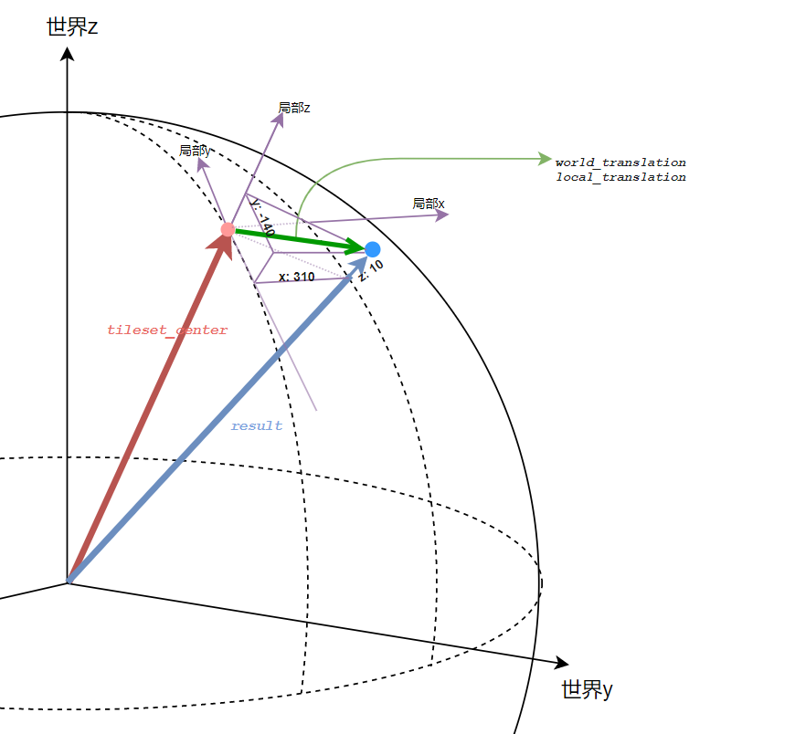
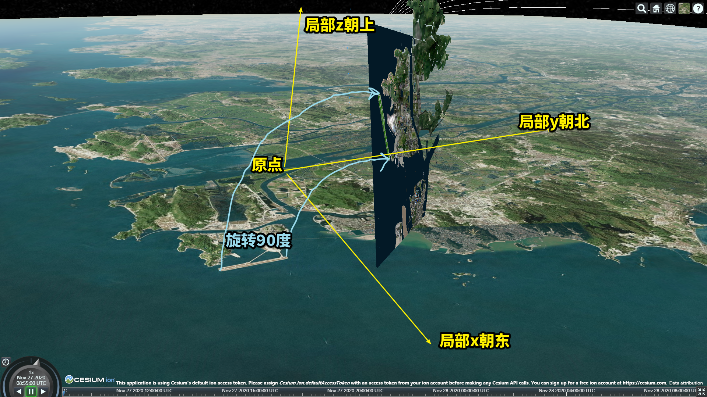

# 开门见山：`tileset.modelMatrix`

这个属性可以在数据本身的基础上再进行坐标变换，不熟悉转换矩阵各个部分的含义的可参考图形学有关资料。


# 平移思路

- 获取当前瓦片数据集的包裹范围（boundingSphere）中心（此时参考系是世界坐标）
- 计算当参考系是局部坐标时，此位置为原点的局部坐标系，到世界坐标的转换矩阵（eastNorthUpToFixedFrame）
- 利用上一步的转换矩阵，左乘一个局部平移向量，得到此平移向量在世界坐标系下的平移目标位置（矩阵×向量，结果是向量）
- 向量相减：世界坐标系下，指向平移目标点位的目标向量 - 指向数据集中心的向量，得到世界坐标系下的平移向量。
- 将世界坐标系下的平移向量转换成平移矩阵，赋予 `tileset.modelMatrix`

## 代码

``` js
tileset
  .readyPromise
  .then(tileset => {
    const tileset_center = tileset.boundingSphere.center; // Cartesian3
    const frompoint_to_world_matrix = Cesium.Transforms.eastNorthUpToFixedFrame(tileset_center); // Matrix4
    const local_translation = new Cesium.Cartesian3(310, -140, 10); // 向模型中心为原点，正北为y，正东为x，地心朝上为z分别平移 310、-140、10米
    const result = new Cesium.Cartesian3(0,0,0);
    Cesium.Matrix4.multiplyByPoint(frompoint_to_world_matrix, local_translation, result); // 转换矩阵左乘局部平移向量，结果存储在 result 中，结果是世界坐标下的平移终点向量
    const targetpoint_to_world_matrix = Cesium.Transforms.eastNorthUpToFixedFrame(result);

    const world_translation = new Cesium.Cartesian3(
      targetpoint_to_world_matrix[12] - frompoint_to_world_matrix[12],
      targetpoint_to_world_matrix[13] - frompoint_to_world_matrix[13],
      targetpoint_to_world_matrix[14] - frompoint_to_world_matrix[14],
    ); // 向量相减，得到世界坐标下的平移向量

    tileset.modelMatrix = Cesium.Matrix4.fromTranslation(world_translation); // 构造平移矩阵并赋值
    viewer.zoomTo(tileset);
});
```

## 图解



解释：

- 红点：frompoint（地表点）
- 蓝点：targetpoint（frompoint局部坐标向东向北向上偏移各 310、-140、10米 后得到的目标点）
- 红向量：地表点向量
- 蓝向量：目标点向量
- 绿向量：平移向量。如果是局部坐标，那么就是 (310, -140, 10)，如果是世界坐标下的，那就是 **蓝向量 - 红向量**

cesium 的场景数据最终都是世界坐标的，所以要求的是绿向量的世界坐标表达，然后构造平移矩阵。

现在是已知红向量和局部坐标的绿向量，要先求蓝向量，才能得到世界坐标的绿向量。

# 平移思路二

先平移到世界坐标中心，然后在世界坐标中心求平移，最后再移动回原点。

`tileset.modelMatrix` $= M_{backToOrigin}·M_{localTranslation}·M_{moveToWorldCenter}$

读者可自行实现。


# 旋转思路

局部旋转，应该先将模型移动到世界坐标中心，旋转后，再移动到原来的地方

即

`tileset.modelMatrix` $= M_{backToOrigin}·M_{localRotate}·M_{moveToWorldCenter}$

其中，$M_{moveToWorldCenter}$ 是一个平移矩阵，只需使用模型中心向量取个负值即可

$M_{backToOrigin}$ 则是从世界坐标中心再移动到模型原点

注意，这里是左乘优先顺序，从右往左乘。

旋转矩阵比较容易构造，就不细说了。

**这个思路的计算量比较大！**

## 效果图（绕模型本身x轴转90度）



## 代码

``` JS
tileset
  .readyPromise
  .then(tileset => {
    const tileset_center = tileset.boundingSphere.center; // Cartesian3
    //console.log(tileset_center);
    const backto_matrix = Cesium.Matrix4.fromTranslation(tileset_center);
    const moveto_vec = Cesium.Cartesian3.multiplyByScalar(tileset_center, -1, new Cesium.Cartesian3());
    //console.log(moveto_vec);
    const moveto_matrix = Cesium.Matrix4.fromTranslation(moveto_vec);
    
    /* 绕x（即东方轴）转90度 */
    const cos_rotateX = Math.cos(Math.PI/2);
    const sin_rotateX = Math.sin(Math.PI/2);
    const arr = [1,0,0,0,  0, cos_rotateX, sin_rotateX,0,   0,-sin_rotateX,cos_rotateX,0, 0,0,0,1];
    const rotateX_matrix = Cesium.Matrix4.fromArray(arr);
  
    /* 计算最终矩阵 */
    const temp = Cesium.Matrix4.multiply(rotateX_matrix, moveto_matrix, new Cesium.Matrix4()); 
    const r = Cesium.Matrix4.multiply(backto_matrix, temp, new Cesium.Matrix4());
  
    tileset.modelMatrix = r; // 构造平移矩阵并赋值
    viewer.zoomTo(tileset);
});
```

可以看到会产生非常多中间变量，会引发 JS 的GC，而且矩阵计算本身也比较复杂。


# 缩放思路

缩放思路和旋转类似，先移动到世界坐标系中心，缩放，然后再移动到原来的地方

`tileset.modelMatrix` $= M_{backToOrigin}·M_{localScale}·M_{moveToWorldCenter}$

读者可自行实现。

