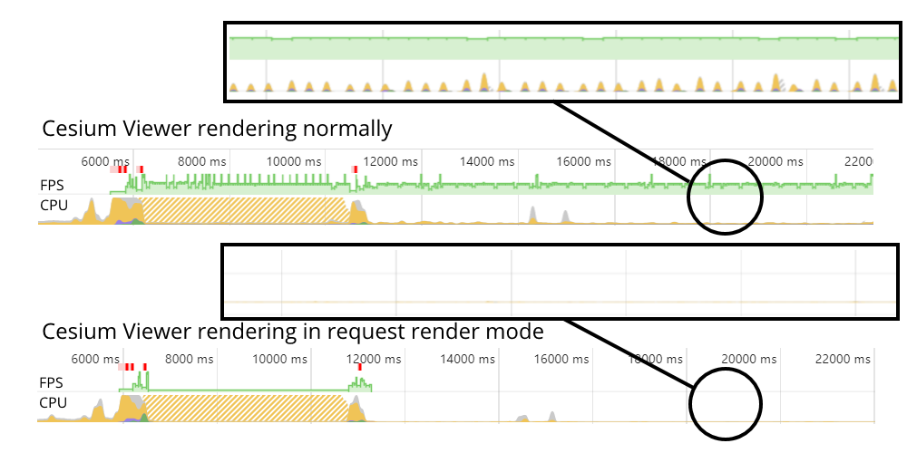

2018.1.24

默认情况下，Cesium 跟普通的游戏引擎一样无时不刻地用固定的帧速率在渲染新的帧。虽然这么做可以确保动态数据的实时性渲染，但是仍然有的Cesium应用并不需要什么时候都刷新的情况的。渲染新的一帧会占用CPU资源，如果你的程序闲置了，意味着并不需要渲染。**显式渲染** 可以提高这方面的性能。

从 v1.42 开始，开发者可以根据需求准确控制 Cesium 中的渲染，例如使用显式渲染模式。启用后，仅以下情况才会渲染新的一帧：

- 摄像机状态变化，包括用户交互、API修改
- 时钟变化超过了指定的变化时长
- 在地形、影像、3dTiles或者 DataSource 中加载新数据时。在底层，当 Blob 数据或 Web 请求结束时，或者一个从 WebWorker 的异步处理返回时，将触发渲染
- 影像图层被添加、被移除、被修改
- 地形 Provider 被修改
- Scene 的 mode 变形时
- 指定了显式渲染模式时

上述覆盖了 Cesium 的大多数功能。程序将根据 Scene 的微小改变来决定是否需要渲染，而不是每次数据更新都要渲染。若存在上述情况没有提及的 API 导致 Scene 的内容发生改变，例如使用 Primitive API 或 Entity API，那么也会触发一个新帧的渲染请求。

Scene 启用显式渲染模式并改动 Scene 后，先根据目标帧速率进行渲染。不过，当 Cesium 程序闲置时，CPU 的占用率其实并不高，使用浏览器的开发者工具可以观察到闲置时 CPU 的平均使用率为 25.1%，但是启用性能改进后，降至 3%（使用 i7 处理器的笔记本电脑实测数据）



初始加载时，二者曲线几乎一致，加载后，下图的 CPU 使用率几乎为 0%。空闲时，下图的帧速率为 0FPS，因为不需要渲染新的帧。

要将 Cesium 的显式渲染模式启动，request render mode 需要启用。模拟时间也要考虑进去。任何没有自动处理的情况都要显式地渲染一帧。

（这段又不知道官方在说什么了）

# 1. 启用 `requestRenderMode`

启用 `requestRenderMode` 可以减少渲染新帧的时间和CPU使用率。

``` JS
const viewer = new Cesium.Viewer('cesiumContainer', {
    requestRenderMode : true
});
```

也可以在创建 viewer 后再设置它：

``` JS
const viewer = new Cesium.Viewer('cesiumContainer');
viewer.scene.requestRenderMode = true;
```

# 2. 处理时钟的变化

当 `requestRenderMode` 启用时，每当时钟的变动时间超过 0.0 秒（？我也不知道官方什么意思，可能是0.01s级别吧），就会请求去渲染新的一帧。你可以修改这个时间阈值，通过设置 `maximumRenderTimeRange` 属性即可。

如果你的场景里没有随着时间变化的东西，例如 Property动画、灯光、水面特效、视频等，可以设置成一个比较高的值，例如无穷。

``` JS
const viewer = new Cesium.Viewer('cesiumContainer', {
    requestRenderMode : true,
    maximumRenderTimeChange : Infinity
});
viewer.scene.debugShowFramesPerSecond = true;
```

这样即使时间变化，也不会渲染新的一帧了，使用旧的帧数据继续 draw 就行。

# 3. 自己控制显式渲染

如果发生了上文没有提及的情况的变化，显式渲染机制会去渲染新的一帧，以表明数据在变化。如果不渲染新的一帧，你就看不到你的数据变化了。

例如，手动设置 `skyBox` 的 show 属性为 false，令天空盒消失，但是此时因为显式渲染机制在作用，Cesium 并不会帮你更新，此时，就得自己更新了：

``` js
scene.skyBox.show = false;
scene.requestRender();
```

调用 `Scene.prototype.requestRender()` 方法即可手动渲染新的一帧。

通常这种需要手动调用 `requestRender()` 方法的，是UI界面设置了一些什么属性导致场景中的数据变化而需要渲染新的一帧。

# 4. 渲染一帧过程中的各种事件

官方修改了这块的逻辑。Cesium 始终使用恒定的帧速率更新（默认60fps，参考 `Viewer.targetFrameRate`）。

当你启用了 `requestRenderMode` 时，仅在渲染新的一帧时触发 `render()` 函数而不是一直在渲染。官方已经调整了渲染周期内的事件顺序。通常，在某个更新事件中如果调用了 `requestRender()` 函数（或者执行了其他更改导致需要请求新的渲染），那么这次的渲染会排到下一次。

``` JS
scene.postUpdate.addEventListener(function() {
    if (changeToPromptRender) {
        scene.requestRender();
    }
}); 

scene.preRender.addEventListener(function() {
  // 当新的一帧渲染（包括changeToPromptRender是true时）这里的代码将被执行
}); 
```

## preUpdate、postUpdate

一个更新前，一个更新后，不受 `requestRenderMode` 的影响，按帧速率来触发此事件。

## preRender

update 后，render 前触发。当 `requestRenderMode` 启用时，这个事件仅在新的一帧被渲染之前触发。

## postRender

render 后触发。同上，当 `requestRenderMode` 启用时，这个事件仅在新的一帧被渲染后触发。

# 5. 举例

沙盒中 `Scene Rendering Performance` 例子举了一些常见的例子，何时需要显式渲染、何时不要的例子都有。

假设有这么一个app，鼠标划过 entity 时来拾取 entity 属性。但是，除非 entity 的状态（颜色、位置、大小等）有变化，否则实在没有必要在每次 `MOUSE_MOVE` 时，都去渲染新的数据。

``` JS
// 启用 requestRenderMode，并告诉系统在无限长的时间内都不要更新
var viewer = new Cesium.Viewer('cesiumContainer', {
    requestRenderMode : true,
    maximumRenderTimeChange : Infinity
});

var entity = viewer.entities.add({
    position : Cesium.Cartesian3.fromDegrees(-75.59777, 40.03883),
    box : {
        dimensions : new Cesium.Cartesian3(1000000.0, 1000000.0, 30000.0),
        material : Cesium.Color.CORNFLOWERBLUE
    }
});

// 每当鼠标划过 entity，改变颜色和缩放比，然后才需要请求渲染新的一帧
var lastPicked;
handler = new Cesium.ScreenSpaceEventHandler(scene.canvas);
handler.setInputAction(function(movement) {
    var pickedObject = scene.pick(movement.endPosition);
    if (Cesium.defined(pickedObject) && (pickedObject.id === entity)) {
        if (Cesium.defined(lastPicked)) {
            return;
        }
        entity.box.material = Cesium.Color.YELLOW;
        scene.requestRender();
        lastPicked = pickedObject;
    } else if (Cesium.defined(lastPicked)) {
        entity.box.material = Cesium.Color.CORNFLOWERBLUE;
        scene.requestRender();
        lastPicked = undefined;
    }
}, Cesium.ScreenSpaceEventType.MOUSE_MOVE);
```

# 6. 译者注

大概就是不要让 Cesium  生生不息渲染数据了，如果你的 app 里动态数据不多（跟时钟、相机位置改变等），可以配置 `requestRenderMode` 为 true，自己控制何时需要渲染新的一帧。

这给予了开发者非常灵活的用法，需要对渲染过程、数据更新细节处处掌控，否则会出现明明更新了数据或者视图中某个东西的属性，却没看到有画面反馈一样，需要慎重使用。