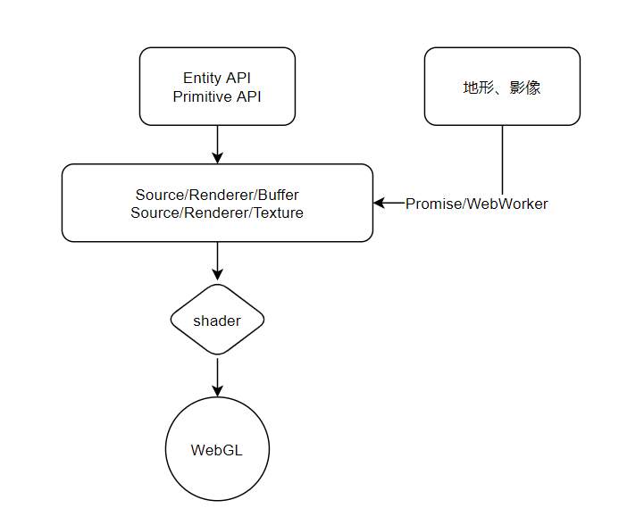

现在，走到了综述中的第二步：数据是如何被加载进来的（Cesium 的数据模型）。

WebGL 1.0 中有一个非常重要的概念：VBO。

VBO 即 WebGL 渲染所需的物料：ArrayBuffer数据以及各种定义。

使用原生 WebGL 绘制一个三角形是需要很繁杂的代码量的，所以各大三维引擎会封装一层。Cesium 对 VBO 的创建进行了简单的封装，叫 `Buffer` 类。这是对顶点数据的，对纹理数据后面还有一个 `Texture` 类。

有了 `Buffer` 和 `Texture`，我们就可以从 Entity API、Primitive API 的数据转译到 `Buffer` 和  `Texture`，最终丢到 WebGL 上进行绘制。

而这后面绘制的过程，就交给着色器了。

简单画个图即：

这一部分，既要弄明白数据对象之间是如何转换的、着色器是如何进入工作的，还要把控 WebGL 的代码层次组装。

