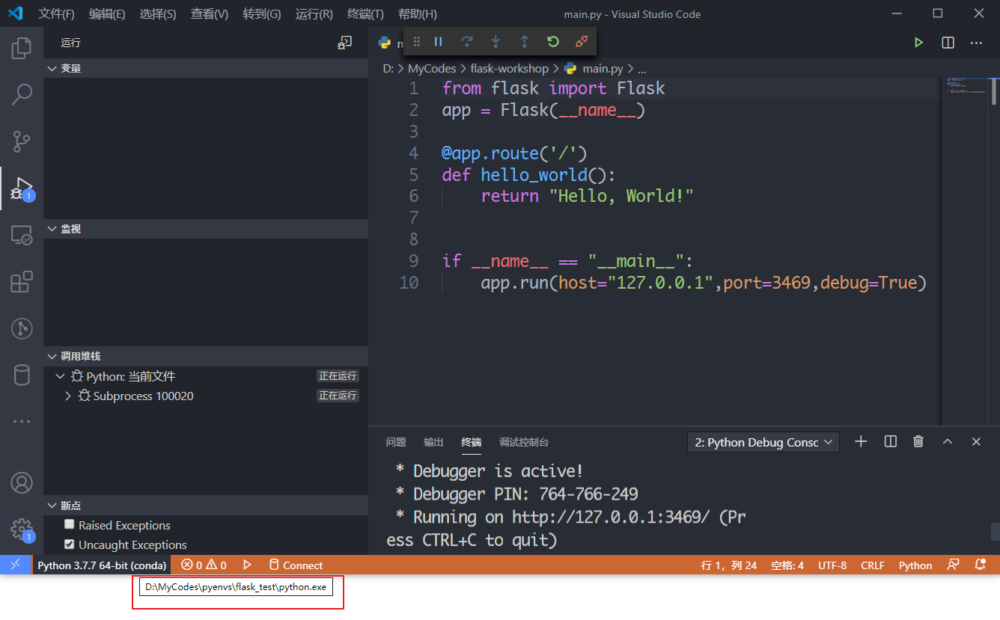

# 1. 安装conda

安装 `Anaconda` 或 `Miniconda`，自己会带的。

以下均在 Windows 系统的 Powershell Preview 中使用，使用 Anaconda.

如果使用 Anaconda Prompt 或 Anaconda Powershell Prompt 可能会有些微差异。

## 检查conda版本

``` SHELL
conda -V
# 或者 conda --version
```

## 切换清华源

和 npm 切换淘宝源是一样的道理，为了下载加速。

``` SHELL
conda config --add channels 'https://mirrors.tuna.tsinghua.edu.cn/anaconda/pkgs/free'
conda config --add channels 'https://mirrors.tuna.tsinghua.edu.cn/anaconda/pkgs/main/'
```

补充两个源：

``` 
# 中科大
channels:
  - https://mirrors.ustc.edu.cn/anaconda/pkgs/main/
  - https://mirrors.ustc.edu.cn/anaconda/pkgs/free/
  - https://mirrors.ustc.edu.cn/anaconda/cloud/conda-forge/
# 上海交大
channels:
  - https://mirrors.sjtug.sjtu.edu.cn/anaconda/pkgs/main/
  - https://mirrors.sjtug.sjtu.edu.cn/anaconda/pkgs/free/
  - https://mirrors.sjtug.sjtu.edu.cn/anaconda/cloud/conda-forge/
```

直接从域名开始也可以（这样可以不加引号）（其实不加引号也可以）

设置搜索包时，显示地址：

``` SHELL
conda config --set show_channel_urls yes
```

恢复默认源

``` SHELL
conda config --remove-key channels
```

### 显示源

``` sh
conda config --show-sources

==> C:\Users\C\.condarc <==                                   
channels:                                                     
  - https://mirrors.tuna.tsinghua.edu.cn/anaconda/pkgs/main/  
  - https://mirrors.tuna.tsinghua.edu.cn/anaconda/pkgs/free/  
  - https://mirrors.tuna.tsinghua.edu.cn/anaconda/pkgs/free   
  - defaults                                                  
show_channel_urls: True                                       
```


## 更新conda自己

``` SHELL
conda update conda
```

# 2. 虚拟环境篇

## ① 列出虚拟环境

``` shell
conda env list
# 或
conda info -e
```

默认状态下，什么都没有，只有一个叫 `base` 的默认虚拟环境。

## ② 创建虚拟环境

``` SHELL
conda create -n <虚拟环境名> python=3.7
```

这样在 Conda 安装的目录下的 envs 目录创建了一个 “虚拟环境名” 的虚拟环境，这个虚拟环境的python版本是 3.7

如果你想指定虚拟环境的位置：

``` SHELL
# 绝对路径
conda create --preifx=D:\myenvs\test_env python=3.7
# 相对路径
conda create --prefix=. python=3.9
```

期间，会提示是否创建虚拟环境（提示已经存在文件夹，但是并不是 conda 环境）要安装一些基础依赖库（sqlite、pip、setuptools、python本身等等），敲 `y` 回车即可。

> - 如果使用绝对路径，目录不存在，则要提前创建

### 创建虚拟环境的同时并安装依赖

```shell
conda create -n <虚拟环境名> python=x.y [包列表]
```

例如：

``` SHELL
conda create -n flask_test python=3.7 flask numpy
```


## ③ 激活（或者叫切换？）虚拟环境、关闭虚拟环境

``` shell
conda activate D:\myenvs\test_env
# linux和mac用以下命令
source activate <虚拟环境路径>
```

貌似有些情况，Windows可以省略 `conda`，直接 `activate` 就可以激活。为了保险起见，最好还是加上 `conda`

激活虚拟环境貌似不能使用相对路径。

### 意外情况

我用的是 powershell preview 版本，第一次激活创建的第一个虚拟环境时会报警告：

``` SHELL
CommandNotFoundError: Your shell has not been properly configured to use 'conda activate'.
If using 'conda activate' from a batch script, change your
invocation to 'CALL conda.bat activate'.

To initialize your shell, run

    $ conda init <SHELL_NAME>

Currently supported shells are:
  - bash
  - cmd.exe
  - fish
  - tcsh
  - xonsh
  - zsh
  - powershell

See 'conda init --help' for more information and options.

IMPORTANT: You may need to close and restart your shell after running 'conda init'.
```

按文中提示，键入 `conda init powershell` 并重启终端后，成功看到提示文字前多了个 `(base)` （如果没有，那么自己手动启动 `root` 虚拟环境试试，应该就出现base提示了）

之后再使用 `conda activate <虚拟环境路径>` 即可。

### 关闭虚拟环境

``` shell
# 切换到base环境
conda activate root
# 关闭虚拟环境
conda deactivate <虚拟环境全路径/虚拟环境名>
```

## ③ 安装依赖、删除依赖、更新依赖、删除虚拟环境

### 查询当前虚拟环境的包

``` sh
conda list
# 或
pip list
```


### 安装依赖到某个虚拟环境

``` shell
conda install -n <虚拟环境名> [包名列表]
```

### 删除某个虚拟环境中的某个包

``` SHELL
conda remove -n <虚拟环境名> <包名>
```

### 更新依赖

``` SHELL
conda update <包名> 
```

注意，这更新的是当前虚拟环境下的。

``` shell
conda update --all
```

这是更新当前激活的虚拟环境的所有依赖

### 删除虚拟环境

``` shell
conda remove -n <虚拟环境名> --all
```

### 我还能使用pip安装吗？

可以。

而且在哪个虚拟环境下，`pip` 程序默认使用哪个虚拟环境下的 `pip`，下面用Windows自带的 `where.exe` 查询 `pip` 这个程序的位置。

``` SHELL
(D:\MyCodes\pyenvs\flask_test) PS C:\Users\C> where.exe pip
D:\MyCodes\pyenvs\flask_test\Scripts\pip.exe
C:\Python38\Scripts\pip.exe
C:\Users\C\Anaconda3\Scripts\pip.exe
```

可见默认是虚拟环境下的，当我不激活虚拟环境时：

``` shell
(D:\MyCodes\pyenvs\flask_test) PS C:\Users\C> conda deactivate D:\MyCodes\pyenvs\flask_test
PS C:\Users\C> where.exe pip
C:\Python38\Scripts\pip.exe
C:\Users\C\Anaconda3\Scripts\pip.exe
```

虚拟环境的 `pip` 反而找不到了，可见虚拟环境的强大之处。

# 3. 补充一些conda命令（奇技淫巧）

## ① 复刻环境

这个操作相当于复制了 nodejs 的 `package.json`、`node_modules` 以及一些配置信息，但是不会复制源代码。

### 同操作系统复刻一个环境

在已有的环境 A 下先导出信息：

``` shell
conda list --explicit > spec-list.txt
```

然后，在别的机器上：

``` SHELL
conda create -n copy_a --file spec-list.txt
```

如果网速不好，可以在已有环境机器安装 `conda-forge` 和 `conda-pack` 工具，实现打包。

参考文档：https://zhuanlan.zhihu.com/p/87344422

### 不同操作系统

上面是导出 `spec-list.txt`，是不包括 `pip` 安装的包的。

不同操作系统可以用 `YAML` 的导出文件，并且记录了 `pip` 安装的包。

``` shell
# 导出
conda env export > environment.yml -n <虚拟环境名>
```

在另一台机器：

``` SHELL
conda env create -f environment.yml
```

yml 文件也可以用绝对路径。

## ② 清华源出问题

删除清华源试试。

``` shell
conda config --remove channels 'https://...(路径在上面自己找)'
```

检查配置：

``` SHELL
conda config --show
```

## ③ pipy（就是pip）安装慢

使用各种第三方源：

``` shell
https://pypi.douban.com/  豆瓣
https://pypi.hustunique.com/  华中理工大学
https://pypi.sdutlinux.org/  山东理工大学
https://pypi.mirrors.ustc.edu.cn/  中国科学技术大学
```

具体命令：

``` shell
pip install <包名> -i <第三方源URL>
```

## ④ 用本地包安装

将下载好的离线包放到 `<anaconda或miniconda安装目录>\pkgs\` 下。

``` shell
conda install --use-local <文件名带后缀>
```

要先切换到这个 `pkgs` 目录下，或者用绝对路径（未尝试）。

## ⑤ 万能查帮助命令

``` shell
conda --<子命令> -h
# 或
conda --<子命令> --help
```

不知道子命令有啥？

``` SHELL
conda -h
```

## ⑥ 取消每次打开终端都激活base环境

``` SHELL
conda config --set auto_activate_base false
```

当然你反悔了，可以通过设置 true。

# 4. 用flask的hello world测试虚拟环境



运行成功