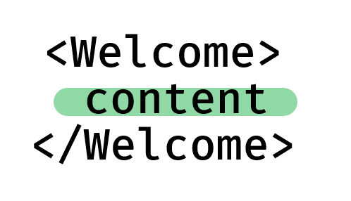

状态指的是 组件 的状态，因为组件内数据的变动，导致界面的变动，叫做状态改变。

> react的组件内有两个属性是 React.Component 继承下来的，即 props 和 state，其他用户想加什么就直接挂在 this 下即可。

要用 state，那就要写成类组件。

``` JS
class Clock extends React.Component {
    constructor(props) {
        super(props)
        this.state = {
            date: new Date() // 这样 state 内就多了一个 date 属性
        }
    }
}
```

## props 和 state 最大的区别

props 是外部**传进来**的，是不可变的，并且其内的属性也不可变

state 是**组件内部**维护，并且与 UI 渲染有关的，本身不可变，但是可以通过 setState() 方法改变其值


除此之外，state 只能在 constructor 里赋值。

## state 更新时依赖 state 本身时

可以传递一个函数

``` JS
setState((state, props) => {
    // do sth.
})
```

## 单向性

state 只能继续往下传，父组件似乎没办法直接使用子组件的 state

# 什么是状态组件？

就是说，组件内部存在一些可变数据，因为这些数据变动，导致组件上的一些 UI（文字、颜色、显隐等）也随即变化，

那这个组件就叫 **有状态组件**，这些内部可变的数据，叫做状态 `state`

# props的特殊属性：children

组件内容里的子组件。组件内容是这个东西：

