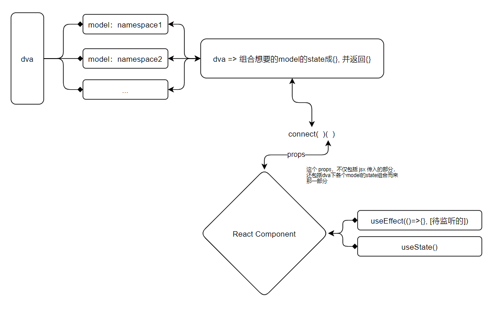

# 1. Model

model 是 dva 提出的一个概念。

model 是一个 Object，每个 model 都有它独一无二的名字：namespace 属性。

model 中也有 `state` 属性，与 `React.Component` 的 `state` 作用是一样的。

所有的 model 均挂在 dva 中的全局对象上，使用 `connect` 方法把 React 函数组件 与 对象的所有 model 连接，将所需的 model 的 state 组合成一个 Object，并与 jsx 中传入的 props 合并，组成新的 props 传给 React 组件。

## 说白了 model 就是各种组件 state 沟通的中介

model 与 React Component（page说到底其实也是 React Component）的关系可以用一张图来描述：



而 umi 的作用就是把这套东西组合在一起，并加上 [Page](#2. Page) 的概念简化  ReactRouter 的使用。

# 2. Page

page 是 umi 提出的一个概念。它其实就是 route，是 umi 中的约定式路由：什么是约定式路由？

你只要在根目录下的 `pages` 文件夹建立了特定规则的文件，那就是一个路由，根本不需要配路由文件。

umijs 项目的入口可以是一个 page，也可以是一个普通的组件，它可以在 `./.umirc.ts` 这个总配置文件里找到：

``` typescript
import { defineConfig, utils } from 'umi';

export default defineConfig({
  // ... ,
  routes: [
    {
      path: '/', component: '@/pages/viewer/index.js'
    }
  ]
})
```

# 3. Model 的成分

## ① namespace

名称，唯一。

这么说吧，借一句官方的话：“整个应用的 State，由多个小的 Model 的 State 以 namespace 为 key 合成。”

## ② state

当前 model 的状态数据。

## ③ effects

处理异步动作。

每一个 effect 必须是 `GeneratorFunction`，且接收参数为：action 和  effects，action 见下方 dispatch 函数中关于 `Action` 的解释，effects 是 `Redux-sage` 中的 `effects` 预置函数，用来实现各种不同的功能。

例如 put 这个预置函数：

``` js
effects: {
  *setState({ payload }, { put }) {
    yield put({ type: 'save', payload });
  },
}
```

这个 setState 生成器函数，是一个异步保存 state 的方法，它调用 `redux-sage` 提供的 `put` 预置函数，传入一个 `action`，随后，put() 就会根据 action 的 type “save”，去调用当前 model 的 save reducer，将这个生成器函数的 action 传入参数的 payload 继续传递给 save reducer。

明显，这里的 put 就像 dispatch 一样发起了一个 reducer 而已。

`redux-saga` 还有很多这样的预置函数。

这是官方的例子：

``` JS
function *addAfter1Second(action, { put, call }) {
  yield call(delay, 1000);
  yield put({ type: 'add' });
}
```

call 用于执行异步函数 delay，put 用于发出 action（类似 dispatch）

## ④ reducers

处理同步动作。

所有的 reducer 有两个参数：state 和 action，为动作发生前的 state 和要做什么 action。

typescript 定义：

``` typescript
type Reducer<S, A> = (state: S, action: A) => S
```

最终返回处理完成后的新 state。

一个简单的例子：

``` JS
reducers: {
  save(state, action) {
    return {
      ...state,
      ...action.payload
    }
  }
}
```

这个 save 方法即一个 “reducer”，它用于保存由 action 发过来的新参数 `action.payload`，合成新的 state，并将这个新的 state 返回。

## ⑤ function：dispatch(Action)

使用 `dispatch` 函数去触发 Model 内的同步 reducer 或 异步 effect。

它接受一个参数 `Action`，其实 Action 就是一个普通的 js 对象，只不过 Action 对象要有以下两个参数：

``` JS
dispatch({
  type: "<命名空间>/<reducer名称或effect名称>",
  payload: {} // 要传递什么数据过去
})
```

在 React Component 中，解构传入的 props，就能拿到 dva 提供的 `dispatch` 方法，这个方法是跟 model 在 `connect` 时绑在一起的。

用法举例：

``` JS
dispatch({ 
  type: 'cesiumviewer/setState', 
  payload: { 
    viewer: viewer.current 
  } 
});
```

## ⑥ subscription

暂时不知道是干什么用的，官方说是 “订阅数据源”，先写个例子在这里：

``` JS
/* key 是一个监听键盘操作然后做出响应的方法，key(string, function) */
keyEvent({dispatch}) {
  key('⌘+up, ctrl+up', () => { dispatch({type:'add'}) });
}
```

