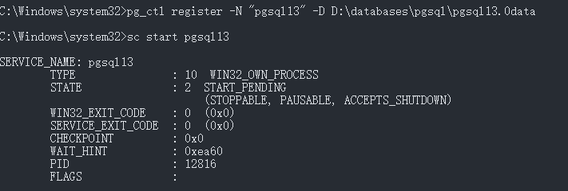

先定位到bin目录下

# 1. 初始化命令：initdb.exe

查看帮助：

``` 
initdb.exe --help
```

实例：

```
initdb.exe -D D:\databases\pgsql\pgsql13.0data -U postgres -A password -E utf8 --locale=C -W
```

此处参数意义：

- -D data            指定初始化的数据库目录(此处为当前目录的data文件夹)

- -U postgres        数据库超级用户名（此处为postgres，如果不设置，会用当前windows用户名为账号）

- -A password       数据库使用密码授权

- -E utf8            数据库编码格式

- --locale=C         数据库簇使用的本地化语言 

- -W               命令行执行后 输入密码

2. 作为服务启动

``` 
pg_ctl.exe -D D:\databases\pgsql\pgsql13.0data -l D:\databases\pgsql\pgsql13.0\log.log start
```

## 连接测试

```
psql -U postgres -W
```

## 使用psql 命令行连接数据库

``` 
D:\pgsql\bin>psql -h 127.0.0.1 -p 1921 -U postgres postgres  
```


# 3. 添加环境变量

- PGHOME：D:\databases\pgsql\pgsql13.0
- PGDATA：D:\databases\pgsql\pgsql13.0data
- PGLIB：%PGHOME%\lib
- PGHOST：localhost

最后在PATH环境变量中添加bin目录：%PGHOME%\bin

# 4. 卸载

## ① 停止

停止数据库

``` 
pg_ctl.exe -D D:\databases\pgsql\pgsql13.0data stop
```

## ② 或者停止并删除Windows服务

``` shell
sc stop pgsql
sc delete pgsql
```




# 5. 配置文件

PGDATA目录下的 pg_hba.conf 文件和 postgresql.conf 文件


# 6. 作为 Windows 服务安装

``` shell
pg_ctl.exe registry -N "pgsql" -D D:\databases\pgsql\pgsql13.0data
```

然后

``` SHELL
sc start pgsql
```

注意，这两个命令必须在 管理员权限下的 cmd 窗口运行。