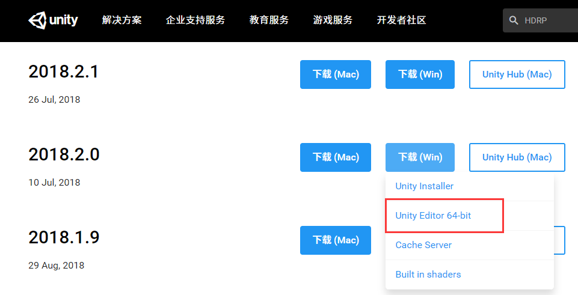
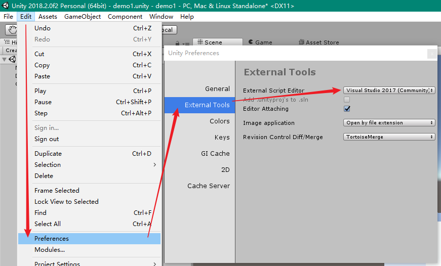
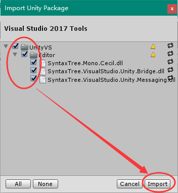

# 1 下载安装

下载比较繁琐，需要注册账户。下载Editor即可。https://unity.cn/

我使用的是 `2018.2.0f2` 版本。

安装比较简单，几乎是一路下一步。

（安装的时候要填一大堆东西，随便填）

## 1.1 安装 VS 2017 插件

到 Visual Studio Installer 找到 VS 2017 的安装区域，安装一个 `Unity3D` 的模块：

然后到Unity中如下设置：

第一步，设置外部脚本编辑器为VS（如果下拉列表没有就手动定位到启动程序）

第二步，在你当前的工程中，导入VS包

如果一切位置是默认的，那么在这个位置（不同版本位置可能不大一样）能找到这个包：

全部选中，导入即可

# 2 有关概念

u3d的工程貌似叫 “场景”。场景文件后缀名是 `.unity`。

场景必须存储在 `Asset` 目录下。

