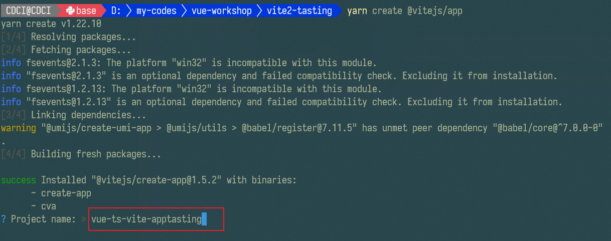
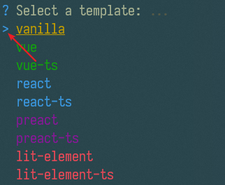
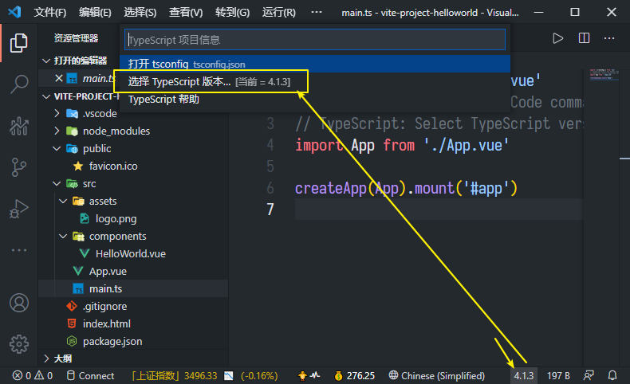

> 跟随官方很重要 我用的就是官网教程

# 控制台引导交互式创建项目

就是按提示操作。

使用 npm 或 yarn 都可以：

``` bash
npm init @vitejs/app
```

``` SHELL
yarn create @vitejs/app
```

以 yarn 为例，创建一个 vue-ts 类型的项目，第一个要输入的就是项目名：



使用中划线命名或其他命名法应该都可以？不确定。

然后，使用上下键选择模板：



选 `vue-ts`，然后就完成了，进入目录，使用常规的 npm script 命令即可启动项目：

``` shell
cd vue-ts-vite-apptasting
yarn # 或 npm install
yarn dev # 或 npm run dev
```

随后，就进入热更新模式了，`src/` 下 `main.ts` 即入口文件，直接被项目根目录下的 `index.html` 引用。

# vite.config.ts

vite 的配置文件，默认 vue-ts 的配置文件极短：

``` ts
import { defineConfig } from 'vite'
import vue from '@vitejs/plugin-vue'

// https://vitejs.dev/config/
export default defineConfig({
  plugins: [vue()]
})
```

# 依赖

使用了 `"vue": "^3.0.5"` 一项，`vite`、`typescript` 是作为开发依赖引入的

# npm script 命令

``` json
// package.json

"scripts": {
  "dev": "vite",
  "build": "vuedx-typecheck . && vite build",
  "serve": "vite preview"
}
```


- dev：开发热更新模式
- build：检查代码，并调用 vite 来进行构建发布
- serve：预发布模式，大体发布到服务器正式环境就是长这样的


# typescript 配置

在编译选项（compilerOptions）中，其他的比较常规，其中 `target`、`module` 均为 `esnext`。


# 程序入口文件：`./src/main.ts`

按理说能改，不过暂且使用这个文件，它所作的事情是从 `vue` 包中的 `createApp()` 函数，创建一个 vue 实例，并挂到 `#app` 这个div上（见 index.html）。

如果你在 vscode 中出现 "./App.vue" 红色下波浪线错误：

``` ts
import App from './App.vue'
```

请在 vscode 右下角单击 typescript 的版本，然后选择 “使用工作区版本”：



恭喜你，你已经会简单使用了。

# * 你也可以使用配置项一行命令生成项目

``` shell
npm init @vitejs/app <项目名> --template vue
```

``` shell
yarn create @vitejs/app <项目名> --template vue
```

注意，在 npm 7.x 中，可能需要双写中横线：

``` shell
npm init @vitejs/app <项目名> -- --template vue
```

# 疑问

package.json 文件中的 typescript 版本与 实际安装在 node_modules 中的不一致。