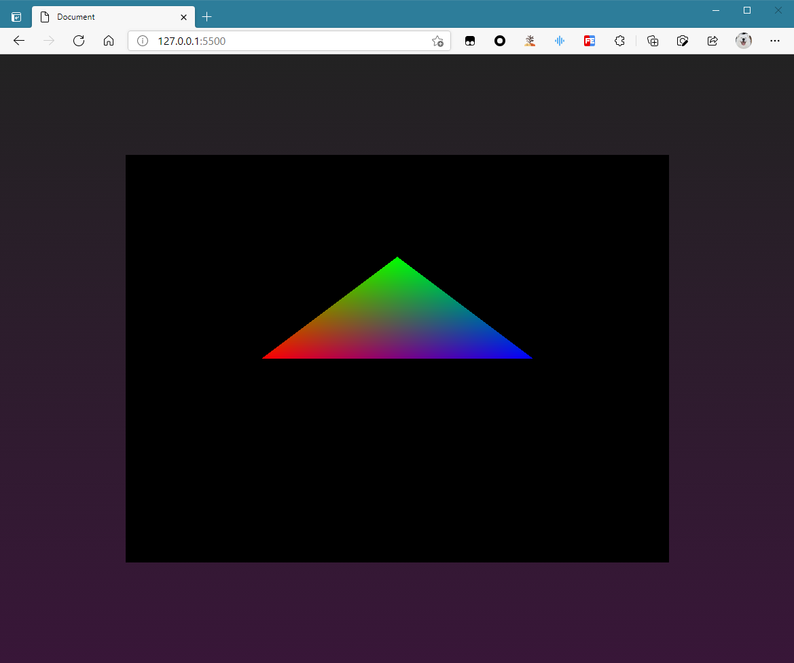

# 创建buffer

与 WebGL 的 `gl.createBuffer()` 几乎一样。

``` js
const vbodata = new Float32Array([
  -0.5, 0.0, 1.0, 0.0, 0.0, 1.0,
  0.0, 0.5, 0.0, 1.0, 0.0, 1.0,
  0.5, 0.0, 0.0, 0.0, 1.0, 1.0
])
const vbo = device.createBuffer({
  size: vbodata.byteLength, 
  usage: GPUBufferUsage.VERTEX,
  mappedAtCreation: true
})
```

与 Float32Array 的绑定，跟 WebGL 就完全不同了：

``` js
new Float32Array(buffer.getMappedRange()).set(vbodata)
vbo.unmap()
```

创建一个坐标缓存，一个颜色缓存。

# 顶点着色器

``` wgsl
[[builtin(position)]] var<out> out_position: vec4<f32>;
[[location(0)]] var<out> out_color: vec4<f32>;
[[location(0)]] var<in> in_position_2d: vec2<f32>;
[[location(1)]] var<in> in_color_rgba: vec4<f32>;

[[stage(vertex)]]
fn main() -> void {
	out_position = vec4<f32>(in_position_2d, 0.0, 1.0);
	out_color = in_color_rgba;
	return;
}
```

与 glsl 有几分相似，但是多了一个出口。


# 片元着色器

顶点着色器的输出，在片元着色器里就要输入。

``` wgsl
[[location(0)]] var<out> fragColor: vec4<f32>;
[[location(0)]] var<in> in_color: vec4<f32>;

[[stage(fragment)]]
fn main() -> void {
	fragColor = in_color;
	return;
}
```


# 管线组装

两端都准备完成后，就要在管线里拼接他们了。

``` js
const pipeline = device.createRenderPipeline({
  vertex: {
    ... // 其他参数同 01 的
    buffers: [{
  		arrayStride: 2 * vBuffer.BYTES_PER_ELEMENT, // 2x4byte 作为一个顶点坐标数据
  		attributes: [{
  			shaderLocation: 0,
  			offset: 0,
  			format: "float2"
			}]
		}, {
  		arrayStride: ,// 同理
  		attributes: [{
  			shaderLocation: 1,
  			offset: 0,
  			format: "float4
			}]
		}]
  },
  fragment: , // 略
	primitive: , // 略
})
```

最后，在通道编码器指定坐标缓存、颜色缓存。

``` js
passEncoder.setVertexBuffer(0, vbo)
```

# 数据交错

将两个缓存合并成一个。vertexState 中的 vertexBuffer 下的 arrayStride 要改动，若为二维坐标+rgba颜色，那么就要改为 6x4 了；offset 属性也要改动，即从 buffer 的第几个字节开始是它自己第一个数据。

或者合并 vertexBuffer 对象下的 attributes 属性。

